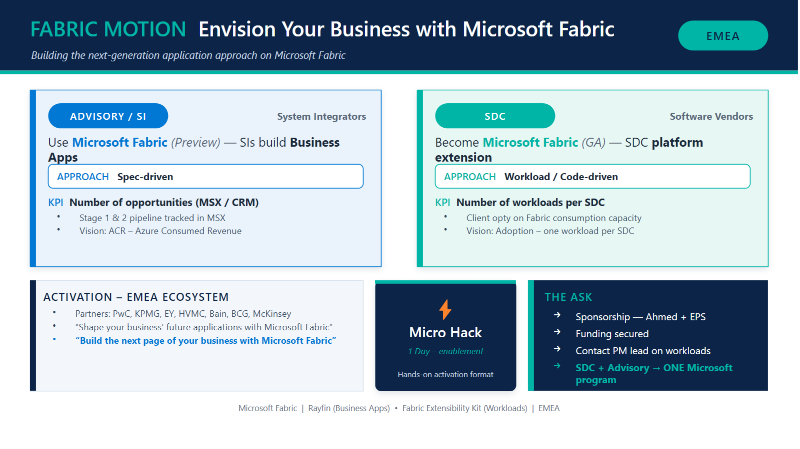
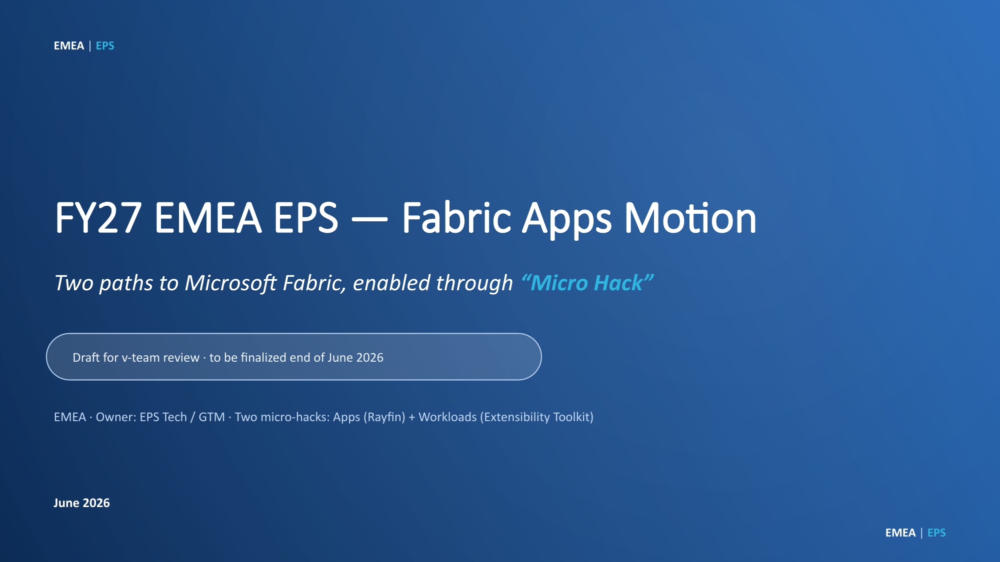

# FY27 Fabric Motion

This repo is the **Microsoft Fabric application motion** for FY27. It follows the
shared motion template: a README with the strategy, a one-slide executive
summary, supporting docs, build scripts, and the bundled slide generator.

---

## 🎯 What we want to do

Establish **Microsoft Fabric** as the platform for the next generation of business
applications across **EMEA**, through **two complementary go-to-market paths** that
converge into **one Microsoft program**.

| Path | Audience | Approach | KPI |
| ---- | -------- | -------- | --- |
| **Advisory** | System Integrators | Use Microsoft Fabric (Preview) — SIs build Business Apps | **Number of opportunities** (MSX / CRM), Stage 1 & 2 — vision **ACR** |
| **Workload** | SDC | Become Microsoft Fabric (GA) — SDC platform extension | **Number of workloads per SDC** — vision **Adoption** (1 workload / SDC) |

**Enablement vehicle:** ⚡ *Micro Hack — 1 day* (hands-on activation).

**Activation — EMEA ecosystem:** PwC · KPMG · EY · HVMC · Bain · BCG · McKinsey.

**Messaging**
- "Shape your business' future applications with Microsoft Fabric."
- "Build the next page of your business with Microsoft Fabric."

**The ask**
- Sponsorship — Ahmed + EPS.
- Funding secured.
- Contact PM lead on workloads.
- **SDC + Advisory → ONE Microsoft program.**

Full detail in [`docs/motion-brief.md`](docs/motion-brief.md). The complete motion write-up is
in [`docs/FY27-EPS-Fabric-Apps-Motion-Micro-Hack.md`](docs/FY27-EPS-Fabric-Apps-Motion-Micro-Hack.md).
The presentation is the editable PowerPoint
[`docs/FY27 EMEA EPS - Fabric Apps Motion - Micro Hack.pptx`](docs/FY27%20EMEA%20EPS%20-%20Fabric%20Apps%20Motion%20-%20Micro%20Hack.pptx) —
15 real editable slides that reuse the **FY27 SQL-in-a-Day deck template** (blue-gradient hero,
light pages, two-path cards, fork & cascade flows, stat tiles, two-column agendas for both
Micro Hacks, Gantt roadmap), generated by [`deck/build-motion-deck.mjs`](deck/build-motion-deck.mjs)
(`cd deck && npm install && npm run build:pptx`). A condensed Marp markdown version is also kept at
[`deck/FY27-Fabric-Apps-Motion-Slides.md`](deck/FY27-Fabric-Apps-Motion-Slides.md).

---

## 🖼️ The one-slide summary



The editable deck is in [`deck/Motion-Fabric-Apps.pptx`](deck/Motion-Fabric-Apps.pptx).
It is generated from a small JSON config ([`deck/motion-fabric.json`](deck/motion-fabric.json)),
so the slide is **reproducible** and **version-controlled** — change the config,
regenerate, and the slide stays consistent.

---

## 🎞️ The full motion deck

[](docs/FY27%20EMEA%20EPS%20-%20Fabric%20Apps%20Motion%20-%20Micro%20Hack.pptx)

📥 **[FY27 EMEA EPS — Fabric Apps Motion — Micro Hack.pptx](docs/FY27%20EMEA%20EPS%20-%20Fabric%20Apps%20Motion%20-%20Micro%20Hack.pptx)** *(15 editable slides, click the cover above to download)*

Where the one-slide summary is the elevator pitch, this **15-slide deck** is the full
v-team / leadership story behind the motion. It opens with an executive summary
("one motion, two execution paths, one repeatable vehicle — the *Micro Hack*") and a
*Motion at a Glance* view — **"We build it, the partner repeats it."**

It then walks both paths end to end:

- **Path A — SI / Advisory (Apps):** GSIs first; partners build & ship customer
  business apps on Fabric (Rayfin), with the **Micro Hack 1** one-day agenda and the
  *"Micro Hack in a Box"* kit that lets the SI repeat runs #2…N without Microsoft.
- **Path B — SDC / ISV (Workloads):** grow the Fabric footprint through ISV offers —
  embed a workload once (Extensibility Toolkit) and consume it mechanically across the
  ISV's customer base, via the same repeatable **Micro Hack 2** shape.

It closes with **what we reuse instead of rebuild**, the **two-scoreboard KPI model**
(north-star = share of apps and workloads that are *partner-led*, not Microsoft-led —
MSX/ACR for SIs, adoption / one-workload-per-ISV for SDCs), the **FY27 execution
roadmap**, and **The Ask** — adopt this motion as the execution layer for building apps
& workloads on Fabric across EMEA.

---

## 🚲 Business Apps track (Rayfin)

The Advisory / SI path is delivered through a **business app built on
[Microsoft Fabric](https://www.microsoft.com/en-us/microsoft-fabric/features/rayfin)
with Rayfin**. The reference scenario is **Helios Bicycle**, a fictional final customer.

**Helios Bicycle Studio — functional summary.** Helios Bicycle runs shared city bikes
across EMEA stations. The app gives station teams one simple, fun place to run daily
operations:

- **Bicycle Board** — fleet readiness per station with a computed health score and tag.
- **Live Map** — every bike on a city map, colored by status (ready / in ride / pit-stop).
- **Pit-Stop Queue** — quick repair tickets, auto-assigned to the best mechanic.
- **Ride Mood & KPI** — rider satisfaction signal plus the pit-stop pipeline (rides → pit-stops raised → resolved) with a fleet-readiness score.

Roles: an **Operations Manager** sees and manages everything; a **Mechanic** only sees
their assigned tickets.

| Bicycle Board | Live Map |
|---|---|
|  |  |
| **Pit-Stop Queue** | **Ride Mood & Fleet KPI** |
|  |  |

**Dive in:**
- Full solution & screenshots: [`docs/microhack-1-business-apps-solution.md`](docs/microhack-1-business-apps-solution.md)
- Code, data model & business logic: [`src/apprayfin/`](src/apprayfin)
- Trainer setup: [`docs/microhack-1-business-apps-setup.md`](docs/microhack-1-business-apps-setup.md) ·
  Participant workbook: [`docs/microhack-1-business-apps-workbook.md`](docs/microhack-1-business-apps-workbook.md)

---

## 🧩 SDC Workloads track (Fabric Extensibility Toolkit)

The SDC path is delivered through a **Fabric workload built with the
[Extensibility Toolkit](https://learn.microsoft.com/en-us/fabric/extensibility-toolkit/extensibility-toolkit-overview)**.
The reference scenario is **GreenGrid Analytics**, a fictional SDC.

**GreenGrid Scorecard — functional summary.** GreenGrid scores the **sustainability** of a
customer's sites. The workload shows the complementarity of Fabric + SDC:

- The customer's `sites` data stays in **OneLake** (no data movement).
- A pre-deployed **GreenGrid SaaS** (`/score`) brings the SDC's scoring algorithm.
- The result is a **graphical scorecard rendered inside Fabric** — portfolio green score,
  A/B/C tiers, a map of industrial sites, and per-site recommendations.

### Who does what

| Component | Owner | Responsibility |
|---|---|---|
| **OneLake `sites` table** | Customer | The raw data (energy, renewable %), governed in Fabric |
| **GreenGrid SaaS** (`/score`) | SDC | **Holds the scoring algorithm** (the SDC's IP) — turns site data into green scores + tiers |
| **GreenGrid workload** | SDC, in Fabric | Reads OneLake, calls the SaaS, renders the scorecard natively in Fabric |

So the **algorithm lives in the SaaS**; the **workload is the thin, native Fabric experience**
that brings that algorithm to the customer's own OneLake data — no data leaves Fabric.

A **major prerequisite** is that the SaaS is **deployed and running before the workshop** —
it is coded and runnable in [`src/workloadsdc/saas/`](src/workloadsdc/saas). The workload is
run in **dev mode via the Dev Gateway**.

The SaaS ships with a real **GreenGrid website** (`GET /`) — a polished landing page with a
*Developers* section and a **live demo** that calls `POST /score` on the server. It makes the
prerequisite feel like a genuine product: a front-end in front of the **same scoring algorithm**
the Fabric workload consumes (`npm run saas:start` → `http://localhost:8787/`).

| GreenGrid website (the SaaS front-end) | Live `/score` demo (same algorithm the workload calls) |
|---|---|
|  |  |

And the workload that brings that algorithm into Fabric on the customer's OneLake data:

| Sustainability Scorecard | Industrial sites map |
|---|---|
|  |  |

**Dive in:**
- Full solution & screenshots: [`docs/microhack-2-sdc-workloads-solution.md`](docs/microhack-2-sdc-workloads-solution.md)
- SaaS + workload code: [`src/workloadsdc/`](src/workloadsdc)
- Trainer setup: [`docs/microhack-2-sdc-workloads-setup.md`](docs/microhack-2-sdc-workloads-setup.md) ·
  Participant workbook: [`docs/microhack-2-sdc-workloads-workbook.md`](docs/microhack-2-sdc-workloads-workbook.md)

---

## 🛠️ Regenerate the slide

```bash
# macOS / Linux
./scripts/build.sh
```

```powershell
# Windows
./scripts/build.ps1
```

The scripts install the generator's dependencies, rebuild the `.pptx` from the
config, and (if LibreOffice is available) refresh the PNG preview.

---

## 🧭 Use this repo as a template for a new motion

1. **Create a new repo** from this one (or copy its structure).
2. **Edit the strategy** in this README and `docs/motion-brief.md`.
3. **Edit `deck/motion-fabric.json`** (rename it to your motion) with your content.
4. **Run `scripts/build.*`** and commit the `.pptx` + preview PNG.

```
FY27FabricMotion/
├── README.md                       # the motion: vision, paths, KPIs, ask
├── deck/
│   ├── motion-fabric.json          # slide content as data (edit this)
│   ├── Motion-Fabric-Apps.pptx     # generated slide (commit it)
│   └── preview/Motion-Fabric-Apps.png
├── docs/                           # markdown-only motion kit
│   ├── motion-brief.md
│   ├── app-motion-overview.md
│   ├── microhack-1-business-apps-solution.md
│   ├── microhack-1-business-apps-setup.md
│   ├── microhack-1-business-apps-workbook.md
│   ├── microhack-2-sdc-workloads-solution.md
│   ├── microhack-2-sdc-workloads-setup.md
│   └── microhack-2-sdc-workloads-workbook.md
├── src/
│   ├── apprayfin/                  # Business Apps (Rayfin) solution package
│   └── workloadsdc/                # SDC Workload (Extensibility Toolkit) + SaaS
├── scripts/
│   ├── build.sh                    # regenerate slide + preview (macOS/Linux)
│   └── build.ps1                   # regenerate slide + preview (Windows)
└── skill/pptxmotions/              # the generator (see collapsed section below)
```

**Naming convention for `docs/`:** lowercase `kebab-case`, markdown only.

For the track implementations, start with:

- Business Apps: `src/apprayfin/README.md` · `docs/microhack-1-business-apps-solution.md`
- SDC Workloads: `src/workloadsdc/README.md` · `docs/microhack-2-sdc-workloads-solution.md`

---

<details>
<summary>🧩 <b>How the slide is generated — the <code>pptxmotions</code> skill</b> (click to expand)</summary>

<br>

The deck is produced by **`pptxmotions`**, a small parametric generator bundled in
[`skill/pptxmotions/`](skill/pptxmotions). It turns the JSON config into a polished
Microsoft Fluent–styled slide, and is also a
[GitHub Copilot CLI](https://docs.github.com/copilot/how-tos/use-copilot-agents/use-copilot-cli)
skill so Copilot can build/update the slide for you on request.

### Regenerate the slide (standalone)

```bash
cd skill/pptxmotions
npm install                       # installs pptxgenjs
node motion.js ../../deck/motion-fabric.json ../../deck/Motion-Fabric-Apps.pptx
```

Render a PNG preview (requires LibreOffice):

```bash
soffice --headless --convert-to png --outdir ../../deck/preview ../../deck/Motion-Fabric-Apps.pptx
```

### Use it from Copilot CLI

Install the skill once, then just ask Copilot in natural language.

**macOS / Linux**
```bash
git clone https://github.com/fredgis/pptxskill.git ~/.copilot/skills/pptxmotions
cd ~/.copilot/skills/pptxmotions && npm install
```

**Windows (PowerShell)**
```powershell
git clone https://github.com/fredgis/pptxskill.git "$env:USERPROFILE\.copilot\skills\pptxmotions"
cd "$env:USERPROFILE\.copilot\skills\pptxmotions"; npm install
```

Restart Copilot CLI, run `/skills` to confirm **pptxmotions** is listed, then:

```text
Use the pptxmotions skill to update deck/motion-fabric.json and regenerate the slide.
```

The skill, its full config schema, and a fictional sample live in
[`skill/pptxmotions/README.md`](skill/pptxmotions/README.md). Upstream:
<https://github.com/fredgis/pptxskill>.

</details>

---

## License

The generator skill is MIT-licensed (see
[`skill/pptxmotions/LICENSE`](skill/pptxmotions/LICENSE)). Motion content in this
repo is internal material.