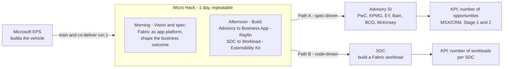
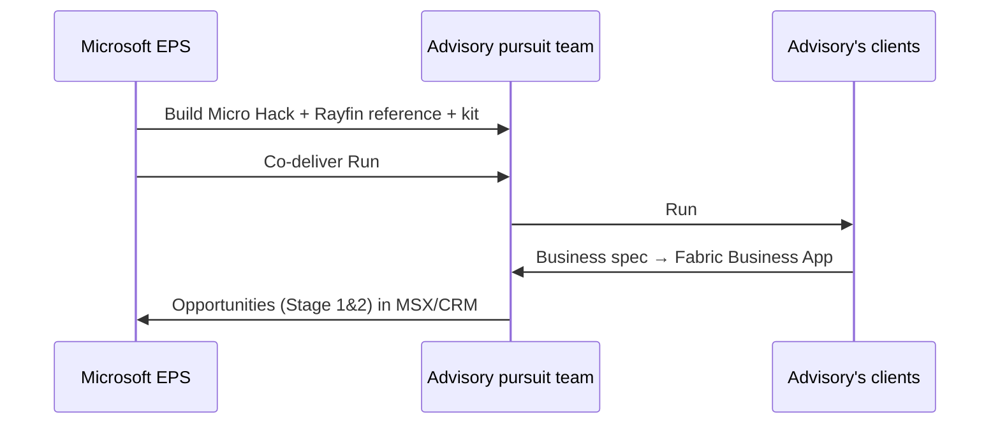
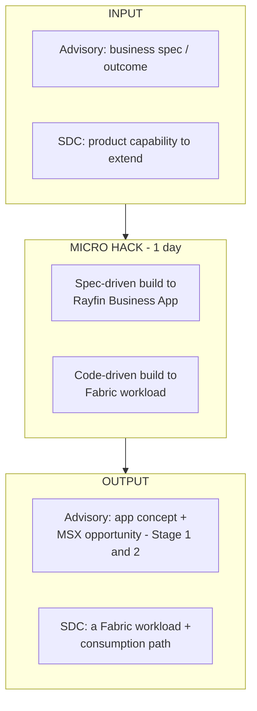

# FY27 EMEA EPS — App Motion
## Envision Your Business with Microsoft Fabric, enabled through the **"Micro Hack"**

> **Status:** Draft for v-team review — to be finalized within two weeks and shared with management end of June.
> **Geography:** EMEA · **Owner:** EPS Tech / GTM · **Sponsorship:** Ahmed + EPS

---

## 1. Executive Summary

This document defines the **application-layer motion** for FY27 EPS. Its operating principle: Microsoft builds a **highly operational, repeatable vehicle** — here the **"Micro Hack" (1 day)** — and the **partner repeats it** with their own clients.

It is **one motion with two execution paths**, both centered on **Microsoft Fabric** as the next-generation application platform.

| Path | Partner type | Outcome we drive | Build vehicle / product | Primary KPI |
|------|--------------|------------------|--------------------------|-------------|
| **A — Advisory** | **System Integrators (Advisory SI)** — PwC, KPMG, EY, HVMC, Bain, BCG, McKinsey | Build **Business Apps on Microsoft Fabric** (Preview), **spec-driven** | **Rayfin** (Business Apps) | **# of opportunities (MSX / CRM)** — Stage 1 & 2 pipeline |
| **B — Platform** | **Software Development Companies (SDC)** | Extend the **Microsoft Fabric platform** (GA), **workload / code-driven** | **Fabric Extensibility Kit** (Workloads) | **# of workloads per SDC** |

**The core idea.** The App motion ships the **"Micro Hack"** — a one-day, hands-on format that turns Fabric from a data platform into an **application** platform. Microsoft builds and co-delivers the first Micro Hack; the partner then **repeats it independently** with their customers.

- For **Advisory SI**, the Micro Hack is **spec-driven**: start from a business spec, shape the future application on Fabric (**Rayfin**), and create pipeline.
- For **SDC**, the Micro Hack is **code-driven**: build a **Fabric workload** using the **Fabric Extensibility Kit**, targeting **one new workload per SDC**.

**Activation sequencing:** **advisories in H1**, **all SI in H2**. **SDC + Advisory converge into ONE Microsoft program.**

---

## 2. The Motion at a Glance

**Operating principle — "We build it, the partner repeats it."**
The Micro Hack is a turnkey vehicle that partners **own and repeat**. Microsoft's role is to build it, co-deliver run #1, and certify the partner team to run the rest.

**Two Micro Hack taglines (from the proposal):**
> *"Shape your business' future applications with Microsoft Fabric"*
> *"Build the next page of your business with Microsoft Fabric"*

---

## 3. Strategic Context (the simplified "why now")

- **Fabric is becoming an application platform, not only a data platform.** With business apps (Rayfin) and a workload **Extensibility Kit**, partners can build and ship applications and custom workloads *on* Fabric.
- **Two partner archetypes, two motions.** **Advisories** lead with **business outcomes** (spec-driven apps → pipeline / ACR). **SDCs** lead with **product** (code-driven workloads → one workload per SDC, driving Fabric capacity consumption).
- **An operational, repeatable entry point.** Partners need a hands-on vehicle — the Micro Hack — not another high-level vision deck.

---

## 4. Path A — Advisory SI (Business Apps on Fabric · "Rayfin")

### 4.1 Objective & KPI

| Item | Definition |
|------|------------|
| **Objective** | Enable **advisory SIs** to use **Microsoft Fabric (Preview)** to build **Business Apps**, **spec-driven**, and create qualified pipeline. |
| **Build vehicle / product** | **Rayfin** — the Business Apps approach on Fabric. |
| **Approach** | **Spec-driven** — start from a business specification / outcome, then shape the application. |
| **Primary KPI** | **Number of opportunities (MSX / CRM)**, with **Stage 1 & 2 pipeline tracked in MSX**. |
| **Vision metric** | **ACR — Azure Consumed Revenue.** |
| **Activation window** | **H1 (advisories first).** |

### 4.2 The Vehicle — "Micro Hack" agenda (Advisory)

| Time | Block | Content | Owner (run #1 → repeat) |
|------|-------|---------|-------------------------|
| **Morning** | **1. Vision** | Fabric as the platform for next-generation business apps; the "next page of your business" narrative. | MS → Partner |
| | **2. Spec** | Capture a real business outcome as a **spec** (the spec-driven method); pick a candidate use case from the advisory's client. | MS → Partner |
| | **3. Architecture** | How a Business App maps onto Fabric (Rayfin); data + app + agent layers. | MS → Partner |
| **Afternoon** | **4. Build** | Hands-on: shape the Business App from the spec on Fabric. | MS → Partner |
| | **5. Outcome → pipeline** | Convert the built concept into an **MSX opportunity** (Stage 1 & 2). | MS + Partner |
| | **6. Repeat plan** | How the advisory runs the Micro Hack with its own clients. | MS + Partner |

### 4.3 Repeatability — advisory runs its own Micro Hack

- **"Micro Hack in a Box":** facilitator deck, spec template, reference Business App, demo script, timing guide.
- **Train-the-trainer:** run #1 co-delivered; certify the advisory's team to run runs #2…N.
- **Repeatability KPI:** number of partner-led Micro Hacks and the Stage 1 & 2 opportunities they generate in MSX.

---

## 5. Path B — SDC (Fabric Workloads · "Fabric Extensibility Kit")

### 5.1 Objective & KPI

| Item | Definition |
|------|------------|
| **Objective** | Get each **SDC** to build on the **Microsoft Fabric platform (GA)** by creating **custom workloads**, **code-driven**. |
| **Build vehicle / product** | **Fabric Extensibility Kit** (Workloads). |
| **Approach** | **Workload / code-driven** — the SDC develops and ships a Fabric workload. |
| **Primary KPI** | **Number of workloads per SDC.** |
| **Vision metric** | **Adoption — one workload per SDC** (and client opportunities on Fabric consumption capacity). |
| **Activation window** | **H2 (all SI).** |

### 5.2 Repeatable workload pattern

1. **Identify** an SDC product capability that fits a Fabric workload.
2. **Scaffold** the workload with the **Fabric Extensibility Kit**.
3. **Build** the workload (code-driven), integrating with OneLake / Fabric items.
4. **Ship & operate** the workload; drive client opportunities on **Fabric consumption capacity**.
5. **Repeat** for additional workloads across the SDC portfolio.

> The Micro Hack for SDCs is the **code-driven** variant: the afternoon is spent scaffolding and building a real workload, not shaping a business app.

### 5.3 KPIs for the SDC track (detail)

| KPI | Definition | Target (FY27) |
|-----|------------|---------------|
| **Workloads per SDC** | # of distinct Fabric workloads built/shipped | ≥ 1 per SDC |
| **Adoption** | % of engaged SDCs that ship a workload | *to set with v-team* |
| **Consumption** | Client opportunities / ACR on Fabric capacity | *to set* |
| **Repeatability** | % of SDCs that build a 2nd workload | *to set* |

---

## 6. The Micro Hack (the build)

> **This is the asset Microsoft builds in this motion** — one vehicle, two variants (spec-driven for Advisory, code-driven for SDC).

### 6.1 What it is — and what it is **not**

| It **is** | It is **not** |
|-----------|---------------|
| A **one-day, hands-on** format that produces a tangible Fabric artifact | A multi-week paid engagement |
| **Reusable & repeatable** by the partner with their own clients | A Microsoft-only delivery |
| Two variants: **Business App (Rayfin)** and **Workload (Extensibility Kit)** | A generic "intro to Fabric" webinar |

### 6.2 Inputs → Build → Outputs

### 6.3 "Micro Hack in a Box" — what we ship

- **Facilitator kit:** agenda, slides, timing guide, FAQ.
- **Two reference builds:** a Rayfin Business App reference (Advisory) and a Fabric workload reference built with the Extensibility Kit (SDC).
- **Spec template** (Advisory) and **workload scaffold** (SDC).
- **Train-the-trainer** package to certify partner teams.

> Detailed build specifications for the Rayfin reference app and the Extensibility-Kit workload reference to be confirmed with the **PM lead on workloads** (see §8).

---

## 7. KPIs & Success Metrics (both paths)

| Path | Leading indicator | Lagging / outcome KPI |
|------|-------------------|-----------------------|
| **A — Advisory** | # Micro Hacks **repeated by partner**; # specs captured | **# opportunities (MSX/CRM), Stage 1&2**; ACR |
| **B — SDC** | # SDCs engaged; # workloads scaffolded | **# workloads per SDC**; Fabric capacity consumption |
| **Repeatability (motion health)** | Ratio of partner-led vs MS-led Micro Hacks | Partner-sourced opportunities / workloads |

> **North-star for this motion:** the share of Micro Hacks that are **partner-led**, and **one shipped workload per SDC**.

---

## 8. The Ask

- **Sponsorship — Ahmed + EPS.**
- **Funding — secured.**
- **Contact the PM lead on workloads** to confirm Rayfin and Extensibility-Kit reference builds.
- **SDC + Advisory → ONE Microsoft program** (single, converged motion rather than two parallel tracks).

---

## 9. Activation & Execution Roadmap

**FY27 fiscal quarters** (Microsoft FY starts in July): **Q1** Jul–Sep '26 · **Q2** Oct–Dec '26 · **Q3** Jan–Mar '27 · **Q4** Apr–Jun '27.
Activation sequencing: **Advisory in H1 (Q1–Q2)**, **all SI in H2 (Q3–Q4)**.

| Workstream | Q1 · Jul–Sep '26 | Q2 · Oct–Dec '26 | Q3 · Jan–Mar '27 | Q4 · Apr–Jun '27 |
|------------|:---------------:|:---------------:|:---------------:|:---------------:|
| **Build** — Micro Hack vehicle + kit | █████ |  |  |  |
| **Build** — Rayfin reference (Advisory) | █████ |  |  |  |
| **Build** — Extensibility-Kit workload ref | █████ |  |  |  |
| **Path A** — Onboard advisories (PwC/KPMG/EY) | █████ |  |  |  |
| **Path A** — Co-deliver Run #1 ◆ | █████ |  |  |  |
| **Path A** — Advisories repeat (own clients) |  | █████ |  |  |
| **Path B** — Onboard SDCs (all SI) |  |  | █████ |  |
| **Path B** — Co-build first workloads |  |  | █████ |  |
| **Path B** — Repeat across portfolio |  |  | █████ | █████ |

**Key milestones**

- **◆ Run #1 co-delivered with an advisory — end of Q1 (Sep '26):** first Micro Hack delivered live; advisory team certified to repeat.
- **End of H1:** advisories run their own Micro Hacks; Stage 1 & 2 opportunities flow into MSX.
- **H2:** all SI onboarded; SDCs co-build and ship their first Fabric workloads, then repeat across the portfolio.

*Legend:* █████ = active period · ◆ = key milestone.

---

*Sources distilled from the FY27 EPS proposal (EPS). Product names (Rayfin, Fabric Extensibility Kit) and reference-build details to be confirmed with the workloads PM lead and v-team. This document intentionally translates the proposal into an execution-ready format.*
