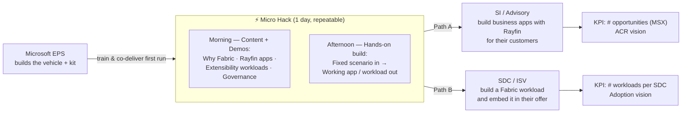
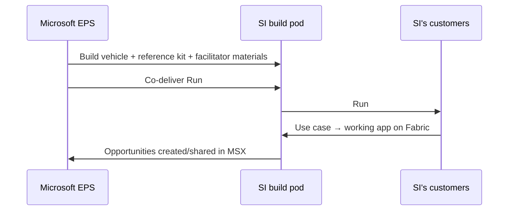
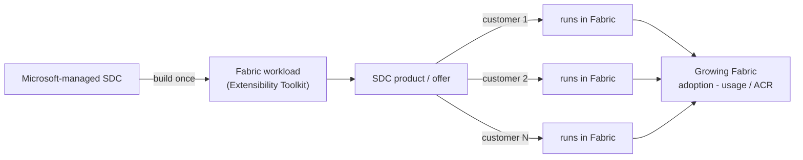
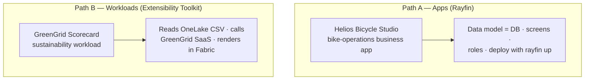

# FY27 EMEA EPS — Fabric Apps Motion
## Two Paths to Microsoft Fabric, enabled through the **"Micro Hack"**

> **Status:** Draft for v-team review — to be finalized and shared with management.
> **Geography:** EMEA · **Owner:** EPS Tech / GTM · **Linked to:** Corp "Build apps & workloads on Microsoft Fabric" motion

---

## 1. Executive Summary

This document defines **one motion with two execution paths**, both powered by a single, repeatable enablement vehicle: the **"Micro Hack" (1 day)**.

| Path | Partner type | Outcome we drive | Primary KPI |
|------|--------------|------------------|-------------|
| **A — Advisory / Apps** | **System Integrators & advisories** (PwC, KPMG, EY, HVMC, Bain, BCG, McKinsey) | Build **business applications on Microsoft Fabric with Rayfin** — a managed backend (database, auth, APIs, hosting) — so SIs ship enterprise apps for their customers without infra plumbing | **# of opportunities created (MSX)**, Stage 1 & 2 — **ACR** vision |
| **B — Adoption / Workloads** | **Software Development Companies (SDC / ISV)** | Get every Microsoft-managed SDC to **build a Fabric workload** with the **Extensibility Toolkit** and embed it in their offer, so their product runs **natively inside Fabric** on the customer's own OneLake data | **# of workloads per SDC** — **Adoption** vision (≥ 1 workload / SDC) |

**The core idea.** Microsoft does *not* ask partners to re-platform from scratch. We already have the managed building blocks — **Microsoft Fabric**, **Rayfin** (Backend-as-a-Service on Fabric), the **Fabric Extensibility Toolkit**, **OneLake**, and the **GitHub Copilot CLI**. What we build is **one turnkey, repeatable vehicle — the "Micro Hack" — that an SI or an SDC can run themselves** with their own teams and customers:

- **Morning = content + demos** — why build on Fabric, the managed backend story (Rayfin) and the workload story (Extensibility Toolkit), governance on OneLake, and a live demo of the reference scenario.
- **Afternoon = hands-on build** — teams build a **real app or workload** from a fixed scenario, with the **GitHub Copilot CLI** writing the code, deploying to a Fabric workspace, and shipping a working result by the end of the day.

The **Micro Hack kit is the one asset we create** — two reference scenarios, their solutions, the pre-deployed SaaS, and the facilitator materials — but it lives **inside** the vehicle (the day), not as a standalone product.

**Why this is different from the existing corp material.** The corp Fabric and app-platform decks are strong but **high-level and broad**. This motion is deliberately **execution-first**: one fixed agenda, two ready-to-run scenarios, reference code, and a clear "train-the-partner-to-repeat" model. Our success is measured by **partners independently repeating the Micro Hack** and shipping apps/workloads, not by Microsoft running every event.

---

## 2. The Motion at a Glance

**Operating principle — "We build it, the partner repeats it."**
For every motion in FY27 EPS, we ship a **highly operational vehicle** (here: the *Micro Hack*; for the data motion: *SQL in a Day*). Microsoft builds and co-delivers the **first** run; the partner then **owns and repeats** the exercise with their own teams and client base.

---

## 3. Strategic Context (the simplified "why now")

This is the **one-slide version** of the narrative — enough to open a partner conversation, no more.

- **Every business now ships software.** Building enterprise apps still means months of backend plumbing (database, auth, hosting, security). **Fabric + Rayfin removes that** — declare your data, ship to production in one command.
- **AI-era apps must sit on governed data.** Apps and workloads built on Fabric inherit **OneLake governance, security and a single copy of data** out of the box — no data movement, no shadow estates.
- **The Fabric audience is large and growing.** Fabric is Microsoft's unified data + AI platform; **SIs** build customer apps on it, and **SDCs** can reach **every Fabric customer** by publishing a workload to the **Workload Hub**.
- **Partners multiply impact.** When an opportunity is shared with a partner, Microsoft sees **+95.6% higher win rate and +46% larger deal size**. Scaling through SIs and SDCs is the only way to cover the ecosystem.

> **Two partner motions to anchor on:** ① **SIs** ship faster, higher-margin app projects on a managed Fabric backend; ② **SDCs** turn their product into a native Fabric workload and grow adoption mechanically across their customer base.

---

## 4. Path A — Advisory / Apps (focus: SIs & advisories)

### 4.1 Objective & KPI

| Item | Definition |
|------|------------|
| **Objective** | Enable SIs and advisories to **build business applications on Microsoft Fabric with Rayfin** — a managed backend — so they ship enterprise apps for their customers fast, on governed data, led by the partner. |
| **Primary KPI** | **Number of opportunities created in MSX** (partner-sourced or partner-shared), Stage 1 & 2. |
| **Secondary KPIs** | # of Micro Hacks **repeated by the partner**; # apps shipped to a Fabric workspace; **Azure / Fabric ACR** pipeline attached. |
| **Lead role** | STU per country + EPS (PDM/PSA), 1 executive sponsor per SI. |

### 4.2 The Vehicle — the Apps Micro Hack agenda

A fixed, repeatable one-day format. Microsoft co-delivers run #1 with the SI; the SI repeats runs #2…N independently.

| Time | Block | Content | Owner (run #1 → repeat) |
|------|-------|---------|-------------------------|
| **Morning** | **1. Why build on Fabric** | The managed-backend story, governance on OneLake, lower time-to-app. | MS → Partner |
| | **2. Rayfin foundations** | Data model = database; auth, APIs, hosting out of the box; deploy in one command. | MS → Partner |
| | **3. Demo** | The reference app (Helios Bicycle Studio) built live with the GitHub Copilot CLI. | MS → Partner |
| | **4. The brief** | Teams, the scenario, environment & accounts check. | MS → Partner |
| **Afternoon** | **5. ⭐ Build sprint 1** | Scaffold, declare the data model (Rayfin provisions the DB), build the core screens. | Teams |
| | **6. ⭐ Build sprint 2** | Extend, polish, **deploy to Fabric** (`rayfin up`), demo. | Teams |
| | **7. Plan & next steps** | Turn the app into a customer opportunity + a 90-day plan. | MS + Partner |

> **The afternoon is the differentiator.** Blocks 5–6 are where teams ship a **real working app on Fabric** — the concrete artifact the SI uses to open and qualify a real customer opportunity. The full step-by-step is in [`microhack-1-business-apps-workbook.md`](microhack-1-business-apps-workbook.md); the reference solution is in [`microhack-1-business-apps-solution.md`](microhack-1-business-apps-solution.md).

### 4.3 Repeatability — how an SI runs its own Micro Hack

The motion only scales if the **SI repeats it without us**. We deliver a **"Micro Hack in a Box"** package:

- **Facilitator kit:** trainer setup guide, participant workbook, reference solution + screenshots, timing guide.
- **Reference code:** the runnable Helios Bicycle solution kit ([`src/apprayfin/`](../src/apprayfin)) and the canonical spec/prompts.
- **Train-the-trainer:** run #1 is co-delivered; we certify an SI "build pod" (presales + delivery) to run runs #2…N.
- **Repeatability KPI:** number of partner-led Micro Hacks and the opportunities they generate (tracked in MSX).

### 4.4 Execution plan (Path A)

| Phase | What | Who | Done when |
|-------|------|-----|-----------|
| **0 — Build** | Finalize vehicle, reference app, facilitator kit | EPS Tech | Kit ready, app demoable |
| **1 — Recruit** | Secure 1 sponsor per SI; start with one advisory | PDM + STU | Sponsor + build pod named |
| **2 — Co-deliver** | Run #1 with the SI (per country, STU-led) | MS + SI | Run #1 delivered, pod certified |
| **3 — Repeat** | SI runs Micro Hacks with own customers | SI | ≥ N sessions, opportunities in MSX |
| **4 — Scale** | Extend across the EMEA advisory ecosystem | PDM | Each SI has a build pod |

---

## 5. Path B — SDC Adoption (grow Fabric adoption through ISV workloads)

### 5.1 Objective & KPI

| Item | Definition |
|------|------------|
| **Objective** | Get **every Microsoft-managed SDC to build a Fabric workload** with the **Extensibility Toolkit** and **embed it in their commercial offer** — so their product runs **natively inside Fabric**, on the customer's own OneLake data, and **every customer of the SDC consumes a Fabric workload by design**. The aim is to **grow Fabric adoption mechanically** through SDC products, not through one-off projects. |
| **Why it matters** | **Build once, adopt many.** When an SDC ships its product as a Fabric workload, its **entire customer base** becomes ongoing Fabric usage — one product decision creates recurring, multi-tenant adoption and a path to the **Workload Hub** marketplace. |
| **Primary KPI** | **# of workloads per SDC** (target: every managed SDC ships ≥ 1 Fabric workload). |
| **Secondary KPIs** | **Fabric usage / ACR** generated through SDC end-customers; # of SDC products published as workloads; # of end-customers running the embedded workload. |
| **Approach** | **Adoption / Operate** — build the workload once, then adopt mechanically across the SDC's customer base. |

### 5.2 How it works — build once, adopt mechanically

For SDCs the target is the **ISV's own product/offer**, not a single end-customer estate. The mechanism:

1. **Target the product, not one estate** — work with the SDC on a workload that surfaces their value inside Fabric.
2. **Build a workload** with the Extensibility Toolkit that reads the customer's **OneLake** data and runs the SDC's logic natively — no data movement.
3. **Adopt mechanically** — every customer who uses the SDC's offer runs that workload, so adoption scales with the SDC's business, with no per-customer selling effort from us.
4. **Repeat & publish** across the SDC's product modules and, ultimately, to the **Workload Hub** for all Fabric customers.

> The **Micro Hack** is the **technical entry point** for an SDC — to build the first workload and see it run in Fabric in a day (see [`microhack-2-sdc-workloads-workbook.md`](microhack-2-sdc-workloads-workbook.md)). But Path B is ultimately measured on **adoption**, not on repeated workshops: the win is the embedded workload, and the Fabric footprint it generates across the SDC's customer base.

### 5.3 KPIs for the SDC track (detail)

| KPI | Definition | Target (FY27) |
|-----|------------|---------------|
| **Adoption rate** | % of Microsoft-managed SDCs that ship ≥ 1 Fabric workload | *to set with v-team* |
| **Footprint (usage)** | Fabric usage / ACR generated through SDC end-customers | *to set* |
| **End-customer reach** | # of SDC end-customers running the embedded workload | *to set* |
| **Repeatability** | % of SDCs that build a 2nd workload / publish to the Workload Hub | *to set* |

---

## 6. The Micro Hack Kit (the build)

> **This is the asset Microsoft builds in this motion** — and it is **an integral part of the Micro Hack**, demoed in the morning and used hands-on in the afternoon. It is **not** a product; it is a **reusable enablement kit** that lets a partner build a real app or workload on Fabric in one day, then repeat the day on their own.

### 6.1 What it is — and what it is **not**

| It **is** | It is **not** |
|-----------|---------------|
| Two **ready-to-run reference scenarios** (a Rayfin business app, an Extensibility workload) with full solutions | A finished product or a customer deliverable |
| A **facilitator kit** (setup, workbook, solution, screenshots) that a partner can run themselves | A services engagement Microsoft must staff every time |
| A **pre-deployed SaaS prerequisite** + sample OneLake data for the workload scenario | A migration / data-movement tool |

### 6.2 The two reference scenarios

- **Path A scenario — Helios Bicycle Studio** (final customer): a friendly bike-operations app built on Rayfin. Reference code: [`src/apprayfin/`](../src/apprayfin). Workbook + solution in [`docs/`](.).
- **Path B scenario — GreenGrid Scorecard** (SDC): a sustainability workload that reads the customer's `Files/sites.csv` from OneLake, calls the **GreenGrid SaaS** (the SDC's algorithm), and renders a scorecard inside Fabric. Reference code + SaaS: [`src/workloadsdc/`](../src/workloadsdc).

### 6.3 Kit contents (what we curate)

- **Facilitator materials:** trainer setup guides, participant workbooks (didactic, step-by-step), reference solutions with real screenshots, 1-day agendas.
- **Reference code:** runnable Rayfin app kit and runnable workload kit (+ the GreenGrid SaaS prerequisite and sample OneLake data).
- **Prompts & specs:** canonical generation specs and master prompts for the GitHub Copilot CLI.
- **The one-slide motion summary** and this motion document.

### 6.4 Build approach (high level)

- **Apps:** scaffold a Rayfin project, declare the data model (Rayfin provisions the Fabric database), build screens conversationally with the Copilot CLI, deploy with `rayfin up`.
- **Workloads:** clone the Extensibility Toolkit, run the setup (Entra app + Dev Gateway), validate with the built-in Hello World, then build the GreenGrid item (read OneLake → call SaaS → render).
- **Delivery surface:** usable live in the Micro Hack afternoon, and by partners during their own repeats.

> Detailed build instructions live in the per-track setup, workbook and solution docs in [`docs/`](.) and the reference kits in [`src/`](../src).

---

## 7. Microsoft Assets & Programs to lean on (simplified catalog)

The **simplified** version — the minimum a partner needs to know.

### 7.1 The platform building blocks (we reuse — we do not rebuild)

| Need | Microsoft building block |
|------|--------------------------|
| Managed backend for apps (DB, auth, APIs, hosting) | **Rayfin** (Backend-as-a-Service on Fabric) |
| Extend Fabric with a custom item / workload | **Fabric Extensibility Toolkit** + Dev Gateway |
| Single, governed copy of customer data | **OneLake** |
| Write/ship the code from a prompt | **GitHub Copilot CLI** |
| Reach all Fabric customers with a workload | **Fabric Workload Hub** |

### 7.2 Enablement & funding (simplified)

| Program | What it gives the partner | Use it to… |
|---------|---------------------------|-----------|
| **Micro Hack kit** | Turnkey 1-day vehicle + reference scenarios | Build the first app/workload, then repeat |
| **Reference solutions** | Working app + workload + SaaS, with screenshots | De-risk delivery, give a target |
| **Partner enablement (train-the-trainer)** | Co-delivered run #1 + certification | Make the partner self-sufficient |
| **Funding (ECIF/ACO where applicable)** | Post-sales execution funding | Fund the first customer engagements |

### 7.3 The two reference scenarios (the worked examples)

| # | Scenario | Track | Outcome |
|---|----------|-------|---------|
| 1 | **Helios Bicycle Studio** | A — Apps (Rayfin) | A deployed business app on Fabric |
| 2 | **GreenGrid Scorecard** | B — Workloads (Toolkit) | A workload running natively in Fabric |

---

## 8. KPIs & Success Metrics (both paths)

| Path | Leading indicator | Lagging / outcome KPI |
|------|-------------------|-----------------------|
| **A — Advisory / Apps** | # Micro Hacks **repeated by partner**; # apps deployed to Fabric | **# opportunities (MSX)**, Stage 1 & 2; Fabric/Azure ACR pipeline |
| **B — SDC Adoption** | # managed SDCs engaged; # offers with a workload built | **# workloads per SDC**; **Fabric usage / ACR** from SDC end-customers |
| **Repeatability (motion health)** | Ratio of partner-led vs MS-led sessions | Partner-sourced opportunities & adoptions share |

> **North-star for this motion:** the share of Micro Hacks, apps and workloads that are **partner-led, not Microsoft-led**.

---

## 9. The Ask

- **Sponsorship** — Ahmed + EPS leadership.
- **Funding** to build the Micro Hack kit + reference scenarios and to run the first co-delivered sessions.
- **A PM lead on workloads** to align with the Extensibility Toolkit roadmap and the Workload Hub.
- **ISV + Advisory → ONE Microsoft program** — align the two paths so they are one execution layer, not parallel tracks.

---

## 10. Execution Roadmap

**FY27 fiscal quarters** (Microsoft FY starts in July): **Q1** Jul–Sep '26 · **Q2** Oct–Dec '26 · **Q3** Jan–Mar '27 · **Q4** Apr–Jun '27.

| Workstream | Q1 · Jul–Sep '26 | Q2 · Oct–Dec '26 | Q3 · Jan–Mar '27 | Q4 · Apr–Jun '27 |
|------------|:---------------:|:---------------:|:---------------:|:---------------:|
| **Build** — Micro Hack kit + facilitator materials | █████ |  |  |  |
| **Build** — Reference scenarios (app + workload + SaaS) | █████ |  |  |  |
| **Path A** — Sponsor + SI build pod | █████ |  |  |  |
| **Path A** — Co-deliver Run #1 (advisory) ◆ | █████ |  |  |  |
| **Path A** — SIs repeat (own customers) |  | █████ | █████ |  |
| **Path A** — Scale across the advisory ecosystem |  | █████ | █████ | █████ |
| **Path B** — SDC engagement + first workloads | █████ | █████ |  |  |
| **Path B** — Repeat + publish to Workload Hub |  | █████ | █████ | █████ |

**Key milestones**

- **◆ Run #1 co-delivered — end of Q1 (Sep '26):** first Apps Micro Hack delivered live; SI build pod certified; first SDC workload shipped.
- **End of Q1:** the kit is in the partners' hands — the motion shifts from *Microsoft build* to *partner-led repeat*.
- **Q2–Q3:** SIs repeat independently while we scale across the advisory ecosystem; SDC workload adoptions run in parallel.

*Legend:* █████ = active period · ◆ = key milestone.

---

## 11. Appendix — "Why build on Fabric" in one page (partner-ready)

**The pitch (use to open any conversation):**

1. **Ship faster** — Fabric + Rayfin gives you the managed backend (database, auth, APIs, hosting); declare your data, deploy in one command. No infra plumbing.
2. **Governed by design** — apps and workloads run on **OneLake**: one copy of data, enterprise security and governance inherited out of the box, no data movement.
3. **Reach & adoption** — SIs ship higher-margin app projects; SDCs turn their product into a native **Fabric workload** and grow adoption mechanically across every customer, with a path to the **Workload Hub**.

**Messaging**

- *"Shape your business' future applications with Microsoft Fabric."*
- *"Build the next page of your business with Microsoft Fabric."*

**The vehicle:** one **Micro Hack** day — morning content + demos, afternoon hands-on build — that the partner learns once and **repeats on their own**.
