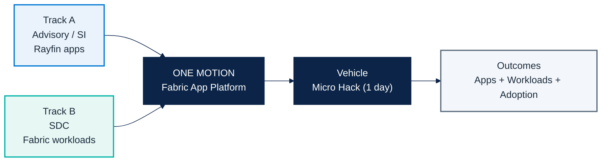
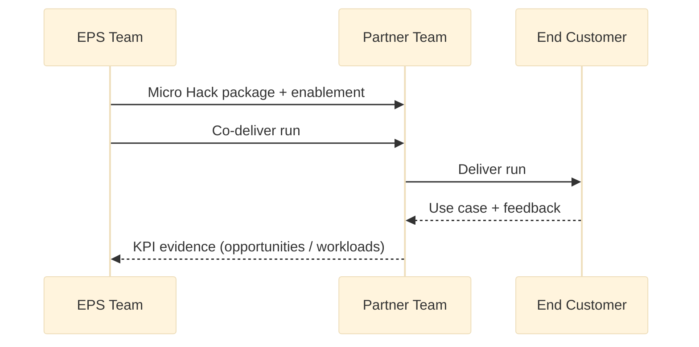

# FY27 EMEA — Fabric App Motion Overview

Single reference for business direction, delivery model and KPI logic.

## 1) Motion in one page

## 2) KPI frame

| Track | KPI | KPI interpretation |
|---|---|---|
| Advisory / SI | # opportunities (MSX/CRM) | Stage quality + revenue proxy (ACR view) |
| SDC | # workloads per SDC | Productized adoption + Fabric usage growth |

## 3) Operating principle

1. Microsoft/EPS prepares a repeatable vehicle.
2. First run is co-delivered.
3. Partners repeat independently with customers.

## 4) Asset map in `/docs`

- `motion-brief.md`: concise narrative baseline.
- `microhack-1-business-apps-solution.md`: full Business Apps solution with screenshots.
- `microhack-1-business-apps-setup.md`: trainer setup for end-customer apps.
- `microhack-1-business-apps-workbook.md`: participant workbook for apps.
- `microhack-2-sdc-workloads-solution.md`: full SDC workload solution with screenshots.
- `microhack-2-sdc-workloads-setup.md`: trainer setup for SDC workload build.
- `microhack-2-sdc-workloads-workbook.md`: participant workbook for SDC build.

## 5) Code asset map in `/src`

- `src/apprayfin/`: Business Apps Rayfin implementation package for the Helios scenario.
- `src/workloadsdc/`: SDC workload + GreenGrid SaaS package for the GreenGrid scenario.
