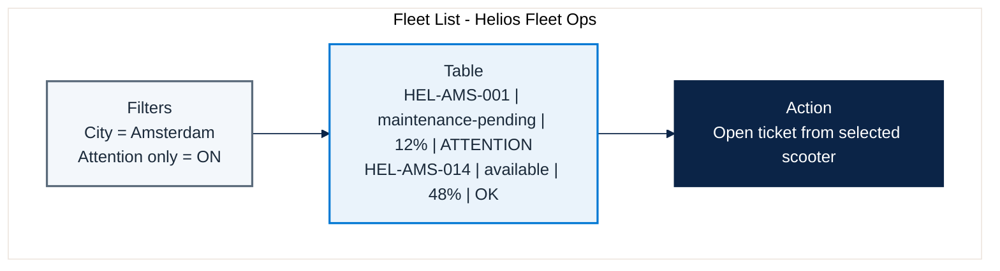
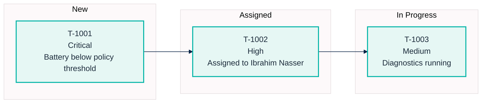
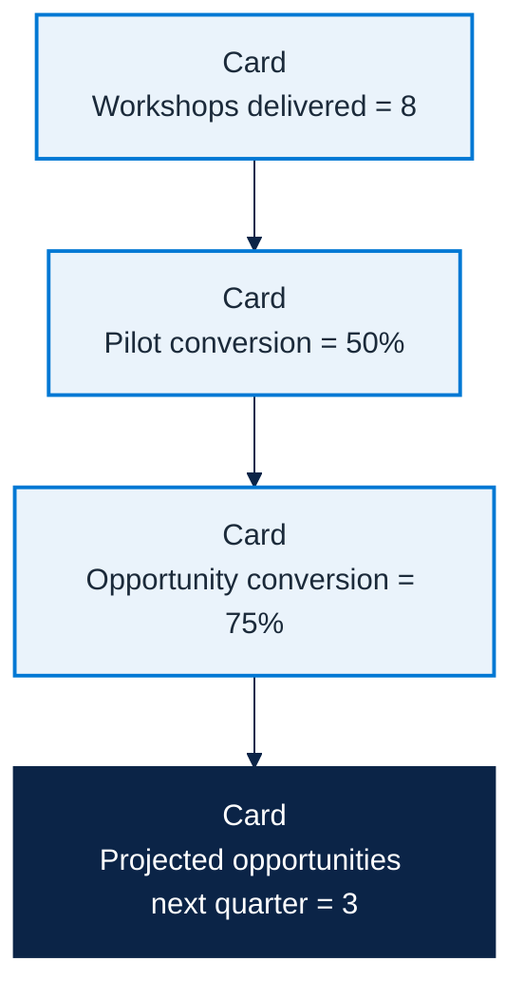

# AppRayfin Solution - Helios Mobility Business App

Reference implementation for the **Business Apps (Rayfin)** micro-hack scenario.
This is the trainer-grade solution aligned with:

- `docs/microhack-1-business-apps-setup.md`
- `docs/microhack-1-business-apps-workbook.md`
- `src/apprayfin/`

---

## 1) End-to-end solution map

```mermaid
%%{init: {'theme':'base','themeVariables':{
  'primaryColor':'#EAF3FB',
  'primaryTextColor':'#1B2A3A',
  'primaryBorderColor':'#0078D4',
  'lineColor':'#0B2447',
  'secondaryColor':'#E6F7F4'
}}}%%
flowchart LR
    D["Helios sample data<br/>Scooters + Battery + Tickets"] --> M["Rayfin data model<br/>src/apprayfin/rayfin/data"]
    M --> S["Business services<br/>priority + assignment + KPI"]
    S --> U["Rayfin-generated app UX<br/>Fleet list · Detail · Queue · KPI"]
    U --> K["Advisory KPI output<br/>MSX opportunity pipeline"]
    classDef data fill:#F3F7FB,stroke:#5B6B7B,color:#1B2A3A,stroke-width:2px;
    classDef model fill:#EAF3FB,stroke:#0078D4,color:#1B2A3A,stroke-width:2px;
    classDef service fill:#0B2447,stroke:#0B2447,color:#FFFFFF,stroke-width:2px;
    classDef outcome fill:#E6F7F4,stroke:#00B4A6,color:#1B2A3A,stroke-width:2px;
    class D data;
    class M model;
    class S,U service;
    class K outcome;
```

---

## 2) What is coded in `src/apprayfin`

| Area | Files | Purpose |
|---|---|---|
| Rayfin model | `rayfin/data/*.ts` | Canonical entities and roles for fleet operations |
| Rayfin service config | `rayfin/rayfin.yml` | Auth/data/storage/static hosting configuration |
| Business logic | `src/services/*.ts` | Priority scoring, technician assignment, KPI projection |
| Scenario seed | `src/seed/helios-demo-seed.ts` | Consistent sample payload for demos and coaching |
| Generation spec | `src/specs/helios-fleet-spec.md` | Prompt-ready application specification for Rayfin |

---

## 3) Simulated screenshots (graphical mock captures)

### 3.1 Fleet List screen (manager view)

### 3.2 Maintenance Queue screen (dispatch view)

### 3.3 KPI screen (advisory impact view)

---

## 4) Trainer answer key linkage

These files are the concrete implementation references used during facilitation:

1. `src/apprayfin/src/services/fleet-priority.ts` -> how "needs attention" is scored.
2. `src/apprayfin/src/services/maintenance-assignment.ts` -> how tickets are assigned.
3. `src/apprayfin/src/services/kpi-model.ts` -> how advisory KPI projections are computed.
4. `src/apprayfin/src/specs/helios-fleet-spec.md` -> what participants should target in Rayfin.

Use this document during the afternoon sprint to keep teams aligned on scope and expected output.
