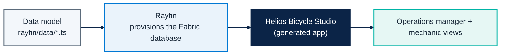

# Micro Hack 1 — Business Apps Setup (Trainer Guide)

Track: **End-customer Apps (Rayfin)**
Scenario: **Helios Bicycle** (fictional final customer)

> **Key Rayfin fact for trainers.** With Rayfin, the **data model is the database** — Rayfin
> provisions and migrates the database from the TypeScript data model when you run `npm run dev`
> / `npx rayfin up`. There is **no Lakehouse to pre-create and no tables to pre-load**. Don't set
> up a Lakehouse for this track.

---

## 1) Architecture to prepare before the day



---

## 2) Prerequisites checklist (must be true before 09:00)

### Platform & accounts
- [ ] Fabric **capacity** available and assigned to the workshop **workspace**.
- [ ] All participant accounts can sign in to **Microsoft Fabric** and have the workspace.
- [ ] All participants signed in to the **GitHub Copilot CLI** (`copilot` → `/login`).
- [ ] Node.js 20+ and npm installed; GitHub Copilot CLI installed.

### Materials
- [ ] Reference kit available: [`src/apprayfin/`](../src/apprayfin).
- [ ] Workbook link shared: `docs/microhack-1-business-apps-workbook.md`.
- [ ] Reference solution ready: `docs/microhack-1-business-apps-solution.md`.

### Delivery readiness
- [ ] Trainer ran the **reference build once** end-to-end (scaffold → `npm run dev` → build the
  screens → smoke demo) and it deploys to the workspace.
- [ ] Backup account + backup browser session ready.

> No `HeliosLake`, no CSV/tables to load — Rayfin creates the database from the data model.

---

## 3) Setup procedure (the reference build, run once before the day)

1. **Scaffold** a Rayfin project (built-in template, no repo to clone):
   ```bash
   npm create @microsoft/rayfin@latest -- --template dataapp
   ```
2. **Run it** — this deploys to Fabric and **provisions the database** from the data model:
   ```bash
   npm run dev
   ```
3. **Declare the Helios data model** in `rayfin/data/` (Bicycle, RideSession, PitStopTicket,
   MechanicProfile) — using the master prompt with the GitHub Copilot CLI. Re-running `npm run dev`
   (or `npx rayfin up db apply`) provisions the matching tables.
4. **Build the screens** with the Copilot CLI: Bicycle Board, Pit-Stop Queue, Ride Mood & KPI,
   Live Map.
5. **Smoke demo**: open the app, list bikes by station, create and assign a pit-stop ticket.

> Full step-by-step (prereqs, prompts, expected screens) is in the participant
> [workbook](microhack-1-business-apps-workbook.md). The exact spec is in
> [`src/apprayfin/src/specs/helios-bicycle-app-spec.md`](../src/apprayfin/src/specs/helios-bicycle-app-spec.md).

---

## 3.1) Detailed trainer runbook (recommended)

| Time | Owner | Action | Done when |
|---|---|---|---|
| D-1 (morning) | Trainer | Create workspace + assign capacity | Workspace opens for all trainer accounts |
| D-1 (morning) | Trainer | Confirm Copilot CLI + Fabric sign-in on the VMs | `copilot --version` works, both sign-ins OK |
| D-1 (afternoon) | Trainer | Run the full reference build once | App deploys and opens with data |
| D-day 08:30 | Trainer | Recheck access for all participant accounts | No sign-in failures |
| D-day 08:45 | Trainer | Recheck capacity is running | Workspace is capacity-backed |

---

## 4) Trainer solution path (to orient trainees)

> This section is the answer key for facilitators.

### Recommended minimum solution
- App name: `Helios Bicycle Studio`.
- Main screens: `Bicycle Board` (status + station + rider mood), `Pit-Stop Queue`,
  `Ride Mood & KPI`, `Live Map`.
- Required actions: filter by station · create a pit-stop ticket · assign it to a mechanic.
- Role split: Operations manager (full visibility) · Mechanic (assigned tickets only).

### Solution code references
- Data model: `src/apprayfin/rayfin/data/`
- Bike health scoring: `src/apprayfin/src/services/bike-health.ts`
- Assignment logic: `src/apprayfin/src/services/pit-stop-assignment.ts`
- KPI logic: `src/apprayfin/src/services/business-kpi.ts`
- Seed payload (for the demo/screenshots): `src/apprayfin/src/seed/helios-demo-seed.ts`
- Runnable demo + screenshots: `cd src/apprayfin && npm install && npm run demo`
- App screenshots: `docs/images/scenario1-*.png` (embedded in the solution doc)

### Master prompt (starter for the data model)
```text
Build "Helios Bicycle Studio", a fun bike-operations app on Rayfin.
Data model:
- Bicycle(bikeCode, station, status[ready|in-ride|pit-stop-needed], featured)
- RideSession(bicycle, riderAlias, moodScore, startedAt, endedAt)
- PitStopTicket(ticketCode, bicycle, station, priority[high|normal],
                status[new|assigned|done], issue, openedAt, assignedMechanic)
- MechanicProfile(displayName, station, active)
Roles: Operations Manager full access; Mechanic sees only assigned tickets.
Style: clean, friendly, Microsoft Fluent, blue #0078d4 + teal #00b4a6.
```

### Coaching cues during the hack
- If teams overbuild: bring them back to the core screens first (Board + Queue).
- If teams block on data: remember the data model **is** the database — change a type, re-run.
- If teams diverge: ask "what will your 5-minute demo prove?"

---

## 5) Troubleshooting quick map

| Symptom | Likely cause | Fast fix |
|---|---|---|
| `template "field-technician" not found` | That's a gallery template, not built-in | Use `--template dataapp` (or run with no `--template`) |
| Deploy fails with 401/403 | Rayfin session expired | `npx rayfin login --tenant <tenant-id>`, then `npm run dev` |
| Data-model change not reflected | Schema not applied | `npx rayfin up db apply` (`--force` only if you accept data loss) |
| Sign-in issues to the app once deployed | Email/password is local-dev only | Use Fabric brokered auth (Entra SSO); set `auth.fabric.enabled: true` in `rayfin.yml` |
| Participants blocked | Missing workspace permission or capacity | Re-check workspace role + that the capacity is running |
