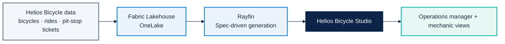

# Micro Hack 1 — Business Apps Setup (Trainer Guide)

Track: **End-customer Apps (Rayfin)**  
Scenario: **Helios Bicycle** (fictional final customer)

---

## 1) App metier architecture to prepare before the day



---

## 2) Prerequisites checklist (must be true before 09:00)

### Platform
- [ ] Fabric capacity available and assigned to workshop workspace.
- [ ] Workspace created: `helios-bicycle-microhack`.
- [ ] Rayfin available and validated in this workspace.
- [ ] All participant accounts can sign in and open the workspace.
- [ ] Solution kit available locally: `src/apprayfin/`.

### Data foundation
- [ ] Lakehouse created: `HeliosLake`.
- [ ] Four datasets loaded as tables:
  - [ ] `bicycles`
  - [ ] `ride_sessions`
  - [ ] `pit_stop_tickets`
  - [ ] `mechanics`
- [ ] One quick data quality check done (sample rows + types).

### Delivery readiness
- [ ] Demo path tested end-to-end once by trainer.
- [ ] Backup account + backup browser session ready.
- [ ] Workbook link shared with all teams.
- [ ] Reference solution document ready: `docs/microhack-1-business-apps-solution.md`.

---

## 3) Setup procedure (step-by-step)

1. **Create workspace** and assign Fabric capacity.
2. **Create Lakehouse** (`HeliosLake`).
3. **Upload files** and load the four tables.
4. **Grant roles**:
   - Trainer: Admin
   - Coaches: Member
   - Participants: Contributor
5. **Launch Rayfin** and verify table discovery.
6. **Run smoke demo**:
   - Start from `src/apprayfin/src/specs/helios-bicycle-app-spec.md`
   - Generate app
   - Open app and list bicycles by station

---

## 3.1) Detailed trainer runbook (recommended)

| Time | Owner | Action | Done when |
|---|---|---|---|
| D-1 (morning) | Trainer | Create workspace + capacity binding | Workspace opens for all trainer accounts |
| D-1 (morning) | Data coach | Create `HeliosLake` and load 4 datasets | 4 tables visible in Lakehouse |
| D-1 (afternoon) | Trainer | Validate Rayfin access in workspace | Rayfin opens without permission errors |
| D-1 (afternoon) | Trainer | Run full smoke demo once | App generated and opens with data |
| D-day 08:30 | Trainer | Recheck access for all participant accounts | No sign-in failures |
| D-day 08:45 | Data coach | Recheck row counts | Non-zero rows in all core tables |

### Data sanity checks before participants arrive

- [ ] At least one bicycle is in `pit-stop-needed` status.
- [ ] At least one ride mood score is below `3.0`.
- [ ] At least one pit-stop ticket is `new`.

This guarantees a meaningful demo flow (detect -> assign -> close).

---

## 4) Trainer solution path (to orient trainees)

> This section is the answer key for facilitators.

### Recommended minimum solution
- App name: `Helios Bicycle Studio`.
- Main screens:
  - `Bicycle Board` (status + station + rider mood)
  - `Pit-Stop Queue`
  - `Ride Mood`
- Required actions:
  - Filter by station
  - Create pit-stop ticket
  - Assign pit-stop ticket to mechanic
- Role split:
  - Operations manager: full visibility
  - Mechanic: assigned tickets only

### Solution code references
- Data model: `src/apprayfin/rayfin/data/`
- Bike health scoring: `src/apprayfin/src/services/bike-health.ts`
- Assignment logic: `src/apprayfin/src/services/pit-stop-assignment.ts`
- KPI logic: `src/apprayfin/src/services/business-kpi.ts`
- Seed payload: `src/apprayfin/src/seed/helios-demo-seed.ts`
- Runnable demo + screenshots: `cd src/apprayfin && npm install && npm run demo`
- App screenshots: `docs/images/scenario1-*.png` (embedded in the solution doc)

### Suggested spec prompt (starter)
```text
Build a simple and fun business app called Helios Bicycle Studio.
Use bicycles, ride_sessions, pit_stop_tickets and mechanics from HeliosLake.
Show bicycle readiness by station, allow quick pit-stop assignment,
and add one rider mood view for operations quality.
```

### Coaching cues during the hack
- If teams overbuild: bring them back to three screens maximum.
- If teams block on data: enforce simple joins first.
- If teams diverge: ask "what will your 5-minute demo prove?"

---

## 5) Troubleshooting quick map

| Symptom | Likely cause | Fast fix |
|---|---|---|
| App generation fails | Wrong workspace/capacity binding | Rebind workspace to active capacity |
| Tables not visible in app | Wrong Lakehouse or table names | Standardize naming and refresh metadata |
| Participants blocked at login | Missing permissions | Re-apply Contributor role in workspace |
