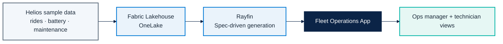

# Micro Hack 1 — Business Apps Setup (Trainer Guide)

Track: **End-customer Apps (Rayfin)**  
Scenario: **Helios Mobility** (fictional final customer)

---

## 1) Architecture to prepare before the day



---

## 2) Prerequisites checklist (must be true before 09:00)

### Platform
- [ ] Fabric capacity available and assigned to workshop workspace.
- [ ] Workspace created: `helios-microhack`.
- [ ] Rayfin available and validated in this workspace.
- [ ] All participant accounts can sign in and open the workspace.

### Data foundation
- [ ] Lakehouse created: `HeliosLake`.
- [ ] Four datasets loaded as tables:
  - [ ] `scooters`
  - [ ] `rides`
  - [ ] `battery`
  - [ ] `maintenance`
- [ ] One quick data quality check done (sample rows + types).

### Delivery readiness
- [ ] Demo path tested end-to-end once by trainer.
- [ ] Backup account + backup browser session ready.
- [ ] Printed / shared workbook link ready for teams.

---

## 3) Setup procedure (step-by-step)

1. **Create workspace** and assign Fabric capacity.
2. **Create Lakehouse** (`HeliosLake`).
3. **Upload files** and load to tables.
4. **Grant roles**:
   - Trainer: Admin
   - Coaches: Member
   - Participants: Contributor
5. **Launch Rayfin** and verify it can read target tables.
6. **Run smoke demo**:
   - Create minimal spec
   - Generate app
   - Open app and list scooters

---

## 3.1) Detailed trainer runbook (recommended)

| Time | Owner | Action | Done when |
|---|---|---|---|
| D-1 (morning) | Trainer | Create workspace + capacity binding | Workspace opens for all trainer accounts |
| D-1 (morning) | Data coach | Create `HeliosLake` and load 4 datasets | 4 tables visible in Lakehouse |
| D-1 (afternoon) | Trainer | Validate Rayfin access in workspace | Rayfin opens without permission errors |
| D-1 (afternoon) | Trainer | Run full smoke demo once | App generated and opens with data |
| D-day 08:30 | Trainer | Recheck access for all participant accounts | No sign-in failures |
| D-day 08:45 | Data coach | Recheck table row counts | Non-zero rows in core tables |

### Data sanity checks before participants arrive

- [ ] At least one city has scooters in `needs_attention` state.
- [ ] At least one scooter has low battery (< 20%).
- [ ] At least one maintenance job is open.

This guarantees the demo flow is meaningful (detect -> assign -> resolve).

---

## 4) Trainer solution path (to orient trainees)

> This section is the "answer key" for facilitators.

### Recommended minimum solution
- App name: `Helios Fleet Ops`.
- Main screens:
  - `Fleet List` (status + battery + city)
  - `Scooter Detail`
  - `Maintenance Queue`
- Required actions:
  - Filter by city
  - Filter "needs attention"
  - Assign maintenance task
- Role split:
  - Manager: full visibility
  - Technician: assigned jobs only

### Suggested spec prompt (starter)
```text
Build a Fleet Operations app for Helios Mobility.
Use scooters, battery and maintenance tables from HeliosLake.
Show scooter status by city, highlight units needing attention,
and allow managers to assign maintenance jobs to technicians.
```

### Coaching cues during the hack
- If teams overbuild: bring them back to one user story and one flow.
- If teams block on data: enforce simple table joins first.
- If teams diverge: ask "what will your 5-minute demo prove?"

---

## 5) Troubleshooting quick map

| Symptom | Likely cause | Fast fix |
|---|---|---|
| App generation fails | Wrong workspace/capacity binding | Rebind workspace to active capacity |
| Tables not visible in app | Wrong Lakehouse or table names | Standardize naming and refresh metadata |
| Participants blocked at login | Missing permissions | Re-apply Contributor role in workspace |
