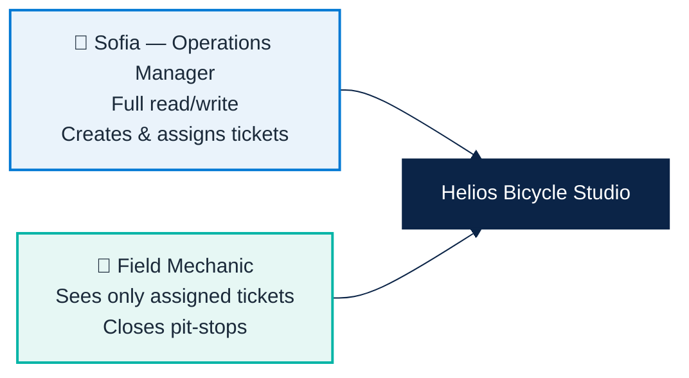
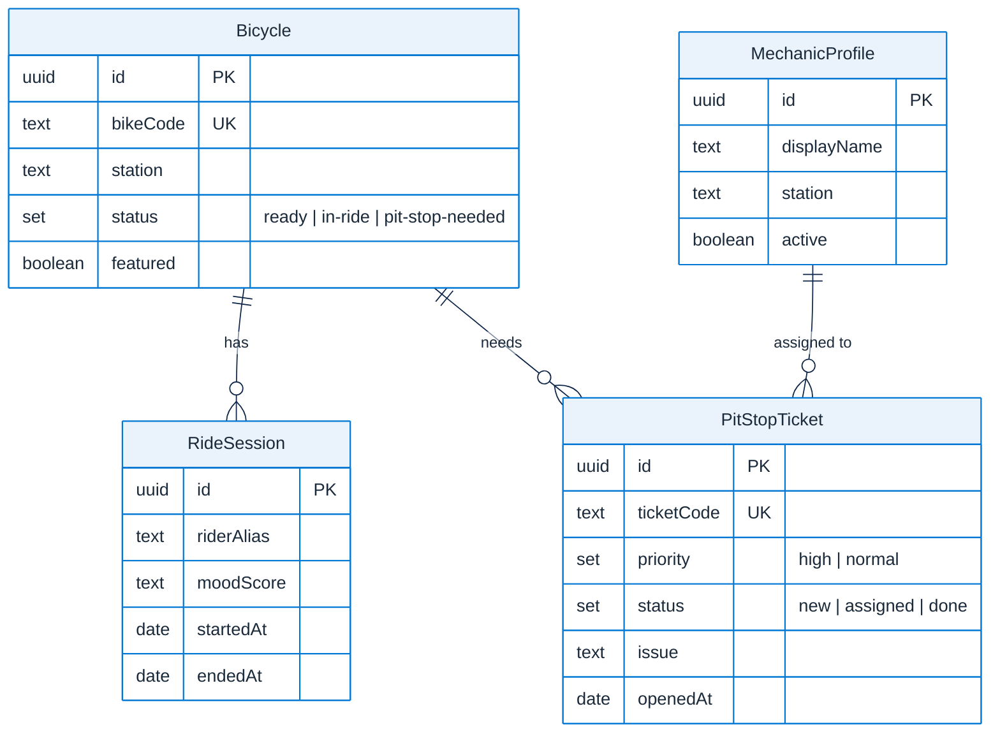

```mermaid
%%{init: {'theme':'base','themeVariables':{
  'primaryColor':'#EAF3FB',
  'primaryTextColor':'#1B2A3A',
  'primaryBorderColor':'#0078D4',
  'lineColor':'#0B2447',
  'secondaryColor':'#E6F7F4'
}}}%%
flowchart LR
    D["Helios Bicycle data<br/>Bikes + Ride sessions + Pit-stop tickets"] --> M["Rayfin data model<br/>src/apprayfin/rayfin/data"]
    M --> S["Business services<br/>health + assignment + KPI"]
    S --> U["Rayfin-generated app UX<br/>Bicycle board · Pit-stop queue · Ride mood"]
    U --> K["Advisory KPI output<br/>MSX opportunity pipeline"]
    classDef data fill:#F3F7FB,stroke:#5B6B7B,color:#1B2A3A,stroke-width:2px;
    classDef model fill:#EAF3FB,stroke:#0078D4,color:#1B2A3A,stroke-width:2px;
    classDef service fill:#0B2447,stroke:#0B2447,color:#FFFFFF,stroke-width:2px;
    classDef outcome fill:#E6F7F4,stroke:#00B4A6,color:#1B2A3A,stroke-width:2px;
    class D data;
    class M model;
    class S,U service;
    class K outcome;
```

# Micro Hack 1 — Business Apps Solution (Helios Bicycle)

Reference implementation for the **Business Apps (Rayfin)** micro-hack, scenario 1.
This is the trainer-grade solution aligned with:

- [`docs/microhack-1-business-apps-setup.md`](microhack-1-business-apps-setup.md)
- [`docs/microhack-1-business-apps-workbook.md`](microhack-1-business-apps-workbook.md)
- [`src/apprayfin/`](../src/apprayfin)

> The screenshots in section 6 are generated from the **real business logic and seed
> data** of this kit — not static mockups. See section 8 to regenerate them.

---

## 1) The business app (app métier)

**App name:** `Helios Bicycle Studio`

**Business context.** Helios Bicycle runs a fleet of shared city bikes across several
EMEA stations (Amsterdam, Brussels, Madrid). Station teams currently juggle bike
readiness, repairs and rider feedback across spreadsheets and chat. They want **one
simple, fun operations app** to run the daily routine.

**One-liner.** *"See every bike, fix the right one first, keep riders smiling."*

### What the app delivers

| # | Capability | Business value |
|---|---|---|
| 1 | **Bicycle Board** — readiness by station with a health score | Spot bikes to pull off the street in seconds |
| 2 | **Pit-Stop Queue** — quick tickets auto-assigned to mechanics | Repairs reach the right person, fast |
| 3 | **Ride Mood** — rider satisfaction signal per bike | Catch quality issues before riders complain |
| 4 | **Business KPI** — workshop → PoC → opportunity funnel | Advisory teams see pipeline impact (MSX/ACR view) |

---

## 2) Personas & roles



| Role | Can see | Can do |
|---|---|---|
| **Operations Manager** | All bikes, all tickets, all KPIs | Create tickets, assign mechanics, manage fleet |
| **Mechanic** | Only tickets assigned to them | Update / close their assigned pit-stops |

### User stories

- *As an Operations Manager, I filter bikes by station so I act on the busiest hub first.*
- *As an Operations Manager, I open and assign a pit-stop ticket in fewer than 3 clicks.*
- *As a Mechanic, I see only my assigned tickets so I stay focused on the field.*
- *As an Operations Manager, I watch rider mood so I detect a bad bike before riders churn.*

---

## 3) Data model



Source of truth: [`src/apprayfin/rayfin/data/`](../src/apprayfin/rayfin/data).

---

## 4) Business rules (the trainer answer key)

These are the exact rules implemented in `src/apprayfin/src/services/`.

### 4.1 Bike health score — `bike-health.ts`

| Signal | Effect on score |
|---|---|
| Status `ready` | base **90** |
| Status `in-ride` | base **75** |
| Status `pit-stop-needed` | base **40** |
| Mood ≥ 4.5 | **+8** ("Riders love this bike") |
| Mood < 3.0 | **−15** ("Low rider mood score") |

Resulting tag: **★ Star** if score ≥ 92 · **Good** if 65–91 · **⚠ Watch** if < 65.

### 4.2 Pit-stop assignment — `pit-stop-assignment.ts`

Tickets are processed **high priority first**, then each is given to the mechanic with
the best fit score:

```
fit = priorityWeight(high=100, normal=60)
    + 25 if mechanic.station == ticket.station
    − 10 × mechanic.activeTicketCount
inactive mechanics are excluded
```

### 4.3 Business KPI — `business-kpi.ts`

```
poCRate          = workshopsConvertedToPoC / workshopsDelivered
opportunityRate  = poCsConvertedToOpportunity / workshopsConvertedToPoC
projected (next quarter) = round(workshopsDelivered × poCRate × opportunityRate)
```

Division-by-zero is guarded (returns `0`).

---

## 5) End-to-end solution map



---

## 6) App screenshots (generated from real code)

### 6.1 Bicycle Board — Operations Manager

The board ranks readiness per station. `HB-AMS-014` (mood 4.7, ready) is a **★ Star
bike** with a health score of 98; `HB-AMS-001` (pit-stop needed, mood 2.8) drops to a
**⚠ Watch** at 25.


### 6.2 Pit-Stop Queue — auto-assignment

The two `high` tickets are processed first, then the `normal` one. Each ticket lands on
the **same-station mechanic** because station match outweighs their current load.


### 6.3 Ride Mood & Business KPI

Average rider mood is **3.7 / 5**, **2** bikes need a pit-stop, and the advisory funnel
(8 workshops → 50% PoC → 75% opportunity) projects **3 opportunities** next quarter.


---

## 7) What is coded in `src/apprayfin`

| Area | Files | Purpose |
|---|---|---|
| Rayfin model | `rayfin/data/*.ts` | Canonical entities and roles for bicycle operations |
| Rayfin service config | `rayfin/rayfin.yml` | Auth/data/storage/static hosting configuration |
| Business logic | `src/services/*.ts` | Bike health scoring, mechanic assignment, KPI projection |
| Scenario seed | `src/seed/helios-demo-seed.ts` | Consistent sample payload for demos and coaching |
| Generation spec | `src/specs/helios-bicycle-app-spec.md` | Prompt-ready application specification for Rayfin |
| Demo & screenshots | `demo/` | Runs the services and produces the screens above |

---

## 8) Audit & regenerate the screenshots

The screens are reproducible from the real services and seed data:

```bash
cd src/apprayfin
npm install
npm run demo     # 1) audit business logic  2) build HTML  3) capture PNGs
```

`npm run audit` runs assertion checks on every service (health scoring, assignment,
KPI maths) and exits non-zero on any regression. See
[`src/apprayfin/demo/README.md`](../src/apprayfin/demo/README.md) for details.

Use this document during the afternoon sprint to keep teams aligned on scope, business
rules and the expected output.
