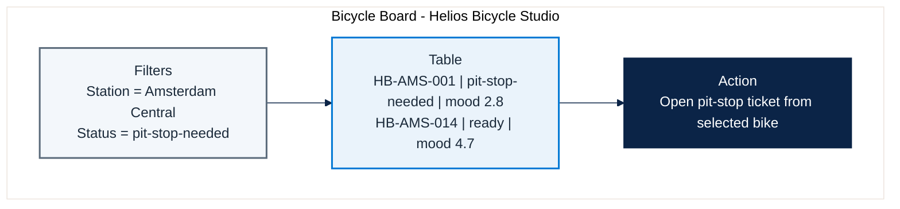
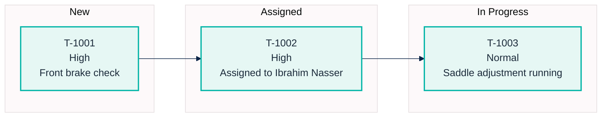
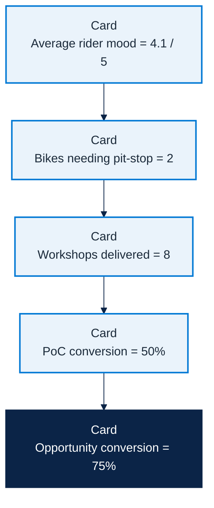

# Micro Hack 1 - Business Apps Solution (Helios Bicycle)

Reference implementation for the **Business Apps (Rayfin)** micro-hack scenario 1.
This is the trainer-grade solution aligned with:

- `docs/microhack-1-business-apps-setup.md`
- `docs/microhack-1-business-apps-workbook.md`
- `src/apprayfin/`

---

## 1) App metier definition

**App name:** `Helios Bicycle Studio`  
**Business context:** Helios Bicycle operates city bike stations and wants one app to run
daily operations with a light and fun experience.

### What the app does

1. Shows bicycle readiness by station.
2. Opens and assigns quick pit-stop tickets.
3. Tracks rider mood to detect quality issues early.
4. Surfaces simple business KPIs (workshops -> PoC -> opportunities).

---

## 2) End-to-end solution map

```mermaid
%%{init: {'theme':'base','themeVariables':{
  'primaryColor':'#EAF3FB',
  'primaryTextColor':'#1B2A3A',
  'primaryBorderColor':'#0078D4',
  'lineColor':'#0B2447',
  'secondaryColor':'#E6F7F4'
}}}%%
flowchart LR
    D["Helios Bicycle data<br/>Bikes + Ride sessions + Pit-stop tickets"] --> M["Rayfin data model<br/>src/apprayfin/rayfin/data"]
    M --> S["Business services<br/>health + assignment + KPI"]
    S --> U["Rayfin-generated app UX<br/>Bicycle board · Pit-stop queue · Ride mood"]
    U --> K["Advisory KPI output<br/>MSX opportunity pipeline"]
    classDef data fill:#F3F7FB,stroke:#5B6B7B,color:#1B2A3A,stroke-width:2px;
    classDef model fill:#EAF3FB,stroke:#0078D4,color:#1B2A3A,stroke-width:2px;
    classDef service fill:#0B2447,stroke:#0B2447,color:#FFFFFF,stroke-width:2px;
    classDef outcome fill:#E6F7F4,stroke:#00B4A6,color:#1B2A3A,stroke-width:2px;
    class D data;
    class M model;
    class S,U service;
    class K outcome;
```

---

## 3) What is coded in `src/apprayfin`

| Area | Files | Purpose |
|---|---|---|
| Rayfin model | `rayfin/data/*.ts` | Canonical entities and roles for bicycle operations |
| Rayfin service config | `rayfin/rayfin.yml` | Auth/data/storage/static hosting configuration |
| Business logic | `src/services/*.ts` | Bike health scoring, mechanic assignment, KPI projection |
| Scenario seed | `src/seed/helios-demo-seed.ts` | Consistent sample payload for demos and coaching |
| Generation spec | `src/specs/helios-bicycle-app-spec.md` | Prompt-ready application specification for Rayfin |

---

## 4) Simulated screenshots (graphical mock captures)

### 4.1 Bicycle Board screen (manager view)

### 4.2 Pit-Stop Queue screen (dispatch view)

### 4.3 Ride Mood + KPI screen (business view)

---

## 5) Trainer answer key linkage

These files are the concrete implementation references used during facilitation:

1. `src/apprayfin/src/services/bike-health.ts` -> how bike health and mood signals are scored.
2. `src/apprayfin/src/services/pit-stop-assignment.ts` -> how pit-stop tickets are assigned.
3. `src/apprayfin/src/services/business-kpi.ts` -> how advisory KPI projections are computed.
4. `src/apprayfin/src/specs/helios-bicycle-app-spec.md` -> what participants should target in Rayfin.

Use this document during the afternoon sprint to keep teams aligned on scope and expected output.
