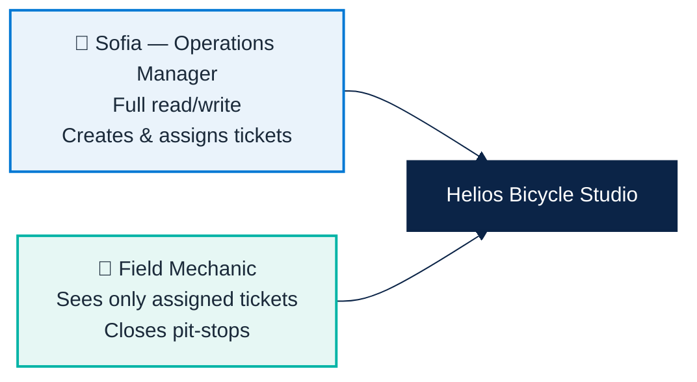
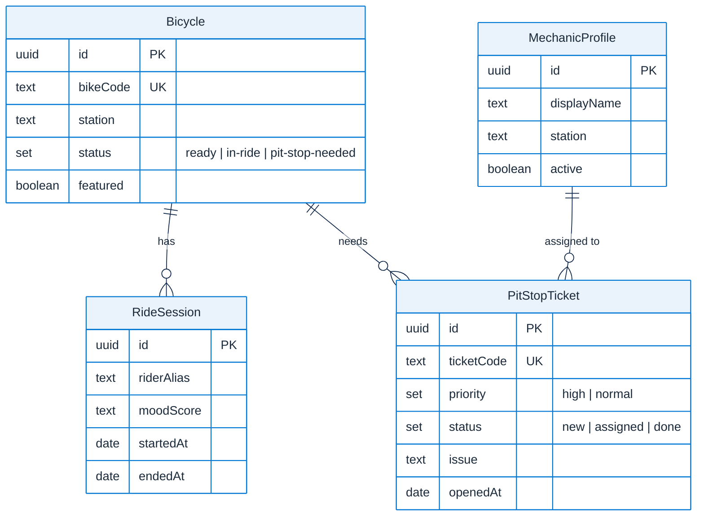
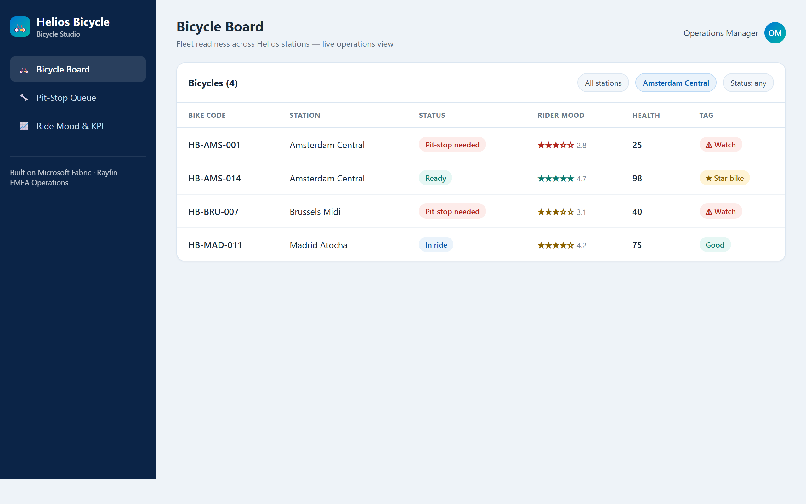
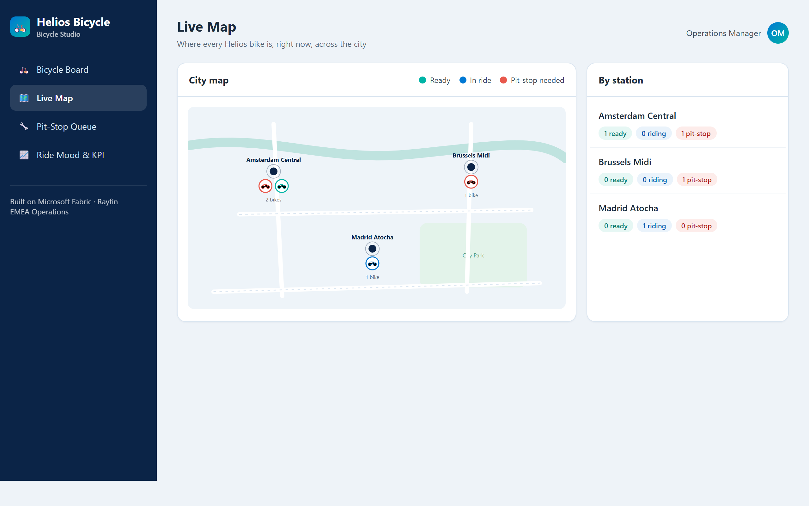
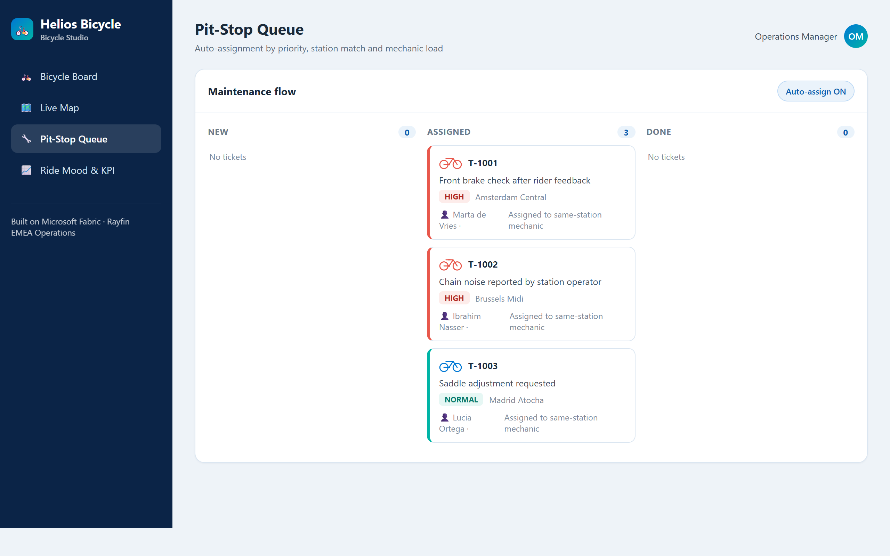
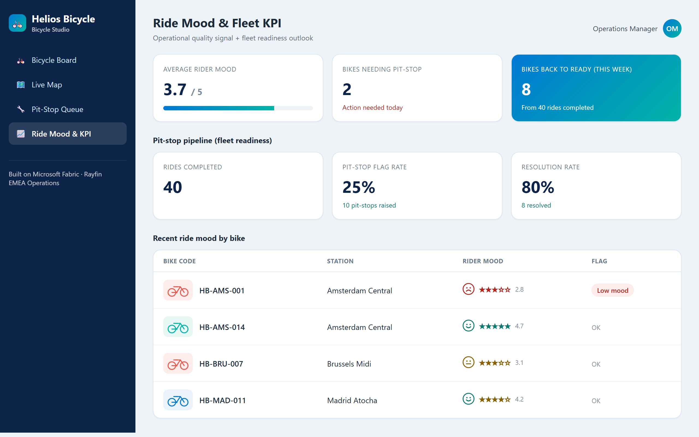

# Micro Hack 1 — Business Apps Solution (Helios Bicycle)

Reference implementation for the **Business Apps (Rayfin)** micro-hack, scenario 1.
This is the **complete reference example proposed as the solution**. Trainees build
**their own** variant of the *same* scenario, guided by the prompts in section 5 and in
the [participant workbook](microhack-1-business-apps-workbook.md).

Aligned with:

- [`docs/microhack-1-business-apps-setup.md`](microhack-1-business-apps-setup.md)
- [`docs/microhack-1-business-apps-workbook.md`](microhack-1-business-apps-workbook.md)
- [`src/apprayfin/`](../src/apprayfin)

> The screenshots in section 7 are generated from the **real business logic and seed
> data** of this kit — not static mockups. See section 9 to regenerate them.

---

## 1) The business app (app métier)

**App name:** `Helios Bicycle Studio`

**Business context.** Helios Bicycle runs a fleet of shared city bikes across several
EMEA stations (Amsterdam, Brussels, Madrid). Station teams currently juggle bike
readiness, repairs and rider feedback across spreadsheets and chat. They want **one
simple, fun operations app** to run the daily routine.

**One-liner.** *"See every bike, fix the right one first, keep riders smiling."*

### What the app delivers

| # | Capability | Business value |
|---|---|---|
| 1 | **Bicycle Board** — readiness by station with a health score | Spot bikes to pull off the street in seconds |
| 2 | **Live Map** — every bike on a city map, colored by status | See the whole city fleet at a glance |
| 3 | **Pit-Stop Queue** — quick tickets auto-assigned to mechanics | Repairs reach the right person, fast |
| 4 | **Ride Mood** — rider satisfaction signal per bike | Catch quality issues before riders complain |
| 5 | **Fleet KPI** — pit-stop pipeline (rides → raised → resolved) | Ops teams see fleet readiness and repair throughput |

---

## 2) Personas & roles



| Role | Can see | Can do |
|---|---|---|
| **Operations Manager** | All bikes, all tickets, all KPIs | Create tickets, assign mechanics, manage fleet |
| **Mechanic** | Only tickets assigned to them | Update / close their assigned pit-stops |

### User stories

- *As an Operations Manager, I filter bikes by station so I act on the busiest hub first.*
- *As an Operations Manager, I open and assign a pit-stop ticket in fewer than 3 clicks.*
- *As a Mechanic, I see only my assigned tickets so I stay focused on the field.*
- *As an Operations Manager, I watch rider mood so I detect a bad bike before riders churn.*

---

## 3) Data model



Source of truth: [`src/apprayfin/rayfin/data/`](../src/apprayfin/rayfin/data).

---

## 4) Business rules (the trainer answer key)

These are the exact rules implemented in `src/apprayfin/src/services/`.

### 4.1 Bike health score — `bike-health.ts`

| Signal | Effect on score |
|---|---|
| Status `ready` | base **90** |
| Status `in-ride` | base **75** |
| Status `pit-stop-needed` | base **40** |
| Mood ≥ 4.5 | **+8** ("Riders love this bike") |
| Mood < 3.0 | **−15** ("Low rider mood score") |

Resulting tag: **★ Star** if score ≥ 92 · **Good** if 65–91 · **⚠ Watch** if < 65.

### 4.2 Pit-stop assignment — `pit-stop-assignment.ts`

Tickets are processed **high priority first**, then each is given to the mechanic with
the best fit score:

```
fit = priorityWeight(high=100, normal=60)
    + 25 if mechanic.station == ticket.station
    − 10 × mechanic.activeTicketCount
inactive mechanics are excluded
```

### 4.3 Fleet KPI — `business-kpi.ts`

```
flagRate         = pitStopsRaised / ridesCompleted
resolveRate      = pitStopsResolved / pitStopsRaised
bikesBackToReady = round(ridesCompleted × flagRate × resolveRate)
```

Division-by-zero is guarded (returns `0`).

---

## 5) How the app is built in Rayfin (step by step)

[Rayfin](https://github.com/microsoft/rayfin) is a fully managed **Backend-as-a-Service
on Microsoft Fabric**. You **declare your data model in TypeScript** and Rayfin
**provisions and manages the database, auth, data APIs, storage and hosting** for you.

```mermaid
%%{init: {'theme':'base','themeVariables':{
  'primaryColor':'#EAF3FB','primaryTextColor':'#1B2A3A',
  'primaryBorderColor':'#0078D4','lineColor':'#0B2447','secondaryColor':'#E6F7F4'
}}}%%
flowchart LR
    A["1 · Scaffold<br/>npm create rayfin"] --> B["2 · Declare data model<br/>rayfin/data/*.ts"]
    B --> C["3 · Rayfin provisions<br/>the Fabric database"]
    C --> D["4 · Build the UI by prompt<br/>Copilot + Rayfin agent"]
    D --> E["5 · Run<br/>npm run dev → Fabric"]
    classDef a fill:#EAF3FB,stroke:#0078D4,color:#1B2A3A,stroke-width:2px;
    classDef b fill:#E6F7F4,stroke:#00B4A6,color:#1B2A3A,stroke-width:2px;
    classDef c fill:#0B2447,stroke:#0B2447,color:#FFFFFF,stroke-width:2px;
    class A,B a;
    class C,E b;
    class D c;
```



### 5.1 Scaffold the project

> **No repo to clone** — Rayfin scaffolds the project for you. The participant
> [workbook](microhack-1-business-apps-workbook.md#part-b--build-it-step-by-step) has the full
> step-by-step; the canonical implementation is in [`src/apprayfin/`](../src/apprayfin).
>
> **Reference path (same as the workbook):** 1) create the project · 2) run the empty app
> (`npm run dev`) to confirm it works · 3) declare the data model · 4) Bicycle Board ·
> 5) Pit-Stop Queue · 6) Ride Mood & KPI · 7) Live Map · 8) polish (bike icons + roles).

```bash
npm create @microsoft/rayfin@latest -- --template dataapp
```

This creates a runnable Rayfin project (data models, auth, APIs, hosting). `dataapp` is the
recommended built-in template (others: `blankapp`, `gettingstartedauth`, `todoapp`).

### 5.2 The data model **is** the database

Yes — the data model lives in the **database provisioned for the Rayfin project**. Each
class in [`rayfin/data/`](../src/apprayfin/rayfin/data) is a TypeScript entity decorated
with field types; Rayfin reads them and **creates and migrates the matching tables**
(SQL, `dialect: mssql` in [`rayfin.yml`](../src/apprayfin/rayfin/rayfin.yml)). You never
write DDL by hand.

```ts
// src/apprayfin/rayfin/data/Bicycle.ts
@entity()
@role('authenticated', '*')
export class Bicycle {
  @uuid() id!: string;
  @text({ unique: true }) bikeCode!: string;
  @text() station!: string;
  @set('ready', 'in-ride', 'pit-stop-needed') status!: BicycleStatus;
  @boolean({ default: false }) featured!: boolean;
}
```

Apply / refresh the schema:

```bash
npm run dev          # deploy to Fabric (rayfin up) → provisions the DB, then runs Vite
# or, full local:
npm run dev:local    # runs the Rayfin backend in Docker
npm run rayfin:db    # apply database migrations locally
```

### 5.3 Build the UI **from a prompt**

Rayfin templates ship **agent context** (`AGENTS.md`, `.agents/skills/rayfin/SKILL.md`
and a `rayfin` MCP server). With **GitHub Copilot** pointed at the project, you describe
the app in natural language and the agent generates the React screens against the typed
Rayfin client — while Rayfin keeps managing the backend and database.

**Master prompt — give this to Copilot in the scaffolded project:**

```text
Build "Helios Bicycle Studio", a fun bike-operations app on Rayfin.

Data model:
- Bicycle(bikeCode, station, status[ready|in-ride|pit-stop-needed], featured)
- RideSession(bicycle, riderAlias, moodScore, startedAt, endedAt)
- PitStopTicket(ticketCode, bicycle, station, priority[high|normal],
                status[new|assigned|done], issue, openedAt, assignedMechanic)
- MechanicProfile(displayName, station, active)

Screens:
1) Bicycle Board — table grouped by station with a status pill, rider mood (stars),
   a health score and a tag (Star / Good / Watch). Filters: station, status.
2) Pit-Stop Queue — kanban (new / assigned / done). Create a ticket from a bike and
   assign a mechanic in one click (prefer same-station, least-loaded mechanic).
3) Ride Mood & KPI — cards for average rider mood, bikes needing a pit-stop, and a
   pit-stop pipeline (rides → pit-stops raised → resolved) with a fleet-readiness score.

Roles: Operations Manager has full access; Mechanic sees only assigned tickets.
Style: clean and friendly, Microsoft Fluent, blue #0078d4 + teal #00b4a6,
with a small colored bike icon on each row.
```

Then refine screen by screen using the prompts in the
[participant workbook](microhack-1-business-apps-workbook.md#part-b--build-it-step-by-step).

### 5.4 Commands & who does what

**The prompt + Copilot do not deploy.** Copilot writes the TypeScript (data model + screens);
**you** run the Rayfin CLI to deploy and provision the database.

| Command | What it does |
|:-------------------------------|:-----------------------------------------------------|
| `npm run dev` | Dev loop: deploys (`rayfin up`) + serves the app — use most of the time |
| `npx rayfin up` | Full deploy: creates the Fabric app item, applies the DB schema from the data model, builds & uploads the UI |
| `npx rayfin up db apply` | Push only data-model/schema changes (`--force` if destructive) |
| `npx rayfin up staticapp deploy` | Redeploy only the frontend |
| `npx rayfin up status` | Show the current deployment |
| `npx rayfin login --tenant <tenant-id>` | Re-authenticate on 401/403 (scope to your tenant) |

Only **Fabric brokered auth (Entra SSO)** works once deployed (email/password is local-dev
only). Reference: [Deploy a Fabric App](https://learn.microsoft.com/en-us/fabric/apps/deploy-app).

> **Trainer note.** This kit is the *reference answer*. Teams are free to design a
> different layout, but they should target the **same scenario, data model and roles** so
> coaching, the seed data and the KPI story stay consistent.

---

## 6) End-to-end solution map

```mermaid
%%{init: {'theme':'base','themeVariables':{
  'primaryColor':'#EAF3FB','primaryTextColor':'#1B2A3A',
  'primaryBorderColor':'#0078D4','lineColor':'#0B2447','secondaryColor':'#E6F7F4'
}}}%%
flowchart LR
    D["Helios Bicycle data<br/>Bikes + Ride sessions + Pit-stop tickets"] --> M["Rayfin data model<br/>src/apprayfin/rayfin/data"]
    M --> S["Business services<br/>health + assignment + KPI"]
    S --> U["Rayfin-generated app UX<br/>Bicycle board · Pit-stop queue · Ride mood"]
    U --> K["Fleet readiness KPI<br/>pit-stop pipeline"]
    classDef data fill:#F3F7FB,stroke:#5B6B7B,color:#1B2A3A,stroke-width:2px;
    classDef model fill:#EAF3FB,stroke:#0078D4,color:#1B2A3A,stroke-width:2px;
    classDef service fill:#0B2447,stroke:#0B2447,color:#FFFFFF,stroke-width:2px;
    classDef outcome fill:#E6F7F4,stroke:#00B4A6,color:#1B2A3A,stroke-width:2px;
    class D data;
    class M model;
    class S,U service;
    class K outcome;
```



---

## 7) App screenshots (generated from real code)

### 7.1 Bicycle Board — Operations Manager

The board ranks readiness per station. `HB-AMS-014` (mood 4.7, ready) is a **★ Star
bike** with a health score of 98; `HB-AMS-001` (pit-stop needed, mood 2.8) drops to a
**⚠ Watch** at 25.



### 7.2 Live Map — bikes across the city

A stylized city map shows every bike at its station, colored by status (teal = ready,
blue = in ride, red = pit-stop needed), with a per-station summary on the right.



### 7.3 Pit-Stop Queue — auto-assignment

The two `high` tickets are processed first, then the `normal` one. Each ticket lands on
the **same-station mechanic** because station match outweighs their current load.



### 7.4 Ride Mood & Fleet KPI

Average rider mood is **3.7 / 5**, **2** bikes need a pit-stop, and the pit-stop pipeline
(40 rides → 25% flag rate → 80% resolution) puts **8 bikes back to ready** this week.



---

## 8) What is coded in `src/apprayfin`

| Area | Files | Purpose |
|---|---|---|
| Rayfin model | `rayfin/data/*.ts` | Canonical entities and roles for bicycle operations |
| Rayfin service config | `rayfin/rayfin.yml` | Auth/data/storage/static hosting configuration |
| Business logic | `src/services/*.ts` | Bike health scoring, mechanic assignment, KPI projection |
| Scenario seed | `src/seed/helios-demo-seed.ts` | Consistent sample payload for demos and coaching |
| Generation spec | `src/specs/helios-bicycle-app-spec.md` | Prompt-ready application specification for Rayfin |
| Demo & screenshots | `demo/` | Runs the services and produces the screens above |

---

## 9) Audit & regenerate the screenshots

The screens are reproducible from the real services and seed data:

```bash
cd src/apprayfin
npm install
npm run demo     # 1) audit business logic  2) build HTML  3) capture PNGs
```

`npm run audit` runs assertion checks on every service (health scoring, assignment,
KPI maths) and exits non-zero on any regression. See
[`src/apprayfin/demo/README.md`](../src/apprayfin/demo/README.md) for details.

Use this document during the afternoon sprint to keep teams aligned on scope, business
rules and the expected output.
