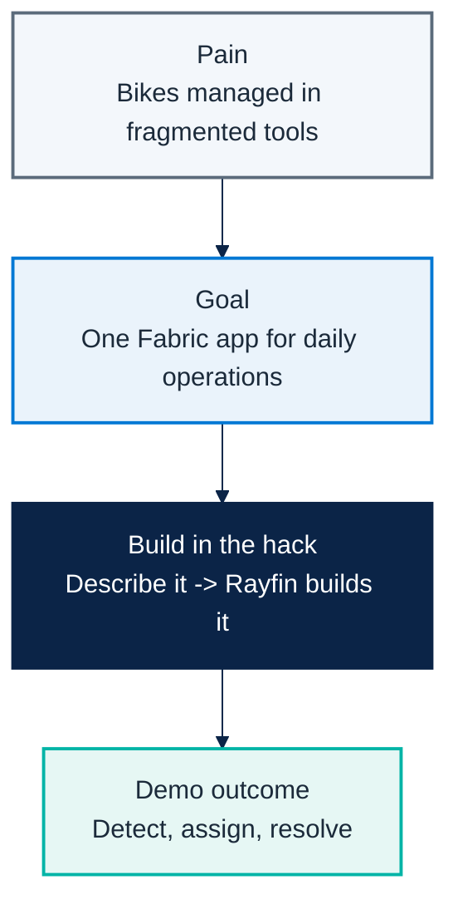

# Micro Hack 1 — Business Apps Workbook (Participants)

Track: **End-customer Apps (Rayfin)**
Scenario: **Helios Bicycle** (fictional final customer)

> 📄 Print-ready PDF: [`microhack-1-business-apps-workbook.pdf`](microhack-1-business-apps-workbook.pdf)

This is a **didactic** micro-hack. You don't need prior Rayfin experience — every step
explains **what** you do, **why**, and **what you should see**. Follow them in order.

---

## 🗓️ Day agenda (1 day)

**Morning — presentations & demos. Afternoon — hands-on hack.** This is a **standalone
one-day micro-hack for the Business Apps (Rayfin) track**.

| Time | Session |
|:-----|:-----------------------------------------------------------------|
| 09:00 | Welcome & motion overview — the Fabric apps motion for EMEA |
| 09:30 | Microsoft Fabric foundations — OneLake, capacity, workspaces |
| 10:00 | Rayfin foundations — spec-driven apps, data model = database |
| 10:30 | Break |
| 10:45 | **Demo · Helios Bicycle Studio** — the app you'll build today |
| 11:15 | The hack brief, teams & environment check |
| 12:00 | Lunch |
| 13:30 | **Hack · Sprint 1** — build the core app (steps 1–5) |
| 15:30 | Break |
| 15:45 | **Hack · Sprint 2** — extend, polish & deploy (steps 6–9) |
| 16:45 | Team demos (5 min each) |
| 17:00 | Wrap-up, KPIs & next steps |

---

# Part A — Understand

## 1) The scenario in plain words

**Helios Bicycle** runs shared city bikes across several stations. Today the station teams
track bikes, repairs and rider feedback in spreadsheets and chat — slow and error-prone.
Your job in the afternoon: build **one simple app**, *Helios Bicycle Studio*, that lets a
manager see every bike, fix the right one first, and keep riders happy.



## 2) What is Rayfin? (60-second primer)

**Rayfin** is a *Backend-as-a-Service on Microsoft Fabric*. In plain terms:

- You **describe your data** (e.g. a `Bicycle` has a code, a station, a status). Rayfin then
  **creates and manages the database** for you in Fabric — no SQL, no servers to run.
- You **describe your screens in natural language** (with GitHub Copilot). Rayfin generates
  the app UI against that data.
- So building an app becomes: *declare the data → describe the screens → run*.

Key idea to remember: **your data model = your database**. When you declare a `Bicycle`
type, Rayfin makes the matching table automatically.

## 3) The result you are aiming for

By the end of the afternoon your app should look like this — a **Bicycle Board** and a
**Live Map** of the fleet:


---

## 🧰 Step 0 — Prerequisites & environment setup (do this first)

Modeled on Microsoft's
[Build LAB514](https://github.com/microsoft/Build26-LAB514-ship-ai-apps-fast-with-a-managed-backend-in-microsoft-fabric)
setup. On a lab VM most tools are pre-installed.

**Tools you need:**

- Node.js 20+ (24 recommended) and npm
- Visual Studio Code
- **GitHub Copilot CLI** (the `copilot` terminal agent)

On Windows, install Node.js LTS, PowerShell 7 and GitHub Copilot CLI:

```powershell
winget install OpenJS.NodeJS.LTS
winget install --id Microsoft.PowerShell --source winget
winget install Github.copilot
```

**Sign in (two accounts):**

1. **GitHub Copilot** — in a terminal run `copilot`, then `/login`, choose **GitHub.com**, finish
   the browser sign-in, confirm *"Signed in successfully"*, then `/exit`.
2. **Microsoft Fabric** — open `https://app.fabric.microsoft.com` and sign in. *(If it shows
   "Power BI" bottom-left, switch it to "Fabric".)*

**Tenant settings (ask your Fabric Administrator to enable these first).** In
**⚙️ → Admin portal → Tenant settings**, search and enable both, clicking **Apply** each time:

- **"Users can create Fabric items"** — search *"Fabric items"* → enable → **Apply**.
- **"Users can discover and create org apps (preview)"** (Fabric Apps) — search *"org apps"* →
  enable → **Apply**.

> Without these two tenant settings, deploying a Rayfin app to Fabric fails. They are
> **tenant-admin** settings — a non-admin participant cannot turn them on themselves.

**Fabric workspace & capacity:** create (or use) a workspace assigned to a **Fabric capacity**
that supports these items — this is where your app deploys. A capacity-less (Pro-only) workspace
will not host the app.

**Verify your setup:**

```shell
node --version
npm --version
copilot --version
```

**First deploy uses `rayfin login` + `rayfin up`.** Once you have scaffolded the project
(Step 1), the **first time** you bring it up, run these two explicitly before relying on the
`npm run dev` loop — they authenticate you against Fabric (Entra) and create the app item:

```shell
npx rayfin login     # interactive Entra sign-in (also fixes later 401/403)
npx rayfin up        # first full deploy: creates the Fabric item + provisions the DB
```

> 🧭 **You must test from inside Fabric.** A Rayfin app is connected to a Fabric semantic model,
> so opening the raw app URL in a normal browser tab shows **"Can't open this app outside
> Fabric — Opening apps connected to semantic models outside of the Fabric portal is not
> supported at this time."** Always open and validate the app **from the Fabric portal**
> (`app.fabric.microsoft.com` → your workspace → the app item), not from the bare URL.

**✅ What you should see.** All three commands print a version, you're signed in to GitHub Copilot
and to Fabric (capacity-backed workspace, both tenant settings enabled), and `npx rayfin up`
prints a live Fabric app link.

---

# Part B — Build it step by step

> **How to work.** **There is no repository to clone** for this track — Rayfin scaffolds the
> whole project for you with one command (Step 1). After that you build the app
> **conversationally** with the **GitHub Copilot CLI** (`copilot` in your terminal): you give it
> a short prompt, it writes the code, and you check the result in the browser. Each step below =
> one action + **what you should see**.

### Who does what — Copilot vs. the Rayfin CLI (read once)

This is the key thing to understand: **the prompt + Copilot do NOT deploy anything by
themselves.**

- **GitHub Copilot** = writes/edits your TypeScript: the data model in `rayfin/data/` and the
  screens. It does **not** touch Fabric or your database.
- **The Rayfin CLI** = *you* run it. It deploys to Fabric, **provisions the database from your
  data model**, and hosts the app. `npm run dev` wraps this for the dev loop.

So the rhythm is: *ask Copilot to write code -> run a CLI command to deploy/provision -> look
at the app.*

| Command | What it does |
|:-------------------------------|:-----------------------------------------------------|
| `npm run dev` | Dev loop: deploys (`rayfin up`) + serves the app for fast iteration. **Use this most of the time.** |
| `npx rayfin up` | Full deploy to Fabric: creates the app item, applies the DB schema from your data model, builds & uploads the UI, prints the live URL. |
| `npx rayfin up db apply` | After you change `rayfin/data/`, push only the new schema (add `--force` if it warns about data loss). |
| `npx rayfin up staticapp deploy` | Redeploy only the frontend (faster). |
| `npx rayfin up status` | Show the current deployment. |
| `npx rayfin up --dry-run` | Preview a deploy without changing anything. |
| `npx rayfin login --tenant <tenant-id>` | Re-authenticate if you hit a 401/403 (scope to your Entra tenant). |

> **Auth note.** Email/password sign-in only works in local dev. Once deployed to Fabric, only
> **Fabric brokered auth (Entra SSO)** works — `rayfin.yml` must have `auth.fabric.enabled: true`.

### The build loop (what happens between prompts)

Every build step follows the same rhythm:

1. **You** give the GitHub Copilot CLI a short prompt.
2. **Copilot** writes/edits the code **and validates it for you** — it type-checks (`tsc`),
   lints (`eslint`), builds (`npm run build`) and runs the unit tests, fixing issues until green.
3. **You** run `npm run dev` to see the change in the browser (it re-deploys and re-provisions
   the database if the data model changed).
4. **You** sanity-check the screen, then move to the next prompt.

> If Copilot reports build/test errors it couldn't fix on its own, paste the error back to it —
> that's the normal loop. Don't move on while the build is red.

---

## Step 1 — Create the project (no clone needed)

**What you do.** Scaffold a Rayfin project. "Scaffold" means *generate a ready-to-run starter
project* — you do **not** clone any repo.

```bash
npm create @microsoft/rayfin@latest -- "MyRayfinApp"
cd MyRayfinApp
```

> **Choose the `Data` template** when prompted. It provides a Fabric-authenticated
> React + Vite app wired for Rayfin data — you add entities in `rayfin/data/`.

**Why.** Rayfin gives you a complete app skeleton (data layer + UI) so you start from
something that already runs.

**✅ What you should see.** A new project folder is created and dependencies install.

---

## Step 2 — Run the empty app first (your "it works" check)

**What you do.** Start the starter app **before changing anything** — exactly like a Hello
World, to confirm your environment and Fabric connection are healthy.

```bash
npx rayfin login --tenant <votre tenant>   # first time only (or on a 401/403) — interactive Entra sign-in
npx rayfin up --workspace "VOTRE NOM DE WORKSPACE"   # first full deploy: creates the Fabric item + provisions the DB
```

**Why.** The first `npx rayfin up` authenticates you and **creates the Fabric app item**, then
provisions your database from the data model in `rayfin/data/*.ts`. `npm run dev` wraps `rayfin up`
for the fast iteration loop, but running `login` + `up` once up front makes the first deploy
reliable. If the starter app opens, your whole chain works and you can safely start customizing.

**✅ What you should see.** `npx rayfin up` prints a **live Fabric app link**; open it **from the
Fabric portal** and the starter app loads, with the new app showing in your workspace.
**Don't go further until this works.**

> 🧭 **Open it from Fabric, not the bare URL.** If you paste the raw app URL into a normal browser
> tab you'll get *"Can't open this app outside Fabric — Opening apps connected to semantic models
> outside of the Fabric portal is not supported at this time."* That's expected — always validate
> from `app.fabric.microsoft.com` → your workspace → the app item.

---

## Step 3 — Declare the data model

**Before you begin.** In your terminal, move to the application directory and start GitHub
Copilot CLI:

```bash
cd MyRayfinApp
copilot
```

**What you do.** Tell Copilot the data your app is about. This defines the **database tables**.

```text
Build "Helios Bicycle Studio", a fun bike-operations app on Rayfin.
Data model:
- Bicycle(bikeCode, station, status[ready|in-ride|pit-stop-needed], featured)
- RideSession(bicycle, riderAlias, moodScore, startedAt, endedAt)
- PitStopTicket(ticketCode, bicycle, station, priority[high|normal],
                status[new|assigned|done], issue, openedAt, assignedMechanic)
- MechanicProfile(displayName, station, active)
Roles: Operations Manager has full access; Mechanic sees only assigned tickets.
Style: clean, friendly, Microsoft Fluent, blue #0078d4 + teal #00b4a6.
```

**Why.** These four types become four tables. `Bicycle.status` is a fixed list of values,
so the app can colour bikes by status later.

**✅ What you should see.** Copilot creates `rayfin/data/*.ts` — one `@entity()` class per type,
marked `@authenticated('*')`, with relationships (e.g. a `@one` link from `PitStopTicket` to
`Bicycle`, and an **optional/nullable** `assignedMechanic`) — exports them from `schema.ts`, and
enables the data service in `rayfin.yml` (`dialect: mssql`).

**Then — apply the schema.** Re-run `npm run dev` (or `npx rayfin up db apply`) so Rayfin
provisions the matching tables. The screens are still empty — that's expected.

> 👥 **Roles are app-level — important.** Rayfin's data layer only knows `authenticated` /
> `anonymous`; there are no per-row database roles. So the **Operations Manager vs Mechanic**
> split is enforced **in the app** (a role context + a header switcher; the Mechanic gets a
> focused "My Pit-Stops" worklist). When you ask Copilot for roles in Step 8, expect this
> app-layer logic — not database roles.

> 🗃️ **Load demo data — your DB starts empty.** Before the screens can show anything, add data.
> Ask Copilot for a **Manager-only "Load demo fleet" button** that writes real rows through the
> data API (no hardcoded display data), then click it once:
> ```text
> Add a Manager-only "Load demo fleet" button that seeds the database with a few bikes,
> mechanics, ride sessions and pit-stop tickets via the Rayfin data API (no hardcoded UI data).
> ```

> 🚀 **Now deploy & check it in Fabric.** Push this change live with **[Step 9](#step-9--go-live-deploy-to-fabric)** and open the app **from the Fabric portal**. Since the app is already deployed, do a **clean redeploy every time**: first run **[Annex A](#annex-a--redeploy-cleanly-after-deleting-the-rayfin-item-in-fabric)** (delete the item in Fabric → clear local state → `npx rayfin up`) so the next deploy doesn't fail with a **404**.

---

## Step 4 — Build the Bicycle Board (your first screen)

**What you do.** Ask for the main screen: the list of bikes a manager looks at every morning.

```text
Add a "Bicycle Board" screen: a table grouped by station showing a status pill,
rider mood as stars, a health score and a tag (Star / Good / Watch).
Add filters for station and status.
```

**Why.** This is the app's home base — *detect* which bikes need attention. The health
score/tag is computed from status + mood so the manager sees priorities at a glance.

**✅ What you should see.** A table of bikes by station with coloured status pills and a
tag. You can filter by station and status.


> 🚀 **Now deploy & check it in Fabric.** Push this change live with **[Step 9](#step-9--go-live-deploy-to-fabric)** and open the app **from the Fabric portal**. Since the app is already deployed, do a **clean redeploy every time**: first run **[Annex A](#annex-a--redeploy-cleanly-after-deleting-the-rayfin-item-in-fabric)** (delete the item in Fabric → clear local state → `npx rayfin up`) so the next deploy doesn't fail with a **404**.

---

## Step 5 — Build the Pit-Stop Queue (take action)

**What you do.** Add the screen where a manager turns a problem into an assigned repair.

```text
Add a "Pit-Stop Queue" screen as a kanban with columns new / assigned / done.
Let me create a ticket from a bike, and assign a mechanic in one click,
preferring the same-station and least-loaded mechanic.
```

**Why.** This is the *assign → resolve* half of the story. "One click" assignment keeps the
manager fast; preferring the same-station, least-busy mechanic is a simple, sensible rule.

**✅ What you should see.** A three-column board. Creating a ticket from a bike places a card
in **New**; assigning moves it to **Assigned** with the mechanic's name.


> 🚀 **Now deploy & check it in Fabric.** Push this change live with **[Step 9](#step-9--go-live-deploy-to-fabric)** and open the app **from the Fabric portal**. Since the app is already deployed, do a **clean redeploy every time**: first run **[Annex A](#annex-a--redeploy-cleanly-after-deleting-the-rayfin-item-in-fabric)** (delete the item in Fabric → clear local state → `npx rayfin up`) so the next deploy doesn't fail with a **404**.

> 🎯 **Milestone (Sprint 1):** Steps 1–5 give you a working app — detect a bike, open a
> ticket, assign it. If you reach here, you can already demo.

---

## Step 6 — Add the Ride Mood & KPI screen

**What you do.** Add a light analytics screen.

```text
Add a "Ride Mood & KPI" screen with cards for average rider mood,
number of bikes needing a pit-stop, and a pit-stop pipeline funnel
(rides completed -> pit-stops raised -> pit-stops resolved) with a
flag rate, a resolution rate, and the number of bikes back to ready.
```

**Why.** Rider mood is an early quality signal; the pit-stop pipeline cards turn raw
maintenance activity into a **fleet-readiness KPI** (how fast issues get bikes back on the road).

**✅ What you should see.** A row of KPI cards with the average mood, the count of bikes
needing a pit-stop, and the pit-stop pipeline percentages (flag rate, resolution rate, bikes back to ready).


> 🚀 **Now deploy & check it in Fabric.** Push this change live with **[Step 9](#step-9--go-live-deploy-to-fabric)** and open the app **from the Fabric portal**. Since the app is already deployed, do a **clean redeploy every time**: first run **[Annex A](#annex-a--redeploy-cleanly-after-deleting-the-rayfin-item-in-fabric)** (delete the item in Fabric → clear local state → `npx rayfin up`) so the next deploy doesn't fail with a **404**.

---

## Step 7 — Add the Live Map (make it shine)

**What you do.** Add a map view of the fleet.

```text
Add a "Live Map" screen: a stylized city map with one marker per bike colored by
status (teal = ready, blue = in ride, red = pit-stop needed), plus a per-station
summary panel.
```

**Why.** A map turns rows of data into an instantly readable picture — great for the demo
and close to how operations teams think about a city fleet.

**✅ What you should see.** A map with coloured bike markers and a side panel counting bikes
per station.


> 🚀 **Now deploy & check it in Fabric.** Push this change live with **[Step 9](#step-9--go-live-deploy-to-fabric)** and open the app **from the Fabric portal**. Since the app is already deployed, do a **clean redeploy every time**: first run **[Annex A](#annex-a--redeploy-cleanly-after-deleting-the-rayfin-item-in-fabric)** (delete the item in Fabric → clear local state → `npx rayfin up`) so the next deploy doesn't fail with a **404**.

---

## Step 8 — Polish (roles & visuals)

**What you do.** Tighten the experience. Pick what you have time for.

```text
Make the bike rows more visual: add a colored bike illustration whose color
reflects the status (teal = ready, blue = in ride, red = pit-stop needed).
```

```text
Enforce roles: a Mechanic user should only see pit-stop tickets assigned to them.
```

**Why.** Visual cues speed up reading; role rules make the app realistic for a real customer
rollout.

**✅ What you should see.** Coloured bike icons on each row, and a mechanic account that only
sees its own tickets.

> 🚀 **Now deploy & check it in Fabric.** Push this change live with **[Step 9](#step-9--go-live-deploy-to-fabric)** and open the app **from the Fabric portal**. Since the app is already deployed, do a **clean redeploy every time**: first run **[Annex A](#annex-a--redeploy-cleanly-after-deleting-the-rayfin-item-in-fabric)** (delete the item in Fabric → clear local state → `npx rayfin up`) so the next deploy doesn't fail with a **404**.

> 🎯 **Milestone (Sprint 2):** the app is graphical and role-aware — ready for the 5-minute demo.

---

## Step 9 — Go live (deploy to Fabric)

**What you do.** Ship the app so it runs embedded in the Fabric portal with a shareable URL.

```bash
npx rayfin login --tenant <your-tenant-id>   # interactive Entra sign-in, scoped to your tenant
npx rayfin up                                # deploys the static app + applies the schema migration
```

> Pass your **tenant ID** (a GUID, or your `contoso.onmicrosoft.com` domain) to `--tenant` so the
> sign-in targets the right Entra tenant — useful when your account belongs to several tenants.

**Why.** Browser validation in Fabric needs the portal embed (interactive Entra sign-in + a
workspace). `npx rayfin up` does the deploy **and** the database migration in one step, and
injects the runtime `VITE_*` env vars the client needs.

**✅ What you should see.** The CLI prints the **live app URL** and a Fabric portal link. Open it
**from the Fabric portal** (not the bare URL — see the note below), sign in, and your Helios
Bicycle Studio runs inside Fabric.

> 🧭 **Validate inside Fabric.** Opening the raw app URL outside the portal returns *"Can't open
> this app outside Fabric — Opening apps connected to semantic models outside of the Fabric portal
> is not supported at this time."* Use the **Fabric portal link** the CLI prints (or
> `app.fabric.microsoft.com` → your workspace → the app item).

> ⚠️ **Deployed already?** If you later delete or hand-edit the item in Fabric before redeploying,
> the next `npx rayfin up` will fail with a **404** — follow **[Annex A](#annex-a--redeploy-cleanly-after-deleting-the-rayfin-item-in-fabric)**.

> 🎯 **Milestone (ship):** the app is deployed and demoable from a real Fabric URL.

---

# Wrap-up

## Team framing (fill this in 2 minutes)

- Team name:
- Who is the primary user (manager or mechanic)?
- One sentence: what does your app make faster?

## Demo storyboard (5 minutes)

1. **Context** (30s): who is the user, what hurts today.
2. **Flow** (3m): detect on the Board → open a ticket → assign on the Queue → show the Map.
3. **Architecture** (45s): how the data and the app connect in Fabric (Rayfin provisioned it).
4. **Next step** (45s): what you'd add before a real rollout.

## Reflection

- What was the easiest part of describing the app to Rayfin?
- What did you have to clarify for Copilot to get it right?
- What metric would prove value in week 1 of production?

## Reference assets

- Reference solution code: `src/apprayfin/`
- Rayfin prompt baseline (canonical spec): `src/apprayfin/src/specs/helios-bicycle-app-spec.md`
- Trainer answer key + screenshots: `docs/microhack-1-business-apps-solution.md`

---

# Annex A — Redeploy cleanly after deleting the Rayfin item in Fabric

> Use this when you want to **re-demo the deployment from scratch** (e.g. for a new session), or
> when a previous `npx rayfin up` fails with a **404** because the deployed item no longer exists.

**Key fact.** The Rayfin CLI has **no command to delete a deployed item** (`rayfin connector remove`
exists but is unrelated). A clean teardown is done **in Fabric**, then you **clear the local state** —
and the **order matters** to avoid the 404.

## 🔑 The golden rule

A `rayfin up` 404 happens when the item was **deleted in Fabric but the local registry was kept**, so
`rayfin up` tries to reuse a **dead item**. Always tear down in this order:

> **1) Delete the item in Fabric → 2) clear `rayfin/.deployments.json` (and `.env`) → 3) `rayfin up`.**

## Where your deployment lives

After a deploy, `npx rayfin up` records the live target in **`rayfin/.deployments.json`** — it holds the
**item ID**, the **workspace** (id + name), the **live app URL**, and a **`fabricDeepLink`**. Open that file
to find exactly what to delete. (Example shape — your IDs will differ.)

```text
item        : <item-id>            e.g. bdeca1fb-…-abaada0   (helios-bicycle)
workspace   : <workspace-name>     e.g. FGI-MAIN  (<workspace-id> afd36cec-…-fddf74a)
live URL    : https://<sub>.webapp.fabricapps.net
fabricDeepLink : <open this to jump straight to the item in the portal>
```

## Step 1 — Delete the item in Fabric

**Option A — Portal (simplest).**
`app.fabric.microsoft.com` → your workspace (e.g. **FGI-MAIN**) → the **`helios-bicycle`** item →
**⋯ → Delete**. (Or just open the **`fabricDeepLink`** from `rayfin/.deployments.json`.)

**Option B — REST (automatable, needs `az login`).**

```powershell
$tok = az account get-access-token --resource https://api.fabric.microsoft.com --query accessToken -o tsv
Invoke-RestMethod -Method Delete `
  -Uri "https://api.fabric.microsoft.com/v1/workspaces/<workspace-id>/items/<item-id>" `
  -Headers @{ Authorization = "Bearer $tok" }
```

> 👉 Deleting the item also removes its **database (your seeded data)** and the **static hosting** —
> exactly what you want for a clean "from-scratch" demo.

## Step 2 — Clear the local state (do this **after** the Fabric delete)

This is the step that's easy to forget — and the cause of the 404 if skipped.

```powershell
Remove-Item -LiteralPath ".\rayfin\.deployments.json" -Force -ErrorAction SilentlyContinue
Remove-Item -LiteralPath ".\rayfin\.env" -Force -ErrorAction SilentlyContinue
```

Then in **`rayfin/rayfin.yml`**, remove the old deployed URL from **`allowedRedirectUris`** and keep only
`http://localhost:5173`. The next deploy re-adds the new URL automatically.

```yaml
allowedRedirectUris:
  - http://localhost:5173
  # (the old https://<sub>.webapp.fabricapps.net line is removed — rayfin up will re-add the new one)
```

## Step 3 — Redeploy on demo day

```bash
npx rayfin login --tenant <your-tenant-id>   # if needed
npx rayfin up                                 # you now show the CREATION of a brand-new item
```

Then open the app from the **Fabric portal** and click **"Load demo fleet"** to repopulate the database
(the new item starts empty — see Step 9).

> 🎯 **Milestone (fresh demo):** a new item is created live, and the seeded data is reloaded on demand —
> nothing reused from the previous run.
