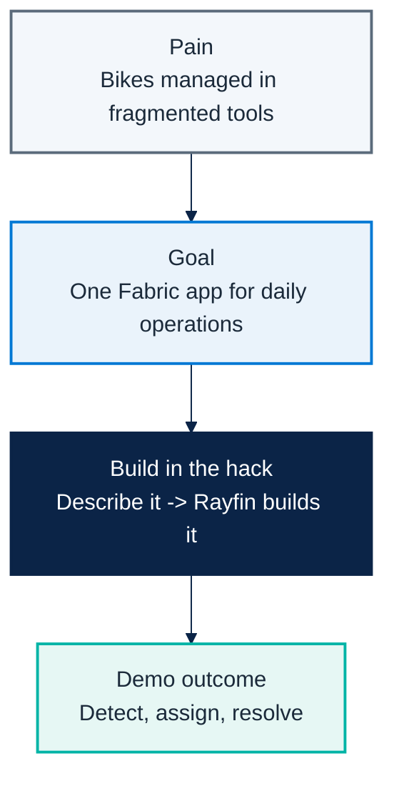

# Micro Hack 1 — Business Apps Workbook (Participants)

Track: **End-customer Apps (Rayfin)**
Scenario: **Helios Bicycle** (fictional final customer)

> 📄 Print-ready PDF: [`microhack-1-business-apps-workbook.pdf`](microhack-1-business-apps-workbook.pdf)

This is a **didactic** micro-hack. You don't need prior Rayfin experience — every step
explains **what** you do, **why**, and **what you should see**. Follow them in order.

---

## 🗓️ Day agenda (1 day)

**Morning — presentations & demos. Afternoon — hands-on hack.** This is a **standalone
one-day micro-hack for the Business Apps (Rayfin) track**.

| Time | Session |
|:-----|:-----------------------------------------------------------------|
| 09:00 | Welcome & motion overview — the Fabric apps motion for EMEA |
| 09:30 | Microsoft Fabric foundations — OneLake, capacity, workspaces |
| 10:00 | Rayfin foundations — spec-driven apps, data model = database |
| 10:30 | Break |
| 10:45 | **Demo · Helios Bicycle Studio** — the app you'll build today |
| 11:15 | The hack brief, teams & environment check |
| 12:00 | Lunch |
| 13:30 | **Hack · Sprint 1** — build the core app (steps 1–5) |
| 15:30 | Break |
| 15:45 | **Hack · Sprint 2** — extend & polish (steps 6–8) |
| 16:45 | Team demos (5 min each) |
| 17:00 | Wrap-up, KPIs & next steps |

---

# Part A — Understand

## 1) The scenario in plain words

**Helios Bicycle** runs shared city bikes across several stations. Today the station teams
track bikes, repairs and rider feedback in spreadsheets and chat — slow and error-prone.
Your job in the afternoon: build **one simple app**, *Helios Bicycle Studio*, that lets a
manager see every bike, fix the right one first, and keep riders happy.



## 2) What is Rayfin? (60-second primer)

**Rayfin** is a *Backend-as-a-Service on Microsoft Fabric*. In plain terms:

- You **describe your data** (e.g. a `Bicycle` has a code, a station, a status). Rayfin then
  **creates and manages the database** for you in Fabric — no SQL, no servers to run.
- You **describe your screens in natural language** (with GitHub Copilot). Rayfin generates
  the app UI against that data.
- So building an app becomes: *declare the data → describe the screens → run*.

Key idea to remember: **your data model = your database**. When you declare a `Bicycle`
type, Rayfin makes the matching table automatically.

## 3) The result you are aiming for

By the end of the afternoon your app should look like this — a **Bicycle Board** and a
**Live Map** of the fleet:


---

# Part B — Build it step by step

> **How to work.** **There is no repository to clone** for this track — Rayfin scaffolds the
> whole project for you with one command (Step 1). After that you build the app
> **conversationally**: you paste a short prompt into **GitHub Copilot** inside the project,
> Copilot writes the code, and you check the result in the browser. Each step below = one
> action + **what you should see**.

---

## Step 1 — Create the project (no clone needed)

**What you do.** Scaffold a Rayfin project. "Scaffold" means *generate a ready-to-run starter
project* — you do **not** clone any repo.

```bash
npm create @microsoft/rayfin@latest -- --template field-technician
cd <the-folder-it-created>
```

**Why.** Rayfin gives you a complete app skeleton (data layer + UI) so you start from
something that already runs.

**✅ What you should see.** A new project folder is created and dependencies install.

---

## Step 2 — Run the empty app first (your "it works" check)

**What you do.** Start the starter app **before changing anything** — exactly like a Hello
World, to confirm your environment and Fabric connection are healthy.

```bash
npm run dev          # deploys to Fabric and provisions the database, then opens the app
```

**Why.** `npm run dev` pushes the project to Fabric and **provisions your database** from the
data model in `rayfin/data/*.ts`. If the starter app opens, your whole chain works and you can
safely start customizing.

**✅ What you should see.** The starter app opens in the browser and your Fabric workspace shows
the new app. **Don't go further until this works.**

---

## Step 3 — Declare the data model

**What you do.** Tell Copilot the data your app is about. This defines the **database tables**.

```text
Build "Helios Bicycle Studio", a fun bike-operations app on Rayfin.
Data model:
- Bicycle(bikeCode, station, status[ready|in-ride|pit-stop-needed], featured)
- RideSession(bicycle, riderAlias, moodScore, startedAt, endedAt)
- PitStopTicket(ticketCode, bicycle, station, priority[high|normal],
                status[new|assigned|done], issue, openedAt, assignedMechanic)
- MechanicProfile(displayName, station, active)
Roles: Operations Manager has full access; Mechanic sees only assigned tickets.
Style: clean, friendly, Microsoft Fluent, blue #0078d4 + teal #00b4a6.
```

**Why.** These four types become four tables. `Bicycle.status` is a fixed list of values,
so the app can colour bikes by status later.

**✅ What you should see.** Copilot creates the data files; running the app re-provisions the
database with the new tables (still empty screens — that's normal).

---

## Step 4 — Build the Bicycle Board (your first screen)

**What you do.** Ask for the main screen: the list of bikes a manager looks at every morning.

```text
Add a "Bicycle Board" screen: a table grouped by station showing a status pill,
rider mood as stars, a health score and a tag (Star / Good / Watch).
Add filters for station and status.
```

**Why.** This is the app's home base — *detect* which bikes need attention. The health
score/tag is computed from status + mood so the manager sees priorities at a glance.

**✅ What you should see.** A table of bikes by station with coloured status pills and a
tag. You can filter by station and status. (Compare with the first example image above.)

---

## Step 5 — Build the Pit-Stop Queue (take action)

**What you do.** Add the screen where a manager turns a problem into an assigned repair.

```text
Add a "Pit-Stop Queue" screen as a kanban with columns new / assigned / done.
Let me create a ticket from a bike, and assign a mechanic in one click,
preferring the same-station and least-loaded mechanic.
```

**Why.** This is the *assign → resolve* half of the story. "One click" assignment keeps the
manager fast; preferring the same-station, least-busy mechanic is a simple, sensible rule.

**✅ What you should see.** A three-column board. Creating a ticket from a bike places a card
in **New**; assigning moves it to **Assigned** with the mechanic's name.

> 🎯 **Milestone (Sprint 1):** Steps 1–5 give you a working app — detect a bike, open a
> ticket, assign it. If you reach here, you can already demo.

---

## Step 6 — Add the Ride Mood & KPI screen

**What you do.** Add a light analytics screen.

```text
Add a "Ride Mood & KPI" screen with cards for average rider mood,
number of bikes needing a pit-stop, and a workshop -> PoC -> opportunity funnel.
```

**Why.** Rider mood is an early quality signal; the funnel cards connect the app to the
**business KPI** of the motion (workshops turning into opportunities).

**✅ What you should see.** A row of KPI cards with the average mood, the count of bikes
needing a pit-stop, and the funnel percentages.

---

## Step 7 — Add the Live Map (make it shine)

**What you do.** Add a map view of the fleet.

```text
Add a "Live Map" screen: a stylized city map with one marker per bike colored by
status (teal = ready, blue = in ride, red = pit-stop needed), plus a per-station
summary panel.
```

**Why.** A map turns rows of data into an instantly readable picture — great for the demo
and close to how operations teams think about a city fleet.

**✅ What you should see.** A map with coloured bike markers and a side panel counting bikes
per station (compare with the second example image above).

---

## Step 8 — Polish (roles & visuals)

**What you do.** Tighten the experience. Pick what you have time for.

```text
Make the bike rows more visual: add a colored bike illustration whose color
reflects the status (teal = ready, blue = in ride, red = pit-stop needed).
```

```text
Enforce roles: a Mechanic user should only see pit-stop tickets assigned to them.
```

**Why.** Visual cues speed up reading; role rules make the app realistic for a real customer
rollout.

**✅ What you should see.** Coloured bike icons on each row, and a mechanic account that only
sees its own tickets.

> 🎯 **Milestone (Sprint 2):** the app is graphical and role-aware — ready for the 5-minute demo.

---

# Wrap-up

## Team framing (fill this in 2 minutes)

- Team name:
- Who is the primary user (manager or mechanic)?
- One sentence: what does your app make faster?

## Demo storyboard (5 minutes)

1. **Context** (30s): who is the user, what hurts today.
2. **Flow** (3m): detect on the Board → open a ticket → assign on the Queue → show the Map.
3. **Architecture** (45s): how the data and the app connect in Fabric (Rayfin provisioned it).
4. **Next step** (45s): what you'd add before a real rollout.

## Reflection

- What was the easiest part of describing the app to Rayfin?
- What did you have to clarify for Copilot to get it right?
- What metric would prove value in week 1 of production?

## Reference assets

- Reference solution code: `src/apprayfin/`
- Rayfin prompt baseline (canonical spec): `src/apprayfin/src/specs/helios-bicycle-app-spec.md`
- Trainer answer key + screenshots: `docs/microhack-1-business-apps-solution.md`
