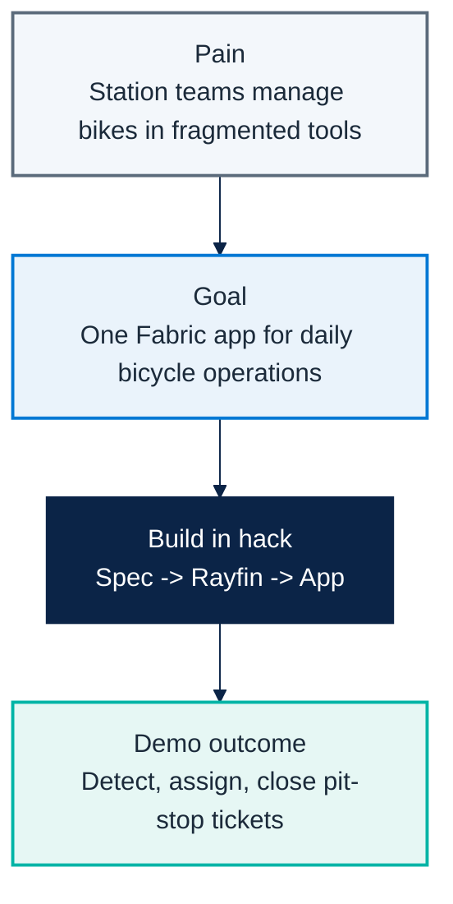

# Micro Hack 1 — Business Apps Workbook (Participants)

Track: **End-customer Apps (Rayfin)**  
Scenario: **Helios Bicycle** (fictional final customer)

> 📄 Print-ready PDF: [`microhack-1-business-apps-workbook.pdf`](microhack-1-business-apps-workbook.pdf)

---

## 🗓️ Day agenda (1 day)

**Morning — presentations & demos. Afternoon — hands-on hack.**

| Time | Session |
|---|---|
| 09:00 | Welcome & motion overview — the Fabric apps motion for EMEA, the two paths |
| 09:30 | Microsoft Fabric foundations — OneLake, capacity, workspaces |
| 10:00 | **Demo · Business Apps (Rayfin)** — Helios Bicycle Studio |
| 10:30 | Break |
| 10:45 | **Demo · SDC Workloads (Extensibility Toolkit)** — GreenGrid Scorecard |
| 11:15 | The hack brief, teams & environment check |
| 12:00 | Lunch |
| 13:30 | **Hack · Sprint 1** — build the core app |
| 15:30 | Break |
| 15:45 | **Hack · Sprint 2** — extend & polish |
| 16:45 | Team demos (5 min each) |
| 17:00 | Wrap-up, KPIs & next steps |

> The morning shows **both** scenarios (Apps + SDC). This workbook drives the **afternoon
> hack on the Business Apps track** (Helios Bicycle). The SDC track has its own workbook.

---

## 1) Visual challenge map



---

## 2) Team framing (fill this first)

- Team name:
- Primary user (persona):
- One sentence problem statement:
- One sentence success statement:

---

## 3) Spec worksheet

### A. User outcomes
1. Which 3 decisions must the user make in the app?
2. What data is mandatory on the first screen?
3. What can be postponed to v2?

### B. Functional scope
- Must-have screens:
- Must-have actions:
- Must-have role rules:

### C. Data mapping
- Tables used:
- Key joins:
- Data quality risks:

---

## 4) Sprint plan

### Sprint 1 (13:30–15:30) — Build the core
- [ ] Generate app from spec.
- [ ] Display bicycle board with status + station + mood.
- [ ] Add station and status filters.
- [ ] Validate one end-to-end path.

### Sprint 2 (15:45–16:45) — Extend
- [ ] Add pit-stop assignment flow.
- [ ] Add role view split (manager / mechanic).
- [ ] Add one rider mood insight tile.
- [ ] Prepare demo story.

---

## 5) Demo storyboard (5 minutes)

1. **Context** (30s): Who is the user and what hurts today?
2. **Flow** (3m): Show detect -> assign -> close.
3. **Architecture** (45s): How data and app are connected in Fabric.
4. **Next step** (45s): What you would implement next in production.

---

## 6) Reflection at close

- What worked best in your spec?
- What blocked you technically?
- What would you change before a real customer rollout?
- What metric would prove value in week 1 of production?

---

## 7) Guided Rayfin prompts

Build your app conversationally. Scaffold the project, then paste these prompts into
**GitHub Copilot** inside the Rayfin project and iterate.

### Step 0 — Scaffold & provision

```bash
npm create @microsoft/rayfin@latest -- --template field-technician
npm run dev          # deploys to Fabric and provisions the database
```

> The data model you declare in `rayfin/data/*.ts` **is** your database — Rayfin creates
> and migrates the tables for you.

### Step 1 — Master prompt (data model + skeleton)

```text
Build "Helios Bicycle Studio", a fun bike-operations app on Rayfin.
Data model:
- Bicycle(bikeCode, station, status[ready|in-ride|pit-stop-needed], featured)
- RideSession(bicycle, riderAlias, moodScore, startedAt, endedAt)
- PitStopTicket(ticketCode, bicycle, station, priority[high|normal],
                status[new|assigned|done], issue, openedAt, assignedMechanic)
- MechanicProfile(displayName, station, active)
Roles: Operations Manager full access; Mechanic sees only assigned tickets.
Style: clean, friendly, Microsoft Fluent, blue #0078d4 + teal #00b4a6,
with a small colored bike icon per row.
```

### Step 2 — Screen prompts (refine one at a time)

```text
Add a "Bicycle Board" screen: a table grouped by station showing a status pill,
rider mood as stars, a health score and a tag (Star / Good / Watch).
Add filters for station and status.
```

```text
Add a "Pit-Stop Queue" screen as a kanban with columns new / assigned / done.
Let me create a ticket from a bike, and assign a mechanic in one click,
preferring the same-station and least-loaded mechanic.
```

```text
Add a "Ride Mood & KPI" screen with cards for average rider mood,
number of bikes needing a pit-stop, and a workshop -> PoC -> opportunity funnel.
```

```text
Add a "Live Map" screen: a stylized city map with one marker per bike colored by
status (teal = ready, blue = in ride, red = pit-stop needed), plus a per-station
summary panel.
```

### Step 3 — Polish prompts (pick what you need)

```text
Make the bike rows more visual: add a colored bike illustration whose color
reflects the status (teal = ready, blue = in ride, red = pit-stop needed).
```

```text
Enforce roles: a Mechanic user should only see pit-stop tickets assigned to them.
```

> Reference prompts and the canonical spec live in
> [`src/apprayfin/src/specs/helios-bicycle-app-spec.md`](../src/apprayfin/src/specs/helios-bicycle-app-spec.md).

---

## 8) Reference assets (for teams and coaches)

- Solution code: `src/apprayfin/`
- Rayfin prompt baseline: `src/apprayfin/src/specs/helios-bicycle-app-spec.md`
- Trainer visual answer key + screenshots: `docs/microhack-1-business-apps-solution.md`
