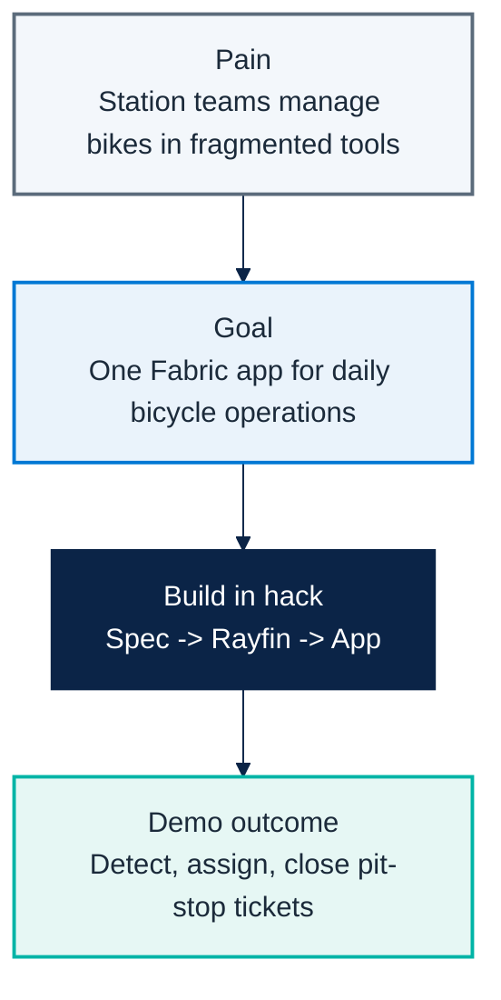

# Micro Hack 1 — Business Apps Workbook (Participants)

Track: **End-customer Apps (Rayfin)**  
Scenario: **Helios Bicycle** (fictional final customer)

---

## 1) Visual challenge map

---

## 2) Team framing (fill this first)

- Team name:
- Primary user (persona):
- One sentence problem statement:
- One sentence success statement:

---

## 3) Spec worksheet

### A. User outcomes
1. Which 3 decisions must the user make in the app?
2. What data is mandatory on the first screen?
3. What can be postponed to v2?

### B. Functional scope
- Must-have screens:
- Must-have actions:
- Must-have role rules:

### C. Data mapping
- Tables used:
- Key joins:
- Data quality risks:

---

## 4) Sprint plan

### Sprint 1 (13:30–15:30) — Build the core
- [ ] Generate app from spec.
- [ ] Display bicycle board with status + station + mood.
- [ ] Add station and status filters.
- [ ] Validate one end-to-end path.

### Sprint 2 (15:45–16:45) — Extend
- [ ] Add pit-stop assignment flow.
- [ ] Add role view split (manager / mechanic).
- [ ] Add one rider mood insight tile.
- [ ] Prepare demo story.

---

## 5) Demo storyboard (5 minutes)

1. **Context** (30s): Who is the user and what hurts today?
2. **Flow** (3m): Show detect -> assign -> close.
3. **Architecture** (45s): How data and app are connected in Fabric.
4. **Next step** (45s): What you would implement next in production.

---

## 6) Reflection at close

- What worked best in your spec?
- What blocked you technically?
- What would you change before a real customer rollout?
- What metric would prove value in week 1 of production?

---

## 7) Reference assets (for teams and coaches)

- Solution code: `src/apprayfin/`
- Rayfin prompt baseline: `src/apprayfin/src/specs/helios-bicycle-app-spec.md`
- Trainer visual answer key: `docs/microhack-1-business-apps-solution.md`
