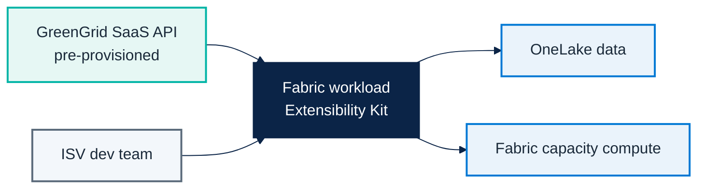

# Micro Hack 2 — ISV Workloads Setup (Trainer Guide)

Track: **ISV Workloads (Fabric Extensibility Kit)**  
Scenario: **GreenGrid Analytics** (fictional ISV)

---

## 1) Architecture to prepare before the day



---

## 2) Critical prerequisite (non-negotiable)

> The **fictional SaaS service must be up and running before the Micro Hack starts**.

Minimum requirement:
- Reachable HTTPS endpoint.
- Auth method available (API key or bearer token).
- Stable health endpoint.

If SaaS is not available, participants cannot complete the workload integration flow.

---

## 3) Prerequisites checklist (before 09:00)

### SaaS layer (must already exist)
- [ ] `GET /health` returns `200`.
- [ ] `POST /optimize` accepts payload and returns run id.
- [ ] `GET /status/{id}` returns execution status/result.
- [ ] CORS policy allows Fabric workload origin.

### Fabric + developer environment
- [ ] Fabric workspace with capacity.
- [ ] Workload dev mode enabled.
- [ ] Extensibility Kit SDK installed on all trainer machines.
- [ ] Starter repository cloned and bootstrapped.
- [ ] Entra app registration and scopes configured.

### Delivery readiness
- [ ] End-to-end smoke test run once by trainer.
- [ ] Backup SaaS URL and fallback token ready.
- [ ] Troubleshooting cheatsheet shared with coaches.

---

## 4) Setup procedure (step-by-step)

1. Validate SaaS endpoints with Postman/curl.
2. Validate auth token flow.
3. Open Fabric workspace and verify dev mode.
4. Start starter workload locally.
5. Wire one backend call to `/health`.
6. Wire one backend call to `/optimize`.
7. Confirm result write/read in OneLake.

---

## 4.1) SaaS readiness verification (copy/paste checks)

Use these checks before the workshop starts.

```bash
# Health
curl -i https://<saas-host>/health

# Start run
curl -i -X POST https://<saas-host>/optimize \
  -H "Authorization: Bearer <token>" \
  -H "Content-Type: application/json" \
  -d '{"modelId":"demo-001","horizon":"24h"}'

# Status
curl -i https://<saas-host>/status/<run-id> \
  -H "Authorization: Bearer <token>"
```

Expected:
- `/health` => `200 OK`
- `/optimize` => `202 Accepted` + `runId`
- `/status/{id}` => `running | completed | failed`

---

## 4.2) Detailed trainer runbook (recommended)

| Time | Owner | Action | Done when |
|---|---|---|---|
| D-2 | ISV tech lead | SaaS API deployed | Public HTTPS endpoint available |
| D-1 (morning) | Trainer | Fabric workspace + capacity ready | Workspace usable by all trainer accounts |
| D-1 (morning) | Platform coach | SDK + starter repo validated | Local workload runs in dev mode |
| D-1 (afternoon) | Trainer | End-to-end smoke run | Workload calls SaaS and returns result |
| D-day 08:30 | Trainer | Recheck tokens/credentials | Auth works for all demo accounts |
| D-day 08:45 | Platform coach | Recheck SaaS health and CORS | No CORS / 401 blockers |

---

## 5) Trainer solution path (to orient trainees)

> This is the facilitation answer key.

### Expected baseline implementation
- One item type: `OptimizationModel`.
- One create/run action from workload UI.
- Backend calls SaaS `POST /optimize`.
- Poll status via `GET /status/{id}`.
- Persist result metadata in OneLake.

### Suggested architecture decisions
- Keep SaaS API contract simple (fixed JSON schema).
- Keep one async execution path (no branching logic in v1).
- Keep auth transparent (single token strategy during workshop).

### Coaching cues
- If teams over-engineer: force v1 scope (one item type, one run flow).
- If teams block on auth: fallback to trainer-issued token.
- If teams block on API: switch to mock status response and continue UI flow.

---

## 6) Troubleshooting quick map

| Symptom | Likely cause | Fast fix |
|---|---|---|
| 401 from SaaS | Wrong/missing token | Re-issue token, re-test with curl |
| CORS errors | Origin not whitelisted | Update SaaS CORS policy |
| Workload not loading | Dev mode disabled | Enable workload dev mode |
| Result not appearing | Polling or mapping bug | Validate status payload and mapping keys |
