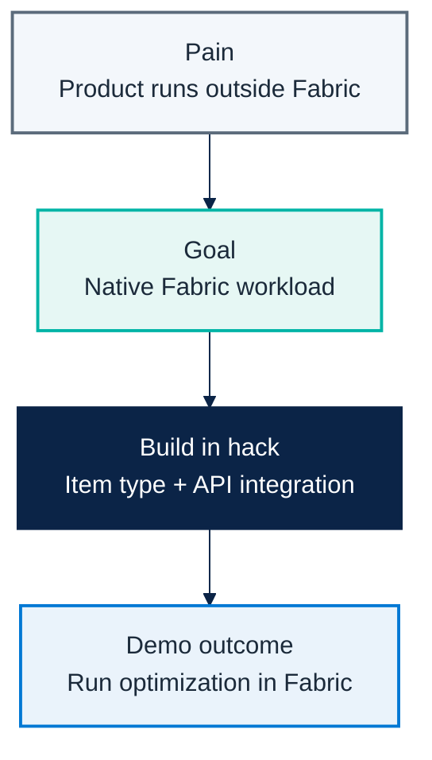

# Micro Hack 2 — ISV Workloads Workbook (Participants)

Track: **ISV Workloads (Fabric Extensibility Kit)**  
Scenario: **GreenGrid Analytics** (fictional ISV)

---

## 1) Visual challenge map

---

## 2) Team framing (fill this first)

- Team name:
- Workload name:
- Item type name:
- One sentence business value:

---

## 3) Product-to-workload worksheet

### A. Product mapping
- Which product capability are you exposing first?
- What should the user see in Fabric?
- What should stay in your SaaS and not in the workload?

### B. API mapping
- Which endpoint starts execution?
- Which endpoint returns status/result?
- Which fields are mandatory in request/response?

### C. Data mapping
- What is read from OneLake?
- What is written back to OneLake?
- Which object becomes your item type?

---

## 4) Sprint plan

### Sprint 1 (13:30–15:30) — Scaffold & run
- [ ] Create workload shell and item type.
- [ ] Render minimal item UI.
- [ ] Call SaaS `POST /optimize`.
- [ ] Track run id and show status.

### Sprint 2 (15:45–16:45) — Integrate & package
- [ ] Add token/auth handling.
- [ ] Connect data path with OneLake.
- [ ] Handle success/failure states.
- [ ] Produce package candidate for hub.

---

## 5) Demo storyboard (5 minutes)

1. **Context** (30s): what ISV product problem are you solving?
2. **Flow** (3m): create item -> run optimization -> show result.
3. **Architecture** (45s): workload/SaaS/OneLake relation.
4. **Publish plan** (45s): what is needed to move from workshop to release?

---

## 6) Reflection at close

- What integration contract was the hardest part?
- What assumptions about your SaaS were wrong?
- What needs hardening before production?
- What metric proves this workload is adopted?

