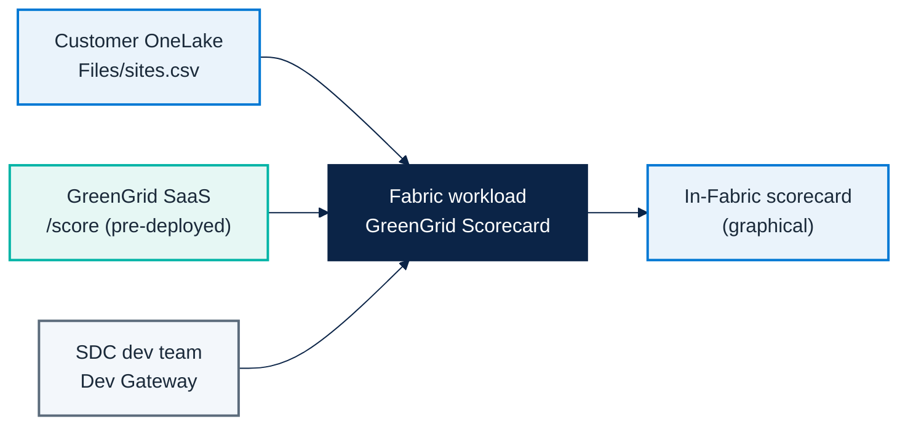

# Micro Hack 2 — SDC Workloads Setup (Trainer Guide)

Track: **SDC Workloads (Fabric Extensibility Toolkit)**
Scenario: **GreenGrid Analytics** (fictional SDC)

---

## 1) Architecture to prepare before the day



---

## 2) Critical prerequisite (non-negotiable) — the SaaS must be live

> The **GreenGrid SaaS must be deployed and running before the Micro Hack starts.**
> Without it, the workload cannot score anything.

The SaaS is **already coded** in this repo: [`src/workloadsdc/saas/`](../src/workloadsdc/saas).
It is tiny and easy to deploy.

```bash
cd src/workloadsdc
npm install
npm run saas:start          # local: http://localhost:8787
```

Open **http://localhost:8787/** to confirm it works: the SaaS now serves a full **GreenGrid
website** (company, product, *Developers* section and a **live demo** that calls `POST /score`
on the server). It is a real front-end in front of the **same scoring algorithm** the workload
calls — a good way to show participants what they are integrating with.

For the workshop, deploy it to a public HTTPS endpoint (Azure Container Apps / App Service
/ any Node host — a Dockerfile is in `saas/README.md`). Capture its URL and API key.

Minimum requirement:
- Reachable HTTPS endpoint.
- `x-api-key` header accepted.
- Stable `GET /health`.

---

## 3) Prerequisites checklist (before 09:00)

### SaaS layer (must already exist)
- [ ] `GET /health` returns `200`.
- [ ] `POST /score` accepts `{ sites: [...] }` and returns scores + summary.
- [ ] `x-api-key` enforced (401 without it).
- [ ] CORS allows the Fabric workload origin.

### Fabric + developer environment
- [ ] Fabric workspace **on a Fabric or Trial capacity** (Pro/PPU only → Dev Gateway fails with `FeatureNotAvailable`).
- [ ] **Tenant settings → Additional workloads** enabled by an admin (see §6.1): *Capacity admins and contributors can add and remove additional workloads*, *Workspace admins can develop workloads*, *Users can see and work with additional workloads not validated by Microsoft*.
- [ ] **Developer mode** enabled per user (Fabric → Settings → Developer settings → *Fabric developer mode*).
- [ ] Extensibility Toolkit Starter-Kit cloned and bootstrapped.
- [ ] Node.js + PowerShell 7 + Dotnet installed (toolkit prerequisites).
- [ ] Entra app registration and scopes configured (required even in dev mode — the Dev Gateway routes the workload but does not provide identity; created by `Setup.ps1`).
- [ ] A lakehouse in OneLake with the sites CSV loaded to `Files/sites.csv` (sample in `src/workloadsdc/data/sites.csv`).

### Delivery readiness
- [ ] End-to-end smoke test run once by trainer (OneLake → SaaS → scorecard).
- [ ] Backup SaaS URL and fallback API key ready.
- [ ] Troubleshooting cheatsheet shared with coaches.

---

## 4) Setup procedure (step-by-step)

1. Deploy the GreenGrid SaaS and validate `/health` + `/score` with curl.
2. Load the sites CSV into a lakehouse: open the Lakehouse, **Files -> Upload** the file
   `src/workloadsdc/data/sites.csv` so it lands at `Files/sites.csv`.
3. `git clone https://github.com/microsoft/fabric-extensibility-toolkit`.
4. `cd scripts/Setup; ./Setup.ps1 -WorkloadName "Org.GreenGrid"` (creates the Entra app,
   writes `.env`, downloads the Dev Gateway).
5. `cd scripts/Run; ./StartDevServer.ps1` and (second terminal) `./StartDevGateway.ps1`.
6. In Fabric, enable the **Additional workloads** tenant settings (Admin portal — see §6.1),
   put the workspace **on a Fabric/Trial capacity**, and turn on **Fabric Developer Mode** (per user).
7. Create the **Hello World** item to confirm the gateway works, then build the
   `GreenGridScorecard` item.
8. Confirm the item reads `Files/sites.csv` from OneLake and renders the SaaS scores.

---

## 4.1) SaaS readiness verification (copy/paste checks)

```bash
# Health
curl -i http://localhost:8787/health

# Score a couple of sites
curl -s -X POST http://localhost:8787/score \
  -H "Content-Type: application/json" \
  -H "x-api-key: greengrid-demo-key" \
  -d '{"sites":[{"siteId":"s1","name":"Helsinki DC","city":"Helsinki","energyKwh":320,"renewablePct":88}]}'
```

Expected:
- `/health` => `200 OK`
- `/score` => `200` with `sites[]` and `summary`
- `/score` without `x-api-key` => `401`

---

## 4.2) Detailed trainer runbook (recommended)

| Time | Owner | Action | Done when |
|---|---|---|---|
| D-2 | SDC tech lead | Deploy GreenGrid SaaS | Public HTTPS `/health` returns 200 |
| D-1 (morning) | Trainer | Fabric workspace + capacity ready | Workspace usable by all trainer accounts |
| D-1 (morning) | Data coach | Upload `Files/sites.csv` into a lakehouse | File visible in OneLake |
| D-1 (afternoon) | Platform coach | Dev Gateway + dev server validated | Dev workload renders in Fabric |
| D-1 (afternoon) | Trainer | End-to-end smoke run | OneLake → SaaS → scorecard works |
| D-day 08:30 | Trainer | Recheck tokens/credentials | Auth works for all demo accounts |
| D-day 08:45 | Platform coach | Recheck SaaS health and CORS | No CORS / 401 blockers |

---

## 5) Trainer solution path (to orient trainees)

> This is the facilitation answer key. Full reference + screenshots:
> [`microhack-2-sdc-workloads-solution.md`](microhack-2-sdc-workloads-solution.md).

### Expected baseline implementation
- One item type: `GreenGridScorecard`.
- On open: read `Files/sites.csv` from OneLake (OBO token).
- Call SaaS `POST /score`.
- Render one graphical scorecard (gauge + tiers + site cards).

### Solution code references
- SaaS: `src/workloadsdc/saas/server.ts`
- Scoring engine: `src/workloadsdc/src/services/green-score.ts`
- Portfolio aggregation: `src/workloadsdc/src/services/scorecard.ts`
- Workload item: `src/workloadsdc/workload/`
- Runnable demo + screenshots: `cd src/workloadsdc && npm install && npm run demo`

### Coaching cues
- If teams over-engineer: force v1 scope (one item, one screen).
- If teams block on OneLake: start from the seed `sites` data, wire OneLake last.
- If teams block on auth: fallback to a trainer-issued SaaS API key.

---

## 6) Troubleshooting quick map

| Symptom | Likely cause | Fast fix |
|---|---|---|
| 401 from SaaS | Wrong/missing `x-api-key` | Re-issue key, re-test with curl |
| CORS errors | Origin not whitelisted | SaaS already sends `*`; check proxy |
| Workload not loading | Developer mode / Dev Gateway off | Enable dev mode, restart `StartDevGateway.ps1` |
| Empty scorecard | `Files/sites.csv` missing in OneLake | Upload the sample CSV (`src/workloadsdc/data/sites.csv`) |
| **`StartDevGateway.ps1` → `Dev instance registration ... Forbidden, errorCode: FeatureNotAvailable`** | **Tenant has not enabled customer-developed workloads** (the Dev Gateway can't register a dev instance) | **Enable the tenant settings below** (admin), put the workspace on a **Fabric/Trial capacity**, and turn on **Developer mode** — see §6.1 |
| **New item type (e.g. `GreenGridScorecard`) not showing in Fabric → New item** | Item not listed in `ITEM_NAMES` (the toolkit only packages configured items) | Add it to `ITEM_NAMES` in **all three** `Workload/.env.{dev,test,prod}` (e.g. `HelloWorld,GreenGridScorecard`), restart **both** Dev Server + Dev Gateway, refresh Fabric |
| `StartDevGateway.ps1` → `Missing keys` / `Unused keys in en-US locale: <Item>_...` | The locale file must match the item manifest's keys **exactly** | In `Workload/Manifest/assets/locales/en-US/translations.json` add the referenced keys (default item: `<Item>_DisplayName` + `_DisplayName_Plural` only — no `_Description`), restart the Dev Gateway |
| `StartDevGateway.ps1` → `MissingAssets: 'assets/images/<Item>_Icon.png'` | `CreateNewItem.ps1` doesn't create the item icon it references | Add a 48×48 PNG `Workload/Manifest/assets/images/<Item>_Icon.png` (copy `HelloWorldItem_Icon.png` to start), restart the Dev Gateway |
| **Gateway registers OK and Hello World shows, but the new item is NOT in *New item*** | The item has no create-card in `Product.json` (only HelloWorld does) | In `Workload/Manifest/Product.json` add the item to `homePage.recommendedItemTypes` and a card to `createExperience.cards` (mirror HelloWorld, `"itemType": "<Item>"`), restart the Dev Gateway, refresh Fabric |
| **Item opens to a blank page, no console error** (console shows a nav to `/<Item>-editor/...`) | No editor `<Route>` registered in `App.tsx` (and/or no `initialView` on `ItemEditor`) | Add the editor route in `Workload/app/App.tsx` (mirror HelloWorld) and `initialView={EDITOR_VIEW_TYPES.DEFAULT}` on `<ItemEditor>`; dev server hot-reloads |
| **Changed the UI / Copilot upgraded it, but Fabric still shows the old version** | Two caches: webpack **build cache** (`Workload/node_modules/.cache`) serving stale compiled modules, and the browser/Fabric **iframe cache** | **Delete `Workload/node_modules/.cache`** and restart the Dev Server (slower rebuild); then **F12 → Network → Disable cache** + reload, or "Empty Cache and Hard Reload", or close & reopen the item. (No Dev Gateway restart for UI changes.) |
| `BuildManifestPackage … CursorPosition: The handle is invalid` | Cosmetic — script resets the console cursor in a host with no real console (VS Code / Windows Terminal) | **Ignore it** — `Delivered manifest package successfully` means the build worked |

### 6.1) Dev Gateway: `FeatureNotAvailable` on dev-instance registration

`StartDevGateway.ps1` builds the manifest NuGet fine, signs you in, then fails at:

```text
fail: Dev instance registration call was not successful, HTTP status code: Forbidden,
      reason: Forbidden, response: { "errorCode":"FeatureNotAvailable",
      "message":"The feature is not available" }
```

This is **not** a repo/code problem — the Dev Gateway is being **refused by the Fabric backend**
because the tenant has not opted in to **customer-developed workloads / developer mode**. Fix it
in this order:

1. **Tenant admin settings** (Fabric **Admin portal → Tenant settings → Additional workloads**) —
   a Fabric **administrator** must enable, for the security group containing the trainee accounts:
   - **"Capacity admins and contributors can add and remove additional workloads"**
   - **"Workspace admins can develop ... workloads"** (a.k.a. *develop partner workloads*)
   - **"Users can see and work with additional workloads not validated by Microsoft"**

   Reference: [Tenant settings for additional workloads](https://learn.microsoft.com/en-us/fabric/admin/service-admin-portal-additional-workloads).
   Tenant-setting changes can take a few minutes to propagate.
2. **Capacity** — the **workspace must be on a Fabric capacity** (a **Trial** capacity works, or an
   **F-SKU**). A Pro/PPU-only workspace cannot host a dev workload → `FeatureNotAvailable`.
   Workspace → *Settings → License info* should show a Fabric/Trial capacity.
3. **Developer mode (per user)** — in Fabric: **Settings (gear) → Developer settings →** toggle
   **"Fabric developer mode"** on, for the **same account** running `StartDevGateway.ps1`.
4. **Permissions** — that account must be an **admin of the workspace** (and ideally the capacity).
5. Re-run `./StartDevGateway.ps1`. Success looks like `info: Dev instance registered` (no
   `Forbidden`), and the Hello World item then loads in Fabric.

> If you are **not** a Fabric admin, this is a blocker only an admin can lift — send them the three
> tenant-setting names above. There is no code change that bypasses it (the gateway is rejected
> server-side by Fabric).

#### 6.1.1) You're **not** a tenant admin — what to do

Enabling those tenant settings and Developer Mode is **tenant-admin only** — a workspace admin or
regular user **cannot** self-enable it. Pick one of these:

1. **Minimal ask to your tenant admin.** You don't need everything — ask them to turn on, *for a
   security group that contains your account*, just:
   *"Workspace admins can develop workloads"* + *"Capacity admins and contributors can add and
   remove additional workloads"* + *"Users can see and work with additional workloads not validated
   by Microsoft"* (Admin portal → Tenant settings → Additional workloads). Then make sure your
   workspace is on a **Trial/Fabric capacity** and you're its **admin**.
2. **Use a tenant where you *are* the admin.** The fastest self-serve path: run the hack in a
   **Fabric tenant you administer** — e.g. a personal/dev tenant or a **demo tenant** (for Microsoft
   field: a CDX / demo.microsoft.com Fabric tenant). Start a **Fabric Trial** there (Account manager
   → *Start trial*), and you can flip the settings yourself.

   <details><summary><b>How to grant someone the Fabric Administrator role</b> (you must already be Global Administrator)</summary>

   Fabric "tenant admin" = the Entra ID **Fabric Administrator** role (formerly *Power BI
   Administrator*, role template `a9ea8996-122f-4c74-9520-8edcd192826c`). It unlocks the Admin
   portal → Tenant settings (it does **not** by itself grant capacity/workspace admin).

   - **Portal:** [entra.microsoft.com](https://entra.microsoft.com) → *Identity → Users* → pick the
     user → *Assigned roles → Add assignments* → **Fabric Administrator**.
   - **PowerShell (Microsoft Graph):**
     ```powershell
     Connect-MgGraph -Scopes "RoleManagement.ReadWrite.Directory","User.Read.All"
     $tpl = "a9ea8996-122f-4c74-9520-8edcd192826c"   # Fabric Administrator
     if (-not (Get-MgDirectoryRole -All | Where-Object RoleTemplateId -eq $tpl)) { New-MgDirectoryRole -RoleTemplateId $tpl }
     $role   = Get-MgDirectoryRole -All | Where-Object RoleTemplateId -eq $tpl
     $userId = (Get-MgUser -UserId "user@tenant.onmicrosoft.com").Id
     New-MgDirectoryRoleMemberByRef -DirectoryRoleId $role.Id -BodyParameter @{ "@odata.id" = "https://graph.microsoft.com/v1.0/directoryObjects/$userId" }
     ```
   Assigning a directory role itself requires **Global Administrator** / *Privileged Role
   Administrator* — so this only works in a tenant where you already hold that. Propagation takes a
   few minutes.
   </details>
3. **No-Fabric fallback — keep building & seeing the scorecard locally.** You can still build and
   *see* the GreenGrid UI without Developer Mode (you just won't be running inside the Fabric portal
   / OneLake):
   ```bash
   cd src/workloadsdc
   npm install
   npm run saas:start      # GreenGrid SaaS + website + live /score demo → http://localhost:8787/
   npm run demo:build      # renders the workload screens as standalone HTML in demo/out/
   ```
   Open `demo/out/scorecard.html`, `sites-map.html` and `site-detail.html` in a browser — they
   render the **real scorecard, sites map and site detail** from the **same scoring algorithm** the
   Fabric workload uses. Great for following the build and demoing the UX while the Fabric dev-mode
   access is being sorted out.
