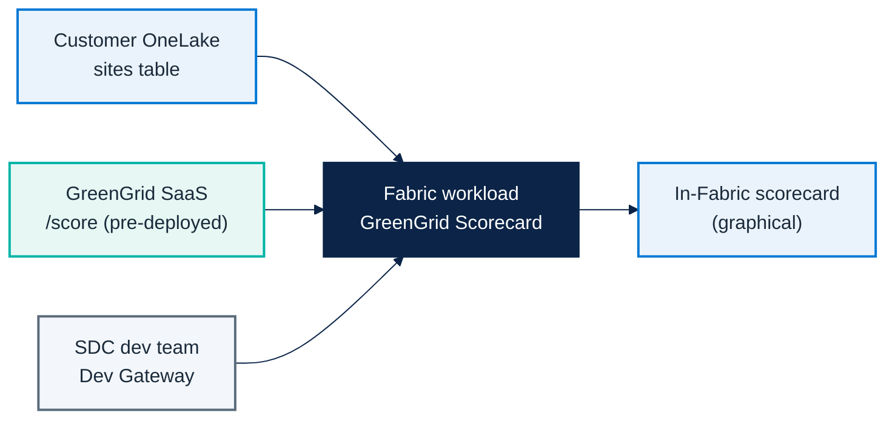

# Micro Hack 2 — SDC Workloads Setup (Trainer Guide)

Track: **SDC Workloads (Fabric Extensibility Toolkit)**
Scenario: **GreenGrid Analytics** (fictional SDC)

---

## 1) Architecture to prepare before the day



---

## 2) Critical prerequisite (non-negotiable) — the SaaS must be live

> The **GreenGrid SaaS must be deployed and running before the Micro Hack starts.**
> Without it, the workload cannot score anything.

The SaaS is **already coded** in this repo: [`src/workloadsdc/saas/`](../src/workloadsdc/saas).
It is tiny and easy to deploy.

```bash
cd src/workloadsdc
npm install
npm run saas:start          # local: http://localhost:8787
```

For the workshop, deploy it to a public HTTPS endpoint (Azure Container Apps / App Service
/ any Node host — a Dockerfile is in `saas/README.md`). Capture its URL and API key.

Minimum requirement:
- Reachable HTTPS endpoint.
- `x-api-key` header accepted.
- Stable `GET /health`.

---

## 3) Prerequisites checklist (before 09:00)

### SaaS layer (must already exist)
- [ ] `GET /health` returns `200`.
- [ ] `POST /score` accepts `{ sites: [...] }` and returns scores + summary.
- [ ] `x-api-key` enforced (401 without it).
- [ ] CORS allows the Fabric workload origin.

### Fabric + developer environment
- [ ] Fabric workspace with capacity.
- [ ] **Developer mode** enabled (Fabric → Settings → Developer settings).
- [ ] Extensibility Toolkit Starter-Kit cloned and bootstrapped.
- [ ] Node.js + PowerShell 7 + Dotnet installed (toolkit prerequisites).
- [ ] Entra app registration and scopes configured (required even in dev mode — the Dev Gateway routes the workload but does not provide identity; created by `Setup.ps1`).
- [ ] A lakehouse in OneLake with the sites CSV loaded to `Files/sites.csv` (sample in `src/workloadsdc/data/sites.csv`).

### Delivery readiness
- [ ] End-to-end smoke test run once by trainer (OneLake → SaaS → scorecard).
- [ ] Backup SaaS URL and fallback API key ready.
- [ ] Troubleshooting cheatsheet shared with coaches.

---

## 4) Setup procedure (step-by-step)

1. Deploy the GreenGrid SaaS and validate `/health` + `/score` with curl.
2. Load the sites CSV into a lakehouse: open the Lakehouse, **Files -> Upload** the file
   `src/workloadsdc/data/sites.csv` so it lands at `Files/sites.csv`.
3. `git clone https://github.com/microsoft/fabric-extensibility-toolkit`.
4. `cd scripts/Setup; ./Setup.ps1 -WorkloadName "Org.GreenGrid"` (creates the Entra app,
   writes `.env`, downloads the Dev Gateway).
5. `cd scripts/Run; ./StartDevServer.ps1` and (second terminal) `./StartDevGateway.ps1`.
6. In Fabric, enable the developer tenant settings (Admin portal) and **Fabric Developer Mode**.
7. Create the **Hello World** item to confirm the gateway works, then build the
   `GreenGridScorecard` item.
8. Confirm the item reads `Files/sites.csv` from OneLake and renders the SaaS scores.

---

## 4.1) SaaS readiness verification (copy/paste checks)

```bash
# Health
curl -i http://localhost:8787/health

# Score a couple of sites
curl -s -X POST http://localhost:8787/score \
  -H "Content-Type: application/json" \
  -H "x-api-key: greengrid-demo-key" \
  -d '{"sites":[{"siteId":"s1","name":"Helsinki DC","city":"Helsinki","energyKwh":320,"renewablePct":88}]}'
```

Expected:
- `/health` => `200 OK`
- `/score` => `200` with `sites[]` and `summary`
- `/score` without `x-api-key` => `401`

---

## 4.2) Detailed trainer runbook (recommended)

| Time | Owner | Action | Done when |
|---|---|---|---|
| D-2 | SDC tech lead | Deploy GreenGrid SaaS | Public HTTPS `/health` returns 200 |
| D-1 (morning) | Trainer | Fabric workspace + capacity ready | Workspace usable by all trainer accounts |
| D-1 (morning) | Data coach | Load `sites` table into a lakehouse | Table visible in OneLake |
| D-1 (afternoon) | Platform coach | Dev Gateway + dev server validated | Dev workload renders in Fabric |
| D-1 (afternoon) | Trainer | End-to-end smoke run | OneLake → SaaS → scorecard works |
| D-day 08:30 | Trainer | Recheck tokens/credentials | Auth works for all demo accounts |
| D-day 08:45 | Platform coach | Recheck SaaS health and CORS | No CORS / 401 blockers |

---

## 5) Trainer solution path (to orient trainees)

> This is the facilitation answer key. Full reference + screenshots:
> [`microhack-2-sdc-workloads-solution.md`](microhack-2-sdc-workloads-solution.md).

### Expected baseline implementation
- One item type: `GreenGridScorecard`.
- On open: read `sites` from OneLake (OBO token).
- Call SaaS `POST /score`.
- Render one graphical scorecard (gauge + tiers + site cards).

### Solution code references
- SaaS: `src/workloadsdc/saas/server.ts`
- Scoring engine: `src/workloadsdc/src/services/green-score.ts`
- Portfolio aggregation: `src/workloadsdc/src/services/scorecard.ts`
- Workload item: `src/workloadsdc/workload/`
- Runnable demo + screenshots: `cd src/workloadsdc && npm install && npm run demo`

### Coaching cues
- If teams over-engineer: force v1 scope (one item, one screen).
- If teams block on OneLake: start from the seed `sites` data, wire OneLake last.
- If teams block on auth: fallback to a trainer-issued SaaS API key.

---

## 6) Troubleshooting quick map

| Symptom | Likely cause | Fast fix |
|---|---|---|
| 401 from SaaS | Wrong/missing `x-api-key` | Re-issue key, re-test with curl |
| CORS errors | Origin not whitelisted | SaaS already sends `*`; check proxy |
| Workload not loading | Developer mode / Dev Gateway off | Enable dev mode, restart `start:devGateway` |
| Empty scorecard | OneLake `sites` table missing | Load the sample `sites` data |
