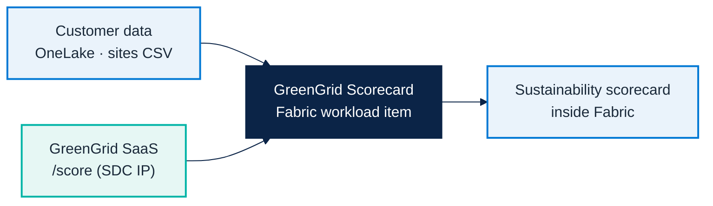

# Micro Hack 2 — SDC Workloads Solution (GreenGrid Scorecard)

Reference implementation for the **SDC Workloads (Fabric Extensibility Toolkit)** micro-hack,
scenario 2. This is the **complete reference example proposed as the solution**. Trainees build
**their own** workload for the *same* scenario, guided by the prompts in section 5 and in the
[participant workbook](microhack-2-sdc-workloads-workbook.md).

Aligned with:

- [`docs/microhack-2-sdc-workloads-setup.md`](microhack-2-sdc-workloads-setup.md)
- [`docs/microhack-2-sdc-workloads-workbook.md`](microhack-2-sdc-workloads-workbook.md)
- [`src/workloadsdc/`](../src/workloadsdc)

> The screenshots in section 7 are generated from the **real scoring logic and sample
> OneLake data** of this kit — not static mockups. See section 9 to regenerate them.

---

## 1) The scenario (SDC + complementarity)

**SDC:** `GreenGrid Analytics` — a fictional software company whose product scores the
**sustainability** of physical sites from their energy usage and renewable mix.

**The complementarity story.** The customer's data already lives in **OneLake**. GreenGrid
brings the *algorithm*. With a Fabric workload, GreenGrid's scoring runs **inside Fabric, on
the customer's own data**, with no data movement:



### Who does what (and where the algorithm lives)

| Component | Owner | Responsibility |
|---|---|---|
| **OneLake `Files/sites.csv`** | Customer | Raw data (energy, renewable %) as a CSV in the Lakehouse, governed in Fabric |
| **GreenGrid SaaS** (`/score`) | SDC | **Holds the scoring algorithm** — the SDC's IP. Turns site data into green scores, tiers and tips |
| **GreenGrid workload** | SDC (in Fabric) | Reads OneLake (OBO token), calls the SaaS, renders the scorecard natively in Fabric |

**Why two pieces?**

- The **SaaS is the value/IP**: it owns the algorithm. The SDC can improve it, version it and
  sell it independently — it is *not* exposed or copied into the customer tenant.
- The **workload is the distribution**: a thin, native Fabric experience that brings that
  algorithm to the customer's **own** OneLake data, with Fabric governance and **no data
  movement**. This is the complementarity the motion sells: *the SDC keeps its IP, the customer
  keeps its data, Fabric is the meeting point.*

---

## 2) Personas & roles

| Role | Can see | Can do |
|---|---|---|
| **Analyst** | The scorecard for their workspace | Open the item, read scores, drill into a site |
| **Admin** | Workload configuration | Set the SaaS URL / API key |

---

## 3) Data flow & contract

**Read from OneLake — `Files/sites.csv`**

The customer sites are provided as a CSV file in the Lakehouse `Files` area
(`Files/sites.csv`; sample at [`src/workloadsdc/data/sites.csv`](../src/workloadsdc/data/sites.csv)).
Columns:

| Column | Type | Example |
|---|---|---|
| `siteId` | text | `site-hel` |
| `name` | text | `Helsinki Data Center` |
| `city` | text | `Helsinki` |
| `energyKwh` | number | `320` |
| `renewablePct` | number | `88` |

**Call the SaaS — `POST /score`** (`x-api-key` header) → returns scored sites + a portfolio
summary. Source of truth: [`src/workloadsdc/`](../src/workloadsdc).

---

## 4) Business rules (the trainer answer key)

Implemented in `src/workloadsdc/src/services/`.

### 4.1 Green score — `green-score.ts`

```
efficiency = clamp(100 − energyKwh / 1000 × 100)        # lower usage = better
greenScore = round(renewablePct × 0.6 + efficiency × 0.4)
tier       = A if score ≥ 75 · B if ≥ 50 · C otherwise
tip        = "Increase renewable sourcing" if renewable < 40
             "Improve energy efficiency"   if efficiency < 50
             "On track — maintain"         otherwise
```

### 4.2 Portfolio — `scorecard.ts`

Average score, average renewable %, tier counts, best & worst site.

With the sample OneLake data: **portfolio score 60**, tiers **A:1 · B:3 · C:1**, best
**Helsinki (80)**, watch **Warsaw (19)**.

---

## 5) How the workload is built in Fabric (step by step)

The workload uses the **[Fabric Extensibility Toolkit](https://learn.microsoft.com/en-us/fabric/extensibility-toolkit/extensibility-toolkit-overview)**:
a web app, manifest-driven, rendered in Fabric via iFrame, authenticated with Entra, able to
read OneLake and call Fabric REST APIs from the frontend.

```mermaid
%%{init: {'theme':'base','themeVariables':{
  'primaryColor':'#E6F7F4','primaryTextColor':'#1B2A3A',
  'primaryBorderColor':'#00B4A6','lineColor':'#0B2447','secondaryColor':'#EAF3FB'
}}}%%
flowchart LR
    A["1 · Deploy SaaS"] --> B["2 · Clone + Setup.ps1"]
    B --> C["3 · Dev server + Dev Gateway"]
    C --> D["4 · Hello World test"]
    D --> E["5 · Create item + code"]
    E --> F["6 · Read OneLake CSV"]
    F --> G["7 · Polish"]
    classDef a fill:#E6F7F4,stroke:#00B4A6,color:#1B2A3A,stroke-width:2px;
    classDef b fill:#EAF3FB,stroke:#0078D4,color:#1B2A3A,stroke-width:2px;
    classDef c fill:#0B2447,stroke:#0B2447,color:#FFFFFF,stroke-width:2px;
    class A,D,G a;
    class C,F b;
    class B,E c;
```



The participant [workbook](microhack-2-sdc-workloads-workbook.md#part-b--build-it-step-by-step-full-solution)
has the full copy-paste code for each step. The canonical implementation is in
[`src/workloadsdc/`](../src/workloadsdc). Reference path:

1. **Deploy the SaaS** (non-negotiable prerequisite) — it holds the algorithm.
   ```bash
   cd src/workloadsdc && npm install && npm run saas:start   # http://localhost:8787
   ```
   Deploy to a public HTTPS endpoint for the workshop (Dockerfile in `saas/README.md`).
2. **Clone the toolkit and configure it.** `Setup.ps1` creates the Entra app (**required even
   with the Dev Gateway** — the gateway routes the workload, Entra provides identity/OBO).
   ```bash
   git clone https://github.com/microsoft/fabric-extensibility-toolkit
   cd fabric-extensibility-toolkit/scripts/Setup
   ./Setup.ps1 -WorkloadName "Org.GreenGrid"
   ```
3. **Start the dev environment** — two terminals, then enable Fabric Developer Mode.
   ```bash
   cd scripts/Run; ./StartDevServer.ps1       # frontend + APIs
   cd scripts/Run; ./StartDevGateway.ps1      # bridge to Fabric
   ```
4. **Hello World test** — create the built-in Hello World item in Fabric to confirm the chain
   *localhost → Dev Gateway → Fabric* works **before** building anything.
5. **Create the item and add the code** — `./CreateNewItem.ps1 -Name "GreenGridScorecard"`,
   then add `contracts.ts`, `greengridClient.ts`, `seed.ts`, `Scorecard.tsx` and render with
   **seed data first** (Milestone M1).
6. **Read OneLake** — add `onelake.ts` (OBO token) to read & parse `Files/sites.csv`, then swap
   the one render line from seed to OneLake (Milestone M2).
7. **Polish** — gauge, A/B/C tiers, provenance chips and the sites map (Milestone M3).

**Master prompt** (for the AI-assisted path — the toolkit ships `.github/copilot-instructions.md`):

```text
Create a Fabric Extensibility Toolkit item "GreenGridScorecard".
On open: read Files/sites.csv (siteId, name, city, energyKwh, renewablePct) from the selected
lakehouse in OneLake using an Entra OBO token, POST it to the GreenGrid SaaS /score endpoint
(header x-api-key), and render ONE graphical sustainability scorecard: a portfolio green-score
gauge, a tier (A/B/C) distribution, provenance chips "Data from OneLake" -> "Scored by
GreenGrid", and site cards with green score, tier badge, renewable % bar and a one-line tip.
Style: Fluent UI, teal #00b4a6 + green accents, clean and friendly. One screen.
```

> **Trainer note.** This kit is the *reference answer*. Teams can design a different layout but
> should keep the **same scenario, contract and OneLake → SaaS flow**.

---

## 6) What is coded in `src/workloadsdc`

| Area | Files | Purpose |
|---|---|---|
| SaaS prerequisite | `saas/server.ts` | GreenGrid Score API (`/health`, `/score`) |
| Scoring engine | `src/services/green-score.ts` | Green score, tier, tip (shared with the SaaS) |
| Portfolio | `src/services/scorecard.ts` | Aggregation across sites |
| Sample data | `src/seed/onelake-sample.ts` | Representative OneLake `sites` rows |
| Workload | `workload/` | Manifest + React item editor (Extensibility Toolkit) |
| Generation spec | `src/specs/greengrid-workload-spec.md` | Prompt-ready workload specification |
| Demo & screenshots | `demo/` | Runs the logic and produces the screens below |

---

## 7) Workload screenshots (generated from real code)

### 7.1 Sustainability Scorecard (in Fabric)

The item reads 5 sites from OneLake, scores them via the GreenGrid SaaS, and renders the
portfolio gauge (**60**), the tier distribution (**A:1 · B:3 · C:1**) and per-site cards.


### 7.2 Industrial sites map

The same scored data on a map: each industrial site is a factory marker colored by tier
(A green · B amber · C red) with its green score, plus a portfolio side panel.


### 7.3 Site detail — score breakdown

Helsinki Data Center scores **80 (Tier A)**: renewable sourcing contributes **52.8** and
energy efficiency **27.2**, with a clear recommendation.


---

## 8) Why this matters for the motion

- **Complementarity**: customer data stays in OneLake; the SDC adds value through its SaaS.
- **Native experience**: the scorecard lives inside Fabric, governed and shared like any item.
- **Adoption KPI**: one workload per SDC, measured by usage — the motion's SDC-side metric.

---

## 9) Audit & regenerate the screenshots

```bash
cd src/workloadsdc
npm install
npm run saas:start   # (optional) run the SaaS locally
npm run demo         # 1) audit scoring logic  2) build HTML  3) capture PNGs
```

`npm run audit` asserts the scoring + portfolio maths and exits non-zero on any regression.
See [`src/workloadsdc/demo/README.md`](../src/workloadsdc/demo/README.md).
