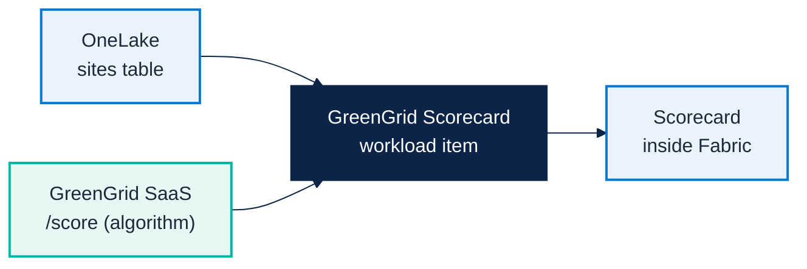

# Micro Hack 2 — SDC Workloads Workbook (Participants)

Track: **SDC Workloads (Fabric Extensibility Toolkit)**
Scenario: **GreenGrid Analytics** (fictional SDC)

> 📄 Print-ready PDF: [`microhack-2-sdc-workloads-workbook.pdf`](microhack-2-sdc-workloads-workbook.pdf)

This workbook is split in two parts:

- **Part A — Understand** (sections 1–3): what you build and why.
- **Part B — Build it step by step** (section 4): the **full solution, copy-paste**. You are
  not expected to *find* the solution — follow the steps and you get a working workload.

---

## 🗓️ Day agenda (1 day)

**Morning — presentations & demos. Afternoon — hands-on hack.**

| Time | Session |
|:-----|:-----------------------------------------------------------------|
| 09:00 | Welcome & motion overview — the Fabric apps motion for EMEA, the two paths |
| 09:30 | Microsoft Fabric foundations — OneLake, capacity, workspaces |
| 10:00 | **Demo · Business Apps (Rayfin)** — Helios Bicycle Studio |
| 10:30 | Break |
| 10:45 | **Demo · SDC Workloads (Extensibility Toolkit)** — GreenGrid Scorecard |
| 11:15 | The hack brief, teams & environment check |
| 12:00 | Lunch |
| 13:30 | **Hack · Sprint 1** — scaffold & run (steps 1–4) |
| 15:30 | Break |
| 15:45 | **Hack · Sprint 2** — integrate & polish (steps 5–7) |
| 16:45 | Team demos (5 min each) |
| 17:00 | Wrap-up, KPIs & next steps |

> The morning shows **both** scenarios (Apps + SDC). This workbook drives the **afternoon
> hack on the SDC Workloads track** (GreenGrid). The Business Apps track has its own workbook.

---

# Part A — Understand

## 1) What you build

A Fabric workload item, **GreenGrid Scorecard**, that:

1. reads the customer's `sites` table from **OneLake**,
2. sends it to the **GreenGrid SaaS** (`/score`) — which holds the scoring algorithm,
3. renders a **graphical sustainability scorecard inside Fabric**.

The finished result looks like this — a sustainability scorecard and a map of the
industrial sites, rendered inside Fabric:


## 2) Architecture in one picture



## 3) Team framing (fill this in 2 minutes, then build)

- Team name:
- SaaS URL + API key (from the trainer):
- One sentence you'll say in the demo:

---

# Part B — Build it step by step (full solution)

> **Golden rule:** get the flow working with **seed data first** (steps 1–4), *then* switch
> the source to OneLake (step 5). Don't block on OneLake auth before your UI renders.

Each step says **where** to paste and **what** to paste. Copy as-is.

---

## Step 1 — Verify the SaaS (1 min)

The SaaS is already deployed by the trainer. Confirm it answers:

```bash
curl -i <SAAS_URL>/health        # expect: 200
curl -s -X POST <SAAS_URL>/score \
  -H "Content-Type: application/json" -H "x-api-key: <API_KEY>" \
  -d '{"sites":[{"siteId":"s1","name":"Helsinki DC","city":"Helsinki","energyKwh":320,"renewablePct":88}]}'
```

You should get back a `greenScore` and a `tier`. ✅ Done — move on.

*(Local fallback: `cd src/workloadsdc && npm install && npm run saas:start`, URL
`http://localhost:8787`, key `greengrid-demo-key`.)*

---

## Step 2 — Scaffold the item

From the [Starter-Kit](https://aka.ms/fabric-extensibility-starter-kit), ask GitHub Copilot:

```text
Create a new Extensibility Toolkit item type "GreenGridScorecard" with an editor tab and a
Leaf icon. Keep the default item creation flow.
```

This creates the item and an empty editor file (e.g. `app/items/GreenGridScorecard/Editor.tsx`).
✅ The empty item opens — move on.

---

## Step 3 — Add the data contract

Create `app/items/GreenGridScorecard/contracts.ts` and paste:

```ts
export type SiteRecord = {
  siteId: string; name: string; city: string; energyKwh: number; renewablePct: number;
};
export type GreenTier = 'A' | 'B' | 'C';
export type ScoredSite = SiteRecord & {
  efficiency: number; greenScore: number; tier: GreenTier; tip: string;
};
export type ScoreResponse = {
  sites: ScoredSite[];
  summary: {
    totalSites: number; avgScore: number; avgRenewablePct: number;
    tierCounts: Record<GreenTier, number>; best: ScoredSite; worst: ScoredSite;
  };
};
```

---

## Step 4 — Call the SaaS, render with seed data

### 4a. The SaaS client — `greengridClient.ts`

```ts
import type { ScoreResponse, SiteRecord } from './contracts';

const SAAS_URL = 'http://localhost:8787';        // ← replace with the trainer URL
const API_KEY = 'greengrid-demo-key';            // ← replace with the trainer key

export async function scorePortfolio(sites: SiteRecord[]): Promise<ScoreResponse> {
  const res = await fetch(`${SAAS_URL}/score`, {
    method: 'POST',
    headers: { 'Content-Type': 'application/json', 'x-api-key': API_KEY },
    body: JSON.stringify({ sites }),
  });
  if (!res.ok) throw new Error(`GreenGrid SaaS error ${res.status}`);
  return res.json();
}
```

### 4b. Seed data — `seed.ts`

```ts
import type { SiteRecord } from './contracts';
export const seedSites: SiteRecord[] = [
  { siteId: 'site-hel', name: 'Helsinki Data Center', city: 'Helsinki', energyKwh: 320, renewablePct: 88 },
  { siteId: 'site-lis', name: 'Lisbon Office', city: 'Lisbon', energyKwh: 210, renewablePct: 71 },
  { siteId: 'site-muc', name: 'Munich Lab', city: 'Munich', energyKwh: 430, renewablePct: 80 },
  { siteId: 'site-dub', name: 'Dublin Hub', city: 'Dublin', energyKwh: 540, renewablePct: 62 },
  { siteId: 'site-waw', name: 'Warsaw Plant', city: 'Warsaw', energyKwh: 880, renewablePct: 24 },
];
```

### 4c. The editor — `Editor.tsx`

```tsx
import React, { useEffect, useState } from 'react';
import { FluentProvider, webLightTheme, Spinner, Badge } from '@fluentui/react-components';
import { scorePortfolio } from './greengridClient';
import { seedSites } from './seed';
import type { ScoreResponse } from './contracts';

const tierColor = (t: 'A' | 'B' | 'C') => (t === 'A' ? '#2faa6a' : t === 'B' ? '#d9a300' : '#d1453b');

export default function Editor() {
  const [data, setData] = useState<ScoreResponse | null>(null);
  const [error, setError] = useState<string | null>(null);

  useEffect(() => {
    // Step 4: seed data. In Step 5 you replace `seedSites` with OneLake rows.
    scorePortfolio(seedSites).then(setData).catch((e) => setError(String(e)));
  }, []);

  if (error) return <div role="alert">Failed: {error}</div>;
  if (!data) return <Spinner label="Scoring sites…" />;

  return (
    <FluentProvider theme={webLightTheme}>
      <div style={{ padding: 24 }}>
        <h1>GreenGrid Scorecard</h1>
        <p>Data from OneLake → scored by GreenGrid</p>
        <div style={{ fontSize: 48, fontWeight: 700 }}>{data.summary.avgScore}<span style={{ fontSize: 18 }}> / 100</span></div>
        <div style={{ display: 'grid', gridTemplateColumns: 'repeat(2,1fr)', gap: 12, marginTop: 16 }}>
          {data.sites.map((s) => (
            <div key={s.siteId} style={{ border: '1px solid #dbe6f1', borderRadius: 12, padding: 14 }}>
              <div style={{ display: 'flex', justifyContent: 'space-between' }}>
                <strong>{s.name}</strong>
                <Badge appearance="filled" style={{ background: tierColor(s.tier) }}>Tier {s.tier}</Badge>
              </div>
              <div style={{ color: '#7a8a9a', fontSize: 12 }}>{s.city}</div>
              <div style={{ fontSize: 26, fontWeight: 700 }}>{s.greenScore}</div>
              <div style={{ fontSize: 13 }}>{s.tip}</div>
            </div>
          ))}
        </div>
      </div>
    </FluentProvider>
  );
}
```

✅ **Milestone M1 (Sprint 1):** the item shows the portfolio score and 5 site cards — the
**end-to-end flow works** with seed data.

---

## Step 5 — Switch the source to OneLake

### 5a. The OneLake reader — `onelake.ts`

```ts
import type { WorkloadClientAPI } from '@ms-fabric/workload-client';
import type { SiteRecord } from './contracts';

export async function readSites(
  client: WorkloadClientAPI, workspaceId: string, lakehouseId: string
): Promise<SiteRecord[]> {
  const { token } = await client.auth.acquireAccessToken({
    additionalScopesToConsent: ['https://storage.azure.com/user_impersonation'],
  });
  const url = `https://onelake.dfs.fabric.microsoft.com/${workspaceId}/${lakehouseId}/Tables/sites`;
  const res = await fetch(url, { headers: { Authorization: `Bearer ${token}` } });
  if (!res.ok) throw new Error(`OneLake read failed: ${res.status}`);
  const rows = (await res.json()) as Array<Record<string, unknown>>;
  return rows.map((r) => ({
    siteId: String(r.siteId), name: String(r.name), city: String(r.city),
    energyKwh: Number(r.energyKwh), renewablePct: Number(r.renewablePct),
  }));
}
```

### 5b. Use it in `Editor.tsx`

Replace the seed line in the `useEffect`:

```tsx
// before:
scorePortfolio(seedSites).then(setData).catch((e) => setError(String(e)));

// after (props: workloadClient, workspaceId, lakehouseId):
readSites(workloadClient, workspaceId, lakehouseId)
  .then(scorePortfolio)
  .then(setData)
  .catch((e) => setError(String(e)));
```

✅ **Milestone M2 (Sprint 2):** the scorecard now reflects the **OneLake** rows.
*(If OBO auth fights you, keep `seedSites` as a fallback and demo with it — don't lose time.)*

---

## Step 6 — Make it graphical (optional polish)

Ask Copilot to upgrade the UI (keep the data flow above):

```text
Upgrade GreenGrid Scorecard: add a circular green-score gauge for the portfolio,
an A/B/C tier distribution, provenance chips "Data from OneLake" -> "Scored by GreenGrid",
and a second view showing the sites as factory markers on a simple map, colored by tier.
Style: Fluent UI, teal #00b4a6 + green accents.
```

✅ **Milestone M3 (Sprint 2):** matches the solution screenshots.

---

## Step 7 — Run it in Fabric (Dev Gateway)

```bash
npm run start            # frontend dev server (serves the item UI)
npm run start:devGateway # registers the dev workload with Fabric
```

In Fabric: **Settings → Developer settings → enable Developer mode**, open your workspace,
then **+ New → GreenGridScorecard**.

✅ The item renders **inside Fabric** while served from your machine. You're ready to demo.

*(Not listed? Developer mode is off or the Dev Gateway isn't running.)*

---

# Wrap-up

## Demo storyboard (5 minutes)

1. **Context** (30s): the SaaS value (the algorithm) you brought into Fabric.
2. **Flow** (3m): open item → read OneLake → call SaaS → show scorecard + map.
3. **Architecture** (45s): OneLake (data) + SaaS (algorithm) + workload (native UI).
4. **Publish plan** (45s): from Dev Gateway to a released workload.

## Reflection

- Where did the OneLake → SaaS contract surprise you?
- What stays in the SaaS (IP) vs. in the workload (experience)?
- What would you harden before production?

## Reference assets

- Full solution code: `src/workloadsdc/`
- SaaS prerequisite: `src/workloadsdc/saas/`
- Canonical spec: `src/workloadsdc/src/specs/greengrid-workload-spec.md`
- Trainer answer key + screenshots: `docs/microhack-2-sdc-workloads-solution.md`
