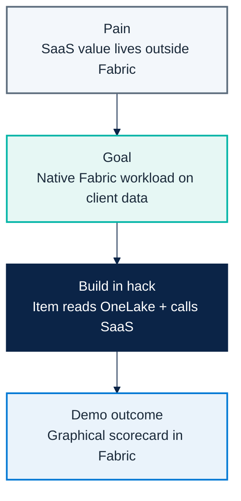

# Micro Hack 2 — SDC Workloads Workbook (Participants)

Track: **SDC Workloads (Fabric Extensibility Toolkit)**
Scenario: **GreenGrid Analytics** (fictional SDC)

---

## 1) Visual challenge map



---

## 2) Team framing (fill this first)

- Team name:
- Workload name:
- Item type name:
- One sentence business value:

---

## 3) Product-to-workload worksheet

### A. Product mapping
- Which SaaS capability are you exposing in Fabric?
- What should the user see inside Fabric?
- What stays in your SaaS (and not in the workload)?

### B. API mapping
- Which endpoint scores the data? (`POST /score`)
- Which fields are mandatory in request/response?
- How do you authenticate? (`x-api-key`)

### C. Data mapping
- What is read from OneLake? (the `sites` table)
- What columns do you send to the SaaS?
- What do you render back in the item?

---

## 4) Sprint plan

### Sprint 1 (13:30–15:30) — Scaffold & run
- [ ] Scaffold the workload from the Starter-Kit.
- [ ] Create the `GreenGridScorecard` item.
- [ ] Render minimal item UI with the seed `sites` data.
- [ ] Call SaaS `POST /score` and show the portfolio score.

### Sprint 2 (15:45–16:45) — Integrate & polish
- [ ] Read `sites` from OneLake (OBO token).
- [ ] Add the gauge + tier distribution + site cards.
- [ ] Handle success/failure states.
- [ ] Prepare the demo story.

---

## 5) Demo storyboard (5 minutes)

1. **Context** (30s): what SaaS value are you bringing into Fabric?
2. **Flow** (3m): open item → read OneLake → call SaaS → show scorecard.
3. **Architecture** (45s): workload / SaaS / OneLake relation.
4. **Publish plan** (45s): what is needed to move from dev gateway to release?

---

## 6) Reflection at close

- What integration contract was the hardest part?
- What assumptions about OneLake were wrong?
- What needs hardening before production?
- What metric proves this workload is adopted?

---

## 7) Guided build prompts

Scaffold from the [Starter-Kit](https://aka.ms/fabric-extensibility-starter-kit) and build
with **GitHub Copilot** (the toolkit ships `.github/copilot-instructions.md` and
`.ai/commands/*`).

### Step 0 — Prerequisite: the SaaS is already running

```bash
# Provided by the trainer; locally:
cd src/workloadsdc && npm install && npm run saas:start
```

### Step 1 — Master prompt (item + integration)

```text
Create a Fabric Extensibility Toolkit item "GreenGridScorecard".
On open: read the `sites` table (siteId, name, city, energyKwh, renewablePct) from the
selected lakehouse in OneLake using an Entra OBO token, POST it to the GreenGrid SaaS
/score endpoint (header x-api-key), and render ONE graphical sustainability scorecard:
a portfolio green-score gauge, a tier (A/B/C) distribution, provenance chips
"Data from OneLake" -> "Scored by GreenGrid", and site cards with green score, tier badge,
renewable % bar and a one-line tip.
Style: Fluent UI, teal #00b4a6 + green accents, clean and friendly. One screen.
```

### Step 2 — Run it in dev mode (Dev Gateway)

```bash
npm run start            # frontend dev server
npm run start:devGateway # registers the dev workload in Fabric
```

> Reference prompts and the canonical spec live in
> [`src/workloadsdc/src/specs/greengrid-workload-spec.md`](../src/workloadsdc/src/specs/greengrid-workload-spec.md).

---

## 8) Reference assets (for teams and coaches)

- Solution code: `src/workloadsdc/`
- SaaS prerequisite: `src/workloadsdc/saas/`
- Workload prompt baseline: `src/workloadsdc/src/specs/greengrid-workload-spec.md`
- Trainer visual answer key + screenshots: `docs/microhack-2-sdc-workloads-solution.md`
