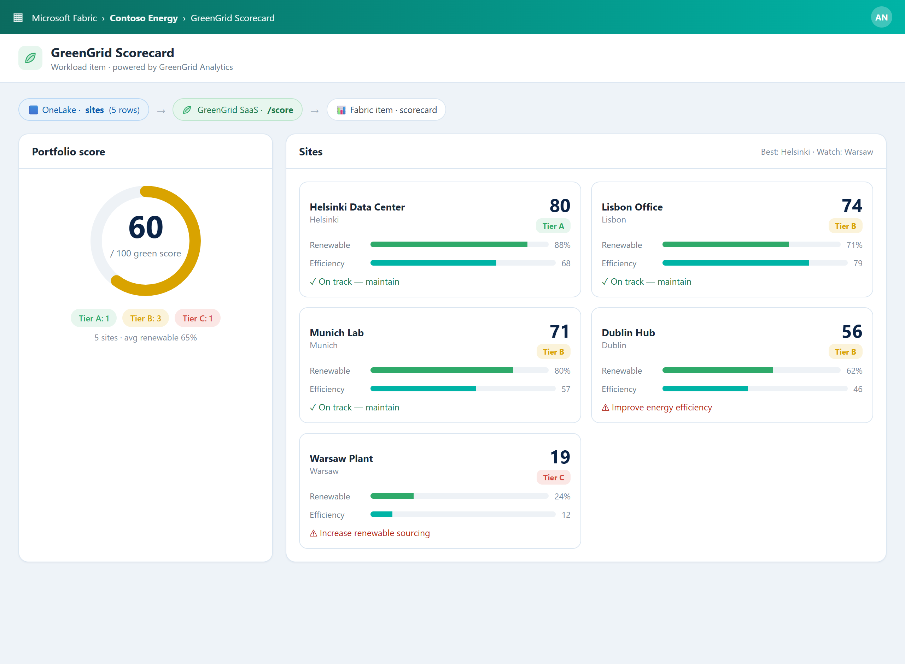
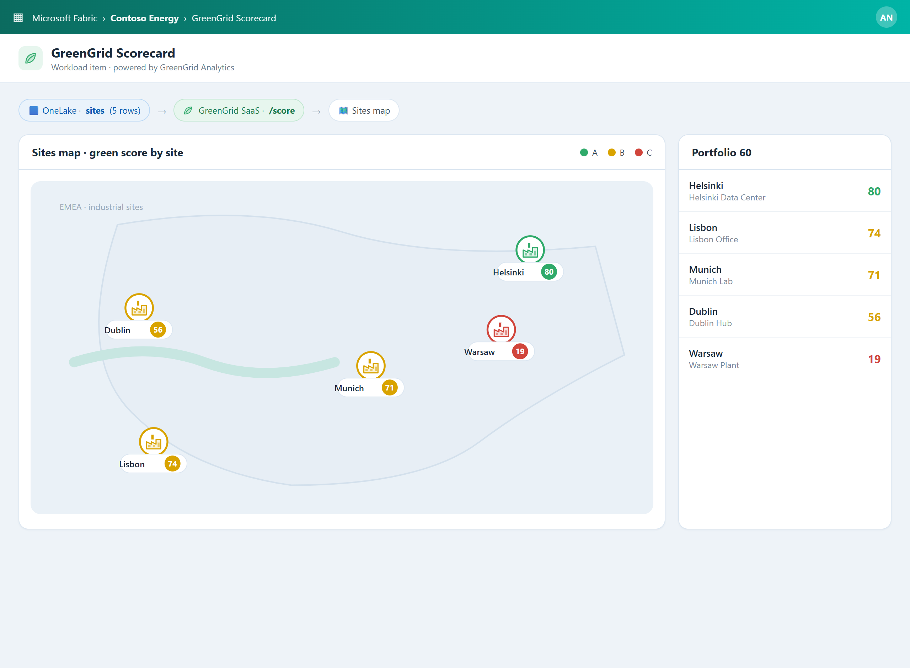
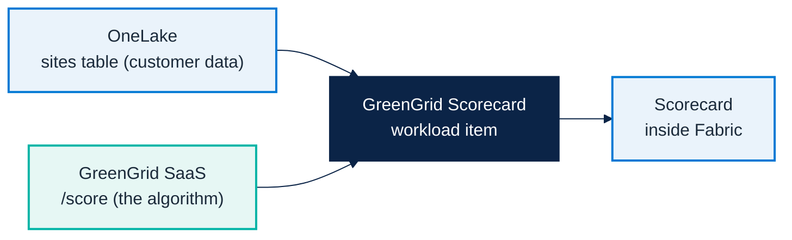

# Micro Hack 2 — SDC Workloads Workbook (Participants)

Track: **SDC Workloads (Fabric Extensibility Toolkit)**
Scenario: **GreenGrid Analytics** (fictional SDC)

> 📄 Print-ready PDF: [`microhack-2-sdc-workloads-workbook.pdf`](microhack-2-sdc-workloads-workbook.pdf)

This is a **didactic** micro-hack. You are **not** expected to *find* the solution — every
step explains **what** you do, **why**, and **what you should see**, and gives you the exact
code to paste. Follow them in order and you get a working Fabric workload.

---

## 🗓️ Day agenda (1 day)

**Morning — presentations & demos. Afternoon — hands-on hack.**

| Time | Session |
|:-----|:-----------------------------------------------------------------|
| 09:00 | Welcome & motion overview — the Fabric apps motion for EMEA, the two paths |
| 09:30 | Microsoft Fabric foundations — OneLake, capacity, workspaces |
| 10:00 | **Demo · Business Apps (Rayfin)** — Helios Bicycle Studio |
| 10:30 | Break |
| 10:45 | **Demo · SDC Workloads (Extensibility Toolkit)** — GreenGrid Scorecard |
| 11:15 | The hack brief, teams & environment check |
| 12:00 | Lunch |
| 13:30 | **Hack · Sprint 1** — scaffold & run (steps 1–4) |
| 15:30 | Break |
| 15:45 | **Hack · Sprint 2** — integrate & polish (steps 5–7) |
| 16:45 | Team demos (5 min each) |
| 17:00 | Wrap-up, KPIs & next steps |

> The morning shows **both** scenarios (Apps + SDC). This workbook drives the **afternoon
> hack on the SDC Workloads track** (GreenGrid). The Business Apps track has its own workbook.

---

# Part A — Understand

## 1) The scenario in plain words

**GreenGrid Analytics** is a software company (an **SDC** — a solution development company).
Its product scores how **sustainable** a customer's sites are, from their energy use and
renewable mix. The customer's data already lives in Microsoft Fabric (**OneLake**). Your job:
bring GreenGrid's scoring **inside Fabric**, as a native screen, **without moving the data**.

The result looks like this — a sustainability scorecard and a map of the industrial sites,
rendered inside Fabric:





## 2) The three pieces (and who owns the algorithm)



- **OneLake** = where the **customer's data** lives (a `sites` table).
- **GreenGrid SaaS** = a small web service that **holds the scoring algorithm** (GreenGrid's
  IP). You send it sites, it returns scores. *The trainer deploys it for you — it is a
  prerequisite.*
- **The workload** = the piece **you build today**: a Fabric *item* that reads OneLake, calls
  the SaaS, and draws the scorecard.

## 3) Key words (30-second primer)

- **Workload**: a web app that runs *inside* the Fabric portal (in an iFrame). You host it,
  Fabric displays it.
- **Item**: one thing a user creates in a workspace (here: a *GreenGrid Scorecard*). Like a
  Notebook or a Lakehouse, but yours.
- **Extensibility Toolkit**: Microsoft's starter kit + SDK to build such workloads quickly.
- **OBO token** (On-Behalf-Of): a secure token the workload gets so it can read the user's
  OneLake data **as that user** — no passwords, no data copies.
- **Dev Gateway**: a local bridge that lets Fabric show your workload while it runs on **your
  machine** — perfect for a hack.

## 4) Team framing (fill this in 2 minutes, then build)

- Team name:
- SaaS URL + API key (from the trainer):
- One sentence you'll say in the demo:

---

# Part B — Build it step by step (full solution)

> **Golden rule (read this!):** make the flow work with **seed (fake) data first**
> (steps 1–4), *then* switch the source to real OneLake data (step 5). Don't fight OneLake
> security before anything appears on screen — you'll waste the afternoon.

Each step tells you **what it is**, **why**, **where to paste** and **what you should see**.
Copy the code as-is.

---

## Step 1 — Check the SaaS is alive (1 min)

**What this is.** A quick test that the GreenGrid service (the algorithm) is reachable.
**Why.** Your workload will call it; if it's down, nothing scores. Test it before coding.

```bash
curl -i <SAAS_URL>/health        # expect: 200
curl -s -X POST <SAAS_URL>/score \
  -H "Content-Type: application/json" -H "x-api-key: <API_KEY>" \
  -d '{"sites":[{"siteId":"s1","name":"Helsinki DC","city":"Helsinki","energyKwh":320,"renewablePct":88}]}'
```

**✅ What you should see.** `/health` returns `200`; `/score` returns a `greenScore` and a
`tier`. (Local fallback: `cd src/workloadsdc && npm install && npm run saas:start`, URL
`http://localhost:8787`, key `greengrid-demo-key`.)

---

## Step 2 — Create the empty item

**What this is.** Generate a new Fabric *item type* from the Starter-Kit, using GitHub Copilot.
**Why.** The item is the container your scorecard lives in. Start empty, fill it next.

```text
Create a new Extensibility Toolkit item type "GreenGridScorecard" with an editor tab and a
Leaf icon. Keep the default item creation flow.
```

**✅ What you should see.** A new item folder (e.g. `app/items/GreenGridScorecard/`) and an
empty editor that opens without errors.

---

## Step 3 — Describe the data shape (the contract)

**What this is.** TypeScript types that describe what you send to the SaaS and what it returns.
**Why.** A shared "contract" means your code and the SaaS agree on field names — fewer bugs.

Create `app/items/GreenGridScorecard/contracts.ts` and paste:

```ts
export type SiteRecord = {
  siteId: string; name: string; city: string; energyKwh: number; renewablePct: number;
};
export type GreenTier = 'A' | 'B' | 'C';
export type ScoredSite = SiteRecord & {
  efficiency: number; greenScore: number; tier: GreenTier; tip: string;
};
export type ScoreResponse = {
  sites: ScoredSite[];
  summary: {
    totalSites: number; avgScore: number; avgRenewablePct: number;
    tierCounts: Record<GreenTier, number>; best: ScoredSite; worst: ScoredSite;
  };
};
```

**✅ What you should see.** The file compiles (no red squiggles) and can be imported.

---

## Step 4 — Call the SaaS and render with fake data

This is the big one: it makes the **end-to-end flow visible**. Three small files.

### 4a. The SaaS client — `greengridClient.ts`

**What this is.** A function that POSTs sites to the SaaS and returns the scores.

```ts
import type { ScoreResponse, SiteRecord } from './contracts';

const SAAS_URL = 'http://localhost:8787';        // <- replace with the trainer URL
const API_KEY = 'greengrid-demo-key';            // <- replace with the trainer key

export async function scorePortfolio(sites: SiteRecord[]): Promise<ScoreResponse> {
  const res = await fetch(`${SAAS_URL}/score`, {
    method: 'POST',
    headers: { 'Content-Type': 'application/json', 'x-api-key': API_KEY },
    body: JSON.stringify({ sites }),
  });
  if (!res.ok) throw new Error(`GreenGrid SaaS error ${res.status}`);
  return res.json();
}
```

### 4b. Fake data — `seed.ts`

**What this is.** A handful of sample sites so you can see results before touching OneLake.

```ts
import type { SiteRecord } from './contracts';
export const seedSites: SiteRecord[] = [
  { siteId: 'site-hel', name: 'Helsinki Data Center', city: 'Helsinki', energyKwh: 320, renewablePct: 88 },
  { siteId: 'site-lis', name: 'Lisbon Office', city: 'Lisbon', energyKwh: 210, renewablePct: 71 },
  { siteId: 'site-muc', name: 'Munich Lab', city: 'Munich', energyKwh: 430, renewablePct: 80 },
  { siteId: 'site-dub', name: 'Dublin Hub', city: 'Dublin', energyKwh: 540, renewablePct: 62 },
  { siteId: 'site-waw', name: 'Warsaw Plant', city: 'Warsaw', energyKwh: 880, renewablePct: 24 },
];
```

### 4c. The screen — `Editor.tsx`

**What this is.** The React component that calls the SaaS on open and shows the scorecard.

```tsx
import React, { useEffect, useState } from 'react';
import { FluentProvider, webLightTheme, Spinner, Badge } from '@fluentui/react-components';
import { scorePortfolio } from './greengridClient';
import { seedSites } from './seed';
import type { ScoreResponse } from './contracts';

const tierColor = (t: 'A' | 'B' | 'C') => (t === 'A' ? '#2faa6a' : t === 'B' ? '#d9a300' : '#d1453b');

export default function Editor() {
  const [data, setData] = useState<ScoreResponse | null>(null);
  const [error, setError] = useState<string | null>(null);

  useEffect(() => {
    // Step 4: fake data. In Step 5 you replace `seedSites` with OneLake rows.
    scorePortfolio(seedSites).then(setData).catch((e) => setError(String(e)));
  }, []);

  if (error) return <div role="alert">Failed: {error}</div>;
  if (!data) return <Spinner label="Scoring sites..." />;

  return (
    <FluentProvider theme={webLightTheme}>
      <div style={{ padding: 24 }}>
        <h1>GreenGrid Scorecard</h1>
        <p>Data from OneLake, scored by GreenGrid</p>
        <div style={{ fontSize: 48, fontWeight: 700 }}>{data.summary.avgScore}<span style={{ fontSize: 18 }}> / 100</span></div>
        <div style={{ display: 'grid', gridTemplateColumns: 'repeat(2,1fr)', gap: 12, marginTop: 16 }}>
          {data.sites.map((s) => (
            <div key={s.siteId} style={{ border: '1px solid #dbe6f1', borderRadius: 12, padding: 14 }}>
              <div style={{ display: 'flex', justifyContent: 'space-between' }}>
                <strong>{s.name}</strong>
                <Badge appearance="filled" style={{ background: tierColor(s.tier) }}>Tier {s.tier}</Badge>
              </div>
              <div style={{ color: '#7a8a9a', fontSize: 12 }}>{s.city}</div>
              <div style={{ fontSize: 26, fontWeight: 700 }}>{s.greenScore}</div>
              <div style={{ fontSize: 13 }}>{s.tip}</div>
            </div>
          ))}
        </div>
      </div>
    </FluentProvider>
  );
}
```

**✅ What you should see — 🎯 Milestone M1 (Sprint 1).** The item shows the portfolio score
(a big number) and 5 site cards with their tier. The **whole chain works**: your screen →
the SaaS → back to the screen. This alone is demoable.

---

## Step 5 — Switch the source to real OneLake data

**What this is.** Replace the fake `seedSites` with the customer's real `sites` table.
**Why.** This is the point of the workload: score the customer's **own** data, in place.

### 5a. The OneLake reader — `onelake.ts`

```ts
import type { WorkloadClientAPI } from '@ms-fabric/workload-client';
import type { SiteRecord } from './contracts';

export async function readSites(
  client: WorkloadClientAPI, workspaceId: string, lakehouseId: string
): Promise<SiteRecord[]> {
  // Ask Fabric for a token that lets us read OneLake AS the signed-in user (OBO).
  const { token } = await client.auth.acquireAccessToken({
    additionalScopesToConsent: ['https://storage.azure.com/user_impersonation'],
  });
  const url = `https://onelake.dfs.fabric.microsoft.com/${workspaceId}/${lakehouseId}/Tables/sites`;
  const res = await fetch(url, { headers: { Authorization: `Bearer ${token}` } });
  if (!res.ok) throw new Error(`OneLake read failed: ${res.status}`);
  const rows = (await res.json()) as Array<Record<string, unknown>>;
  return rows.map((r) => ({
    siteId: String(r.siteId), name: String(r.name), city: String(r.city),
    energyKwh: Number(r.energyKwh), renewablePct: Number(r.renewablePct),
  }));
}
```

### 5b. Use it in `Editor.tsx`

**What you do.** Swap one line in the `useEffect`: read OneLake, then score.

```tsx
// before (fake data):
scorePortfolio(seedSites).then(setData).catch((e) => setError(String(e)));

// after (real OneLake data; props: workloadClient, workspaceId, lakehouseId):
readSites(workloadClient, workspaceId, lakehouseId)
  .then(scorePortfolio)
  .then(setData)
  .catch((e) => setError(String(e)));
```

**✅ What you should see — 🎯 Milestone M2 (Sprint 2).** The same scorecard, now built from
the **OneLake** rows. *(If the OBO token gives you trouble, keep `seedSites` as a fallback and
keep moving — don't lose time on auth.)*

---

## Step 6 — Make it graphical (polish)

**What this is.** Upgrade the plain list into the polished scorecard + map.
**Why.** A graphical result is what sells the story in the demo.

Ask Copilot (keep the data flow from steps 4–5):

```text
Upgrade GreenGrid Scorecard: add a circular green-score gauge for the portfolio,
an A/B/C tier distribution, provenance chips "Data from OneLake" then "Scored by GreenGrid",
and a second view showing the sites as factory markers on a simple map, colored by tier.
Style: Fluent UI, teal #00b4a6 + green accents.
```

**✅ What you should see — 🎯 Milestone M3 (Sprint 2).** A gauge, A/B/C tiers, and the sites
map — matching the example images at the top.

---

## Step 7 — Run it inside Fabric (Dev Gateway)

**What this is.** Show your locally-running workload **inside the Fabric portal**.
**Why.** That's how a workload really looks to a user — and how you demo it.

```bash
npm run start            # frontend dev server (serves the item UI)
npm run start:devGateway # registers the dev workload with Fabric
```

Then in Fabric: **Settings -> Developer settings -> enable Developer mode**, open your
workspace, then **+ New -> GreenGridScorecard**.

**✅ What you should see.** The `GreenGridScorecard` item appears in Fabric and renders your
scorecard, served from your machine. You're ready to demo. *(Not listed? Developer mode is
off, or the Dev Gateway isn't running.)*

---

# Wrap-up

## Demo storyboard (5 minutes)

1. **Context** (30s): the SaaS value (the algorithm) you brought into Fabric.
2. **Flow** (3m): open the item, read OneLake, call the SaaS, show the scorecard + map.
3. **Architecture** (45s): OneLake (data) + SaaS (algorithm) + workload (native UI).
4. **Publish plan** (45s): from Dev Gateway to a released workload.

## Reflection

- Where did the OneLake -> SaaS contract surprise you?
- What stays in the SaaS (the IP) vs. in the workload (the experience)?
- What would you harden before production?

## Reference assets

- Full solution code: `src/workloadsdc/`
- SaaS prerequisite: `src/workloadsdc/saas/`
- Canonical spec: `src/workloadsdc/src/specs/greengrid-workload-spec.md`
- Trainer answer key + screenshots: `docs/microhack-2-sdc-workloads-solution.md`
