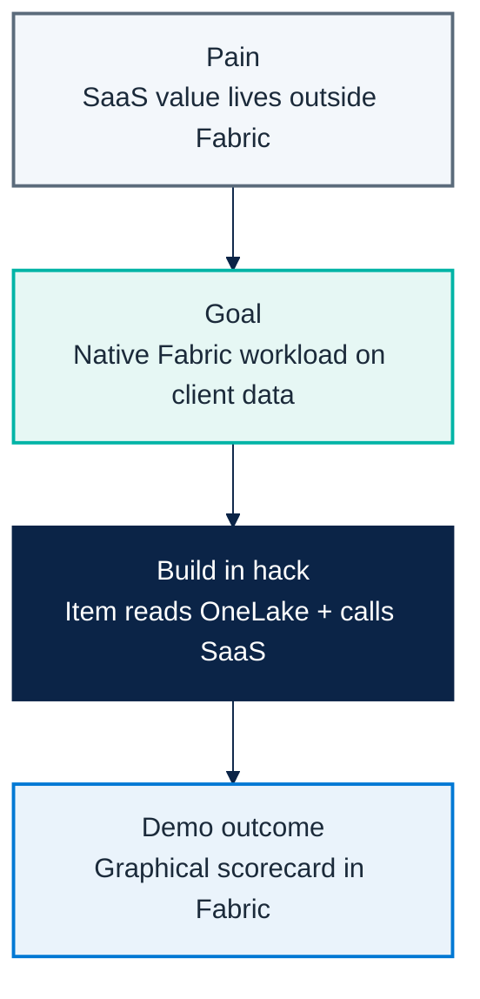

# Micro Hack 2 — SDC Workloads Workbook (Participants)

Track: **SDC Workloads (Fabric Extensibility Toolkit)**
Scenario: **GreenGrid Analytics** (fictional SDC)

---

## 1) Visual challenge map



---

## 2) Team framing (fill this first)

- Team name:
- Workload name:
- Item type name:
- One sentence business value:

---

## 3) Product-to-workload worksheet

### A. Product mapping
- Which SaaS capability are you exposing in Fabric?
- What should the user see inside Fabric?
- What stays in your SaaS (and not in the workload)?

### B. API mapping
- Which endpoint scores the data? (`POST /score`)
- Which fields are mandatory in request/response?
- How do you authenticate? (`x-api-key`)

### C. Data mapping
- What is read from OneLake? (the `sites` table)
- What columns do you send to the SaaS?
- What do you render back in the item?

---

## 4) Sprint plan

> Each task maps to the **step-by-step guide in section 7** — follow the steps, tick here.

### Sprint 1 (13:30–15:30) — Scaffold & run (steps 0–4 → milestone M1)
- [ ] Verify the SaaS is up (step 0).
- [ ] Scaffold the `GreenGridScorecard` item (step 1).
- [ ] Add the contract + SaaS call (steps 2–3).
- [ ] Render the portfolio score + site list from seed data (step 4).

### Sprint 2 (15:45–16:45) — Integrate & polish (steps 5–7 → milestones M2–M3)
- [ ] Read `sites` from OneLake (OBO token) (step 5).
- [ ] Add the gauge + tier distribution + site cards + map (step 6).
- [ ] Run it in Fabric via the Dev Gateway (step 7).
- [ ] Prepare the demo story.

---

## 5) Demo storyboard (5 minutes)

1. **Context** (30s): what SaaS value are you bringing into Fabric?
2. **Flow** (3m): open item → read OneLake → call SaaS → show scorecard.
3. **Architecture** (45s): workload / SaaS / OneLake relation.
4. **Publish plan** (45s): what is needed to move from dev gateway to release?

---

## 6) Reflection at close

- What integration contract was the hardest part?
- What assumptions about OneLake were wrong?
- What needs hardening before production?
- What metric proves this workload is adopted?

---

## 7) Guided build — step by step

You build the workload with the [Starter-Kit](https://aka.ms/fabric-extensibility-starter-kit)
and **GitHub Copilot** (the toolkit ships `.github/copilot-instructions.md` and
`.ai/commands/*` for fast scaffolding). Follow the steps in order — each ends with a
**✅ Checkpoint** and a **🛟 If you're stuck**. Copy the prompts and snippets directly.

```mermaid
%%{init: {'theme':'base','themeVariables':{
  'primaryColor':'#E6F7F4','primaryTextColor':'#1B2A3A',
  'primaryBorderColor':'#00B4A6','lineColor':'#0B2447'}}}%%
flowchart LR
    S0["0 · Verify SaaS"] --> S1["1 · Scaffold item"]
    S1 --> S2["2 · Contract"]
    S2 --> S3["3 · Call SaaS"]
    S3 --> S4["4 · Render (seed)"]
    S4 --> S5["5 · Read OneLake"]
    S5 --> S6["6 · Make it graphical"]
    S6 --> S7["7 · Dev Gateway"]
    classDef a fill:#E6F7F4,stroke:#00B4A6,color:#1B2A3A,stroke-width:2px;
    class S0,S1,S2,S3,S4,S5,S6,S7 a;
```



> **Golden rule:** wire the flow with the **seed data first** (steps 2–4), then swap the
> source to OneLake (step 5). Don't fight OneLake auth before your UI renders anything.

---

### Step 0 — Verify the SaaS is up (prerequisite)

The SaaS is provided by the trainer. Confirm it answers before you build:

```bash
curl -i <SAAS_URL>/health        # expect 200
curl -s -X POST <SAAS_URL>/score \
  -H "Content-Type: application/json" -H "x-api-key: <API_KEY>" \
  -d '{"sites":[{"siteId":"s1","name":"Helsinki DC","city":"Helsinki","energyKwh":320,"renewablePct":88}]}'
```

**✅ Checkpoint:** `/health` returns `200`; `/score` returns a `greenScore` and a `tier`.
**🛟 If you're stuck:** locally run `cd src/workloadsdc && npm install && npm run saas:start`
and use `http://localhost:8787` with key `greengrid-demo-key`.

---

### Step 1 — Scaffold the item

```text
Copilot prompt:
Using this Fabric Extensibility Toolkit repo, create a new item type "GreenGridScorecard"
with an editor tab and a Leaf icon. Keep the default item creation flow.
```

**✅ Checkpoint:** the `GreenGridScorecard` item builds and its empty editor opens.
**🛟 If you're stuck:** see the item manifest shape in
[`src/workloadsdc/workload/Manifest/GreenGridScorecard.json`](../src/workloadsdc/workload/Manifest/GreenGridScorecard.json).

---

### Step 2 — Define the data contract

Create the shared types the SaaS expects/returns (copy from the kit):

```ts
// contracts.ts
export type SiteRecord = { siteId: string; name: string; city: string; energyKwh: number; renewablePct: number; };
export type GreenTier = 'A' | 'B' | 'C';
export type ScoredSite = SiteRecord & { efficiency: number; greenScore: number; tier: GreenTier; tip: string; };
export type ScoreResponse = { sites: ScoredSite[]; summary: { avgScore: number; avgRenewablePct: number; tierCounts: Record<GreenTier, number>; best: ScoredSite; worst: ScoredSite; }; };
```

**✅ Checkpoint:** types compile and are imported by your editor component.
**🛟 Reference:** [`workload/app/contracts.ts`](../src/workloadsdc/workload/app/contracts.ts).

---

### Step 3 — Call the SaaS

```ts
// greengridClient.ts
export async function scorePortfolio(sites: SiteRecord[]): Promise<ScoreResponse> {
  const res = await fetch(`${SAAS_URL}/score`, {
    method: 'POST',
    headers: { 'Content-Type': 'application/json', 'x-api-key': SAAS_API_KEY },
    body: JSON.stringify({ sites }),
  });
  if (!res.ok) throw new Error(`GreenGrid SaaS error ${res.status}`);
  return res.json();
}
```

**✅ Checkpoint:** calling `scorePortfolio(seedSites)` logs scored sites in the console.
**🛟 If you're stuck:** CORS/401 → check the `x-api-key` header and the SaaS URL.

---

### Step 4 — Render the scorecard with seed data

Hard-code 2–3 `sites` for now and render the result. Keep it to one screen.

```text
Copilot prompt:
In the GreenGridScorecard editor, call scorePortfolio with these 3 hard-coded sites,
then render the portfolio average score as a big number and a list of site rows
(name, green score, tier). Use Fluent UI.
```

**✅ Checkpoint:** the item shows a portfolio number and a site list — **end-to-end works**.
This is your Sprint 1 milestone.

---

### Step 5 — Swap the source to OneLake

Replace the hard-coded sites with a read of the customer's `sites` table.

```text
Copilot prompt:
Acquire an Entra OBO token (scope https://storage.azure.com/user_impersonation),
read the `sites` table from the selected lakehouse in OneLake, map the rows to SiteRecord[],
and pass them to scorePortfolio instead of the hard-coded array.
```

**✅ Checkpoint:** the scorecard now reflects the **OneLake** rows, not the hard-coded ones.
**🛟 Reference:** [`workload/app/onelake.ts`](../src/workloadsdc/workload/app/onelake.ts). If OBO
fails, keep the seed array as a fallback and demo with it.

---

### Step 6 — Make it graphical

```text
Copilot prompt:
Upgrade the scorecard UI: a circular green-score gauge for the portfolio, an A/B/C tier
distribution, provenance chips "Data from OneLake" -> "Scored by GreenGrid", and per-site
cards with a tier badge and a renewable % bar.
Bonus: add a second view with the sites as factory markers on a simple map, colored by tier.
Style: Fluent UI, teal #00b4a6 + green accents.
```

**✅ Checkpoint:** the screen matches the look of the
[solution screenshots](microhack-2-sdc-workloads-solution.md#7-workload-screenshots-generated-from-real-code).
This is your Sprint 2 milestone.

---

### Step 7 — Run it in dev mode (Dev Gateway)

```bash
npm run start            # frontend dev server (serves the item UI)
npm run start:devGateway # registers the dev workload with Fabric
```

Enable **Developer mode** in Fabric (Settings → Developer settings), open your workspace,
and create a `GreenGridScorecard` item.

**✅ Checkpoint:** the item renders **inside Fabric** while served from your machine.
**🛟 If you're stuck:** item not listed → Developer mode off or Dev Gateway not running.

> Canonical spec & master prompt:
> [`src/workloadsdc/src/specs/greengrid-workload-spec.md`](../src/workloadsdc/src/specs/greengrid-workload-spec.md).

---

### Milestone map

| Milestone | Steps | You can demo |
|---|---|---|
| **M1 — flow works** (Sprint 1) | 0–4 | Portfolio score + site list from seed data |
| **M2 — on real data** (Sprint 2) | 5 | Same scorecard, now from OneLake |
| **M3 — beautiful** (Sprint 2) | 6–7 | Gauge + tiers + map, running in Fabric |

---

## 8) Reference assets (for teams and coaches)

- Solution code: `src/workloadsdc/`
- SaaS prerequisite: `src/workloadsdc/saas/`
- Workload prompt baseline: `src/workloadsdc/src/specs/greengrid-workload-spec.md`
- Trainer visual answer key + screenshots: `docs/microhack-2-sdc-workloads-solution.md`
