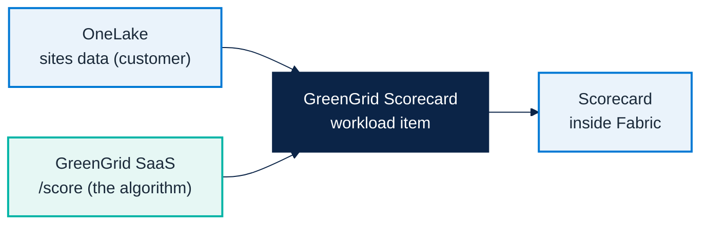
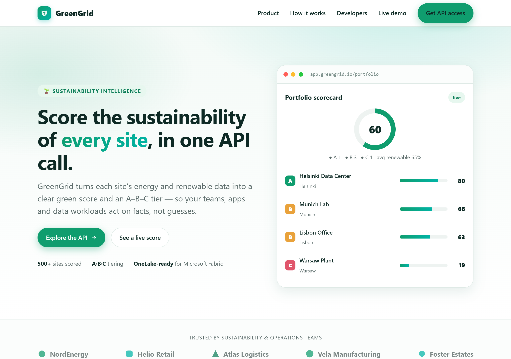
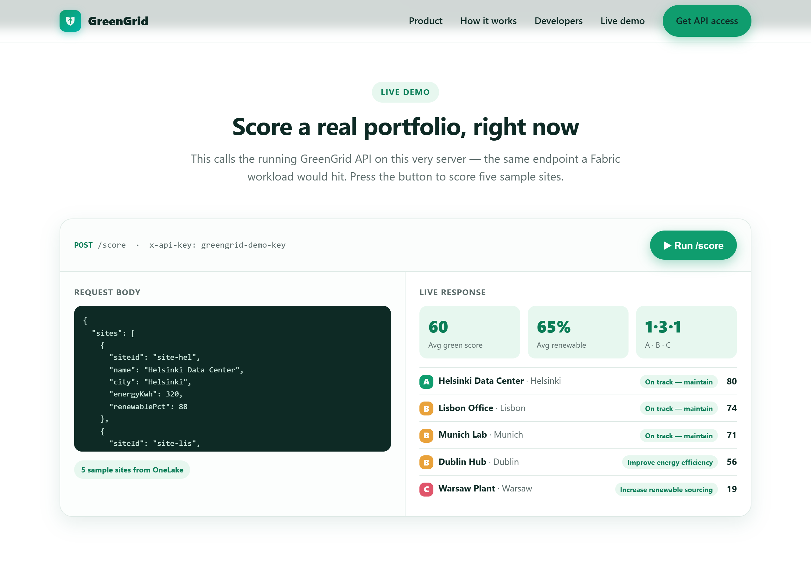
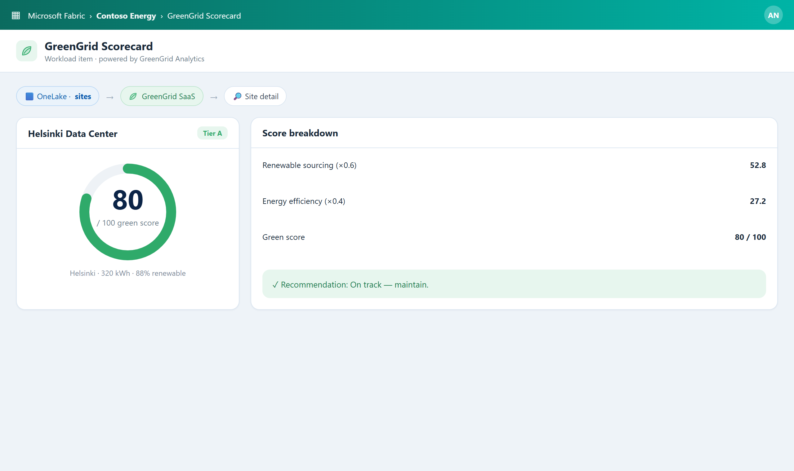

# Micro Hack 2 — SDC Workloads Workbook (Participants)

Track: **SDC Workloads (Fabric Extensibility Toolkit)**
Scenario: **GreenGrid Analytics** (fictional SDC)

> 📄 Print-ready PDF: [`microhack-2-sdc-workloads-workbook.pdf`](microhack-2-sdc-workloads-workbook.pdf)

This is a **didactic** micro-hack. You are **not** expected to *find* the solution — every
step tells you **exactly what to type or paste**, **why**, and **what you should see**. Follow
them in order and you get a working Fabric workload, starting from a clean machine.

---

## 🗓️ Day agenda (1 day)

**Morning — presentations & demos. Afternoon — hands-on hack.** This is a **standalone
one-day micro-hack for the SDC Workloads (Extensibility Toolkit) track**.

| Time | Session |
|:-----|:-----------------------------------------------------------------|
| 09:00 | Welcome & motion overview — the Fabric apps motion for EMEA |
| 09:30 | Microsoft Fabric foundations — OneLake, capacity, workspaces |
| 10:00 | Extensibility Toolkit foundations — workloads, items, Dev Gateway |
| 10:30 | Break |
| 10:45 | **Demo · GreenGrid Scorecard** — the workload you'll build + the SaaS prerequisite |
| 11:15 | The hack brief, teams & environment check |
| 12:00 | Lunch |
| 13:30 | **Hack · Sprint 1** — clone, run Hello World, render with fake data (steps 1–7) |
| 15:30 | Break |
| 15:45 | **Hack · Sprint 2** — switch to OneLake & polish (steps 8–9) |
| 16:45 | Team demos (5 min each) |
| 17:00 | Wrap-up, KPIs & next steps |

---

# Part A — Understand

## 1) The scenario in plain words

**GreenGrid Analytics** is a software company (an **SDC** — a solution development company).
Its product scores how **sustainable** a customer's sites are, from their energy use and
renewable mix. The customer's data already lives in Microsoft Fabric (**OneLake**). Your job:
bring GreenGrid's scoring **inside Fabric**, as a native screen, **without moving the data**.

The result looks like this — a sustainability scorecard and a map of the industrial sites,
rendered inside Fabric:


## 2) The three pieces (and who owns the algorithm)



- **OneLake** = where the **customer's data** lives.
- **GreenGrid SaaS** = a small web service that **holds the scoring algorithm** (GreenGrid's
  IP). *The trainer usually hosts it; if you run solo, you start it yourself in **Step 6a** —
  `cd src/workloadsdc && npm run saas:start`.*
- **The workload** = the piece **you build today**: a Fabric *item* that reads OneLake, calls
  the SaaS, and draws the scorecard.

## 3) Key words (30-second primer)

- **Workload**: a web app that runs *inside* the Fabric portal. You host it, Fabric shows it.
- **Item**: one thing a user creates in a workspace (here: a *GreenGrid Scorecard*).
- **Extensibility Toolkit**: Microsoft's open-source kit + SDK to build such workloads.
- **Dev Gateway**: a local bridge so Fabric can show your workload while it runs on **your
  machine** — this is what makes a one-day hack possible.
- **OBO token** (On-Behalf-Of): a secure token the workload gets so it can read the user's
  OneLake data **as that user** — no passwords, no data copies.

## 4) Prerequisites & environment setup (do this first)

Modeled on Microsoft's
[Build LAB514](https://github.com/microsoft/Build26-LAB514-ship-ai-apps-fast-with-a-managed-backend-in-microsoft-fabric)
setup. On a lab VM most tools are pre-installed.

**Tools you need:**

- Node.js 20+ and npm
- **PowerShell 7**, **.NET (x64)**, **Azure CLI** (the toolkit setup script uses them)
- Visual Studio Code
- **GitHub Copilot CLI** (the `copilot` terminal agent) — used for the graphical polish step

**Sign in (two accounts):**

1. **GitHub Copilot** — run `copilot`, then `/login`, choose **GitHub.com**, finish the browser
   sign-in, confirm *"Signed in successfully"*, then `/exit`.
2. **Microsoft Fabric** — open `https://app.fabric.microsoft.com` and sign in. *(If it shows
   "Power BI" bottom-left, switch it to "Fabric".)*

**From the trainer / your tenant:**

- A **Fabric workspace** with a **capacity** assigned (where the workload runs).
- Permission to create an **Entra app** (or one provided) — required even with the Dev Gateway;
  `Setup.ps1` creates it.
- The **GreenGrid SaaS URL + API key**.

**Verify your setup:**

```shell
node --version
npm --version
copilot --version
pwsh --version
```

**✅ What you should see.** All print a version, you're signed in to GitHub Copilot and Fabric,
and you have the SaaS URL + key in hand.

## 5) Team framing (fill this in 2 minutes, then build)

- Team name:
- SaaS URL + API key:
- One sentence you'll say in the demo:

---

# Part B — Build it step by step (full solution)

> **Golden rule (read this!):** first get the toolkit running with the built-in **Hello
> World** (steps 1–4). Only then build GreenGrid (steps 5–9). And inside GreenGrid, render
> **fake data first** (step 7), *then* switch to real OneLake data (step 8). Never debug
> security before something shows on screen.

Every step says **what it is**, **what to type/paste**, and **what you should see**.

---

## Step 1 — Clone the toolkit

**What this is.** Get Microsoft's Extensibility Toolkit on your machine. This is a real
repository — you clone it and start from it.

```bash
git clone https://github.com/microsoft/fabric-extensibility-toolkit
cd fabric-extensibility-toolkit
```

**✅ What you should see.** A `fabric-extensibility-toolkit` folder with `Workload/` and
`scripts/` inside.

---

## Step 2 — Configure the dev environment (one script)

**What this is.** A setup script that creates the Entra app, writes your `.env`, and downloads
the Dev Gateway. It asks you to sign in and pick your workspace.

```powershell
cd scripts/Setup
./Setup.ps1 -WorkloadName "Org.GreenGrid"
```

> The `WorkloadName` must look like `Organization.Name` — use `Org.GreenGrid` for the hack.
> On macOS/Linux run `pwsh ./Setup.ps1 -WorkloadName "Org.GreenGrid"`.

> **Why an Entra app even with the Dev Gateway?** The Dev Gateway only **routes** your local
> workload into Fabric — it does **not** provide identity. Your workload authenticates with
> **Microsoft Entra**, and the Entra app is what lets it receive Fabric tokens and acquire the
> **OBO token** to read OneLake (step 8). `Setup.ps1` creates this app for you (or reuses an
> existing one).

**✅ What you should see.** The script ends with "setup complete" and prints the next steps.

---

## Step 3 — Start the dev server + the Dev Gateway

**What this is.** Two long-running processes, in **two terminals**. One serves your workload
UI from localhost; the other connects Fabric to that localhost.

```powershell
# Terminal 1 — the frontend + APIs
cd scripts/Run
./StartDevServer.ps1
```

```powershell
# Terminal 2 — the bridge to Fabric
cd scripts/Run
./StartDevGateway.ps1
```

Then, **in the Fabric portal**: open **Settings -> Admin portal** and enable the developer
tenant settings, then **Settings -> Developer settings -> enable Fabric Developer Mode**.

**✅ What you should see.** Both terminals keep running without errors, and Developer Mode is
ON in Fabric.

> ⚠️ **If `StartDevGateway.ps1` fails with** `Dev instance registration ... Forbidden,
> errorCode: FeatureNotAvailable` **:** your tenant hasn't enabled customer-developed workloads.
> An **admin** must turn on, under **Admin portal → Tenant settings → Additional workloads**:
> *Capacity admins and contributors can add and remove additional workloads*, *Workspace admins
> can develop workloads*, and *Users can see and work with additional workloads not validated by
> Microsoft* — **and** the workspace must be on a **Fabric/Trial capacity** (not Pro/PPU). Full
> steps in the setup guide (§6.1). It is not a code issue — the gateway is refused by Fabric.
>
> **Not a tenant admin?** You can't self-enable it — either ask your admin for those toggles, run
> the hack in a tenant **you** administer (a Fabric Trial / demo tenant), or keep building locally
> without Fabric: `npm run saas:start` + `npm run demo:build`, then open
> `src/workloadsdc/demo/out/scorecard.html` (same algorithm, no Fabric needed). See setup §6.1.1.

---

## Step 4 — Hello World test (prove the gateway works, before building anything)

**What this is.** The toolkit ships a **Hello World** item. Create it in Fabric to confirm the
whole chain — *your localhost code -> Dev Gateway -> Fabric* — works. **This is your safety
checkpoint.**

1. Go to
   `https://app.fabric.microsoft.com/workloadhub/detail/Org.GreenGrid.Product?experience=fabric-developer`
   (the workload shows as "Hello Fabric!" until you rename it).
2. Click the **Hello World** item type on the left.
3. Pick your **dev workspace** in the dialog.
4. The Hello World editor opens.

**✅ What you should see.** The Hello World editor renders **inside Fabric**, served from your
machine. If you see it, everything works — now you can build GreenGrid. *(Nothing shows up?
Developer Mode is off, or one of the two terminals isn't running.)*

---

## Step 5 — Create the GreenGrid item

**What this is.** Generate a fresh item to hold your scorecard (don't overwrite Hello World).

```powershell
cd scripts/Setup
./CreateNewItem.ps1 -Name "GreenGridScorecard"
```

This creates `Workload/app/items/GreenGridScorecardItem/` on your machine, including
**`GreenGridScorecardItemEditor.tsx`** — the **React component Fabric renders when your item is
opened** (this is "the editor"; it starts nearly empty).

> 🚨 **`CreateNewItem.ps1` scaffolds the code but leaves 4 things for you to wire up — do all four
> now, or the Dev Gateway rejects the item / Fabric won't surface it.**
>
> **1. Register it in `ITEM_NAMES`** (else it isn't packaged → not in the manifest). Edit **all three**
> `Workload/.env.dev`, `.env.test`, `.env.prod` and append the `-Name` value:
> ```diff
> - ITEM_NAMES=HelloWorld
> + ITEM_NAMES=HelloWorld,GreenGridScorecard
> ```
>
> **2. Add the locale keys** (else `Missing keys in en-US locale: ..._DisplayName, ..._DisplayName_Plural`).
> In `Workload/Manifest/assets/locales/en-US/translations.json` add three keys (Display/Plural are
> used by the item manifest, Description by the create-card in step 4):
> ```json
> "GreenGridScorecardItem_DisplayName": "GreenGrid Scorecard",
> "GreenGridScorecardItem_DisplayName_Plural": "GreenGrid Scorecards",
> "GreenGridScorecardItem_Description": "Score the sustainability of your sites in Fabric."
> ```
> ⚠️ Every key must be **referenced somewhere** — an unreferenced key gives `Unused keys in en-US locale`.
>
> **3. Add the item icon** (else `MissingAssets: 'assets/images/GreenGridScorecardItem_Icon.png'`).
> Drop a 48×48 PNG named `<Item>_Icon.png` into `Workload/Manifest/assets/images/` (quickest fix:
> copy `HelloWorldItem_Icon.png`, swap a nicer icon later).
>
> **4. Add a create-card to `Product.json`** (else the gateway registers fine and Hello World shows,
> but **your item never appears in *New item***). In `Workload/Manifest/Product.json` add your item
> to `homePage.recommendedItemTypes` **and** add a card to `createExperience.cards` mirroring the
> HelloWorld one — set `title`/`description`/`icon` to your `GreenGridScorecardItem_*` keys/asset,
> `availableIn: ["home","create-hub","workspace-plus-new","workspace-plus-new-teams"]`, and
> `"itemType": "GreenGridScorecard"`.

**Restart *both* terminals** so the manifest is rebuilt and re-delivered to Fabric — the Dev Server
(Ctrl+C, `./StartDevServer.ps1`) **and** the Dev Gateway (Ctrl+C, `./StartDevGateway.ps1`). On
restart the gateway should log `Configured items from ITEM_NAMES: HelloWorldItem, GreenGridScorecardItem`
and `Registering dev instance...` should **succeed** (no `fail`).

Now **create an instance** of your item *in the Fabric portal* so you have something to render
into:

1. **Refresh** Fabric (F5), then open the Workload Hub:
   `https://app.fabric.microsoft.com/workloadhub/detail/Org.GreenGrid.Product?experience=fabric-developer`
   (same place as Hello World in Step 4).
2. Click the **GreenGridScorecard** item type → pick your **dev workspace** → the editor opens.

> 💡 **Type vs instance.** `CreateNewItem.ps1` scaffolds the item **type + its editor code** (on
> your machine). Creating it in Fabric makes an **instance** that runs that code inside Fabric.
> Keep this instance open: every time you save the editor `.tsx`, the dev server hot-reloads and
> this open item re-renders — you do **not** re-create the item for each change.

> ⚠️ **Don't see GreenGridScorecard in "New item"?** 99% of the time it's the `ITEM_NAMES` step
> above: confirm the item is added in **all three** `.env` files, restart **both** the Dev Server
> **and** the Dev Gateway, then **refresh** Fabric. *(The `BuildManifestPackage … CursorPosition:
> The handle is invalid` warning is harmless — it's a console-cursor quirk; `Delivered manifest
> package successfully` means the build is fine.)*

**✅ What you should see.** An empty GreenGridScorecard editor opens in Fabric (your code, rendered
in the portal).

---

## Step 6 — Start & check the GreenGrid SaaS

**What this is.** The SaaS holds GreenGrid's scoring algorithm — your workload is useless without
it, so it must be **running and reachable** before you build.

### 6a. Start the SaaS

If the **trainer hosts it**, just grab the **SaaS URL + API key** they give you and skip to 6b.

If you're **running it yourself** (solo, or as a local fallback), start it from the kit:

```bash
cd src/workloadsdc
npm install
npm run saas:start
```

It starts on **`http://localhost:8787`** with the default API key **`greengrid-demo-key`**
(override with the `GREENGRID_API_KEY` env var). The console should print:

```text
GreenGrid SaaS listening on http://localhost:8787
  GET  /          (marketing site + live API demo)
  GET  /health
  POST /score     (header: x-api-key: greengrid-demo-key)
```

> Keep this terminal open — the SaaS must stay running for the whole hack. Open
> **http://localhost:8787/** in a browser to see the GreenGrid website + a **live `/score` demo**
> (same algorithm your workload will call).





### 6b. Check it's alive

Replace `<SAAS_URL>` with your URL (local: `http://localhost:8787`) and `<API_KEY>` with your key
(local: `greengrid-demo-key`):

```bash
curl -i <SAAS_URL>/health        # expect: 200
curl -s -X POST <SAAS_URL>/score \
  -H "Content-Type: application/json" -H "x-api-key: <API_KEY>" \
  -d '{"sites":[{"siteId":"s1","name":"Helsinki DC","city":"Helsinki","energyKwh":320,"renewablePct":88}]}'
```

> 🪟 **On Windows PowerShell**, `curl` is an alias for `Invoke-WebRequest` and won't accept the
> flags above — use **`curl.exe`** (real curl), or the native form:
> ```powershell
> Invoke-RestMethod http://localhost:8787/health
> Invoke-RestMethod -Method Post -Uri http://localhost:8787/score `
>   -Headers @{ 'x-api-key' = 'greengrid-demo-key' } -ContentType 'application/json' `
>   -Body '{"sites":[{"siteId":"s1","name":"Helsinki DC","city":"Helsinki","energyKwh":320,"renewablePct":88}]}'
> ```

**✅ What you should see.** `/health` returns `200`, and `/score` returns a `greenScore` and a
`tier` (Helsinki → `greenScore 80`, `tier A`). Note your working **SAAS_URL + API_KEY** — you'll
paste them into the workload client in Step 7.

---

## Step 7 — Make it work with fake data (Milestone M1)

Create **four files** in `Workload/app/items/GreenGridScorecardItem/`, then render the
scorecard from the generated editor. This proves the whole chain *screen -> SaaS -> screen*.

### 7a. `contracts.ts` — the data shapes

```ts
export type SiteRecord = {
  siteId: string; name: string; city: string; energyKwh: number; renewablePct: number;
};
export type GreenTier = 'A' | 'B' | 'C';
export type ScoredSite = SiteRecord & {
  efficiency: number; greenScore: number; tier: GreenTier; tip: string;
};
export type ScoreResponse = {
  sites: ScoredSite[];
  summary: { totalSites: number; avgScore: number; avgRenewablePct: number;
    tierCounts: Record<GreenTier, number>; best: ScoredSite; worst: ScoredSite; };
};
```

### 7b. `greengridClient.ts` — call the SaaS

```ts
import type { ScoreResponse, SiteRecord } from './contracts';

const SAAS_URL = 'http://localhost:8787';   // <- replace with the trainer URL
const API_KEY = 'greengrid-demo-key';       // <- replace with the trainer key

export async function scorePortfolio(sites: SiteRecord[]): Promise<ScoreResponse> {
  const res = await fetch(`${SAAS_URL}/score`, {
    method: 'POST',
    headers: { 'Content-Type': 'application/json', 'x-api-key': API_KEY },
    body: JSON.stringify({ sites }),
  });
  if (!res.ok) throw new Error(`GreenGrid SaaS error ${res.status}`);
  return res.json();
}
```

### 7c. `seed.ts` — fake sites to start

```ts
import type { SiteRecord } from './contracts';
export const seedSites: SiteRecord[] = [
  { siteId: 'site-hel', name: 'Helsinki Data Center', city: 'Helsinki', energyKwh: 320, renewablePct: 88 },
  { siteId: 'site-lis', name: 'Lisbon Office', city: 'Lisbon', energyKwh: 210, renewablePct: 71 },
  { siteId: 'site-muc', name: 'Munich Lab', city: 'Munich', energyKwh: 430, renewablePct: 80 },
  { siteId: 'site-dub', name: 'Dublin Hub', city: 'Dublin', energyKwh: 540, renewablePct: 62 },
  { siteId: 'site-waw', name: 'Warsaw Plant', city: 'Warsaw', energyKwh: 880, renewablePct: 24 },
];
```

### 7d. `Scorecard.tsx` — the screen

It takes a `getSites` function, so swapping the data source later is **one line**.

```tsx
import React, { useEffect, useState } from 'react';
import { FluentProvider, webLightTheme, Spinner, Badge } from '@fluentui/react-components';
import { scorePortfolio } from './greengridClient';
import type { ScoreResponse, SiteRecord } from './contracts';

const tierColor = (t: 'A' | 'B' | 'C') => (t === 'A' ? '#2faa6a' : t === 'B' ? '#d9a300' : '#d1453b');

export function Scorecard({ getSites }: { getSites: () => Promise<SiteRecord[]> }) {
  const [data, setData] = useState<ScoreResponse | null>(null);
  const [error, setError] = useState<string | null>(null);

  useEffect(() => {
    getSites().then(scorePortfolio).then(setData).catch((e) => setError(String(e)));
  }, [getSites]);

  if (error) return <div role="alert">Failed: {error}</div>;
  if (!data) return <Spinner label="Scoring sites..." />;

  return (
    <FluentProvider theme={webLightTheme}>
      <div style={{ padding: 24 }}>
        <h1>GreenGrid Scorecard</h1>
        <p>Data from OneLake, scored by GreenGrid</p>
        <div style={{ fontSize: 48, fontWeight: 700 }}>{data.summary.avgScore}<span style={{ fontSize: 18 }}> / 100</span></div>
        <div style={{ display: 'grid', gridTemplateColumns: 'repeat(2,1fr)', gap: 12, marginTop: 16 }}>
          {data.sites.map((s) => (
            <div key={s.siteId} style={{ border: '1px solid #dbe6f1', borderRadius: 12, padding: 14 }}>
              <div style={{ display: 'flex', justifyContent: 'space-between' }}>
                <strong>{s.name}</strong>
                <Badge appearance="filled" style={{ background: tierColor(s.tier) }}>Tier {s.tier}</Badge>
              </div>
              <div style={{ color: '#7a8a9a', fontSize: 12 }}>{s.city}</div>
              <div style={{ fontSize: 26, fontWeight: 700 }}>{s.greenScore}</div>
              <div style={{ fontSize: 13 }}>{s.tip}</div>
            </div>
          ))}
        </div>
      </div>
    </FluentProvider>
  );
}
```

### 7e. Render it from the generated editor

**What this is.** Steps 7a–7d created the building blocks (types, SaaS client, seed data, the
`Scorecard` component) — but nothing displays them yet. 7e **wires `Scorecard` into the item's
editor** so it shows inside Fabric. This is the step that turns files-on-disk into a visible item.

The scaffold splits the editor into **views**: `GreenGridScorecardItemEmptyView.tsx` and
`GreenGridScorecardItemDefaultView.tsx` (the main view). You (1) register the editor's **route**,
(2) render your `Scorecard` in the DefaultView's `center`, and (3) make the item open that view:

1. In **`App.tsx`** — register the editor route, or the item opens to a **blank page** (Fabric
   navigates to `/<Item>-editor/:itemObjectId` but no `<Route>` matches → nothing renders, *with no
   error in the console*). `CreateNewItem.ps1` does **not** add this. Mirror the HelloWorld route:
   ```tsx
   import { GreenGridScorecardItemEditor } from "./items/GreenGridScorecardItem";
   // ...inside <Switch>, next to the HelloWorld route:
   <Route path="/GreenGridScorecardItem-editor/:itemObjectId">
     <GreenGridScorecardItemEditor workloadClient={workloadClient} data-testid="GreenGridScorecardItem-editor" />
   </Route>
   ```

2. In **`GreenGridScorecardItemDefaultView.tsx`** — import your component + seed data and put the
   `Scorecard` in the `center` slot (you can keep or remove the `left` "Getting Started" panel):
   ```tsx
   import { Scorecard } from "./Scorecard";
   import { seedSites } from "./seed";
   // ...
   center={{ content: <Scorecard getSites={() => Promise.resolve(seedSites)} /> }}
   ```

3. In **`GreenGridScorecardItemEditor.tsx`** — by default the editor renders **no view** (also a
   blank page) because `ItemEditor` starts with `currentView = initialView || null`. Add
   **`initialView`** so it opens the scorecard view directly:
   ```tsx
   <ItemEditor
     isLoading={isLoading}
     loadingMessage={...}
     initialView={EDITOR_VIEW_TYPES.DEFAULT}   // ← without it the page is blank
     ribbon={...}
     views={views}
   />
   ```

> 🩺 **Blank page with no console error?** It's almost always **#1 (the missing `App.tsx` route)** —
> the console shows a navigation to `/<Item>-editor/...` but nothing renders. Then **#3** (no
> `initialView`).

**Save.** The dev server hot-reloads; refresh your open GreenGrid item in Fabric (keep the **SaaS**
at `http://localhost:8787` **and both** Dev Server + Dev Gateway running). *(If you closed the item,
reopen it from the Workload Hub as in Step 5.)*

**✅ What you should see — 🎯 Milestone M1.** The item shows the portfolio score and 5 site
cards with their tier, **inside Fabric**. The whole chain works on fake data. This is demoable.

---

## Step 8 — Switch to real OneLake data (Milestone M2)

**What this is.** Replace the fake `seedSites` with the customer's **real** site data in OneLake.

### Where does the data live?

In Fabric, customer data lives in a **Lakehouse** inside OneLake. A Lakehouse has **Files**
(raw files: CSV, Parquet...) and **Tables** (Delta). For this hack the sites are a **CSV file**:
`Files/sites.csv`. *(A CSV is the simplest thing to read from a workload; a Delta table would
need a SQL endpoint — out of scope for one day.)*

**Format of `Files/sites.csv`** (a ready copy is in the kit at `src/workloadsdc/data/sites.csv`):

```text
siteId,name,city,energyKwh,renewablePct
site-hel,Helsinki Data Center,Helsinki,320,88
site-lis,Lisbon Office,Lisbon,210,71
site-muc,Munich Lab,Munich,430,80
site-dub,Dublin Hub,Dublin,540,62
site-waw,Warsaw Plant,Warsaw,880,24
```

> The trainer pre-loads this file (Lakehouse -> **Files** -> **Upload**). To test your own,
> upload a CSV with the **same header** to `Files/`.

You also need two IDs (visible in the Lakehouse URL, or from the item context):
`workspaceId` and `lakehouseId`.

### 8a. `onelake.ts` — read & parse the CSV

```ts
import type { WorkloadClientAPI } from '@ms-fabric/workload-client';
import type { SiteRecord } from './contracts';

export async function readSites(
  client: WorkloadClientAPI, workspaceId: string, lakehouseId: string
): Promise<SiteRecord[]> {
  // 1) Token to read OneLake AS the signed-in user (OBO).
  const { token } = await client.auth.acquireAccessToken({
    additionalScopesToConsent: ['https://storage.azure.com/user_impersonation'],
  });
  // 2) Read the CSV file from the Lakehouse "Files" area.
  const url = `https://onelake.dfs.fabric.microsoft.com/${workspaceId}/${lakehouseId}/Files/sites.csv`;
  const res = await fetch(url, { headers: { Authorization: `Bearer ${token}` } });
  if (!res.ok) throw new Error(`OneLake read failed: ${res.status}`);
  // 3) Parse CSV text into rows.
  const [header, ...lines] = (await res.text()).trim().split(/\r?\n/);
  const cols = header.split(',').map((c) => c.trim());
  return lines.filter(Boolean).map((line) => {
    const cells = line.split(',');
    const row = Object.fromEntries(cols.map((c, i) => [c, (cells[i] ?? '').trim()]));
    return { siteId: row.siteId, name: row.name, city: row.city,
      energyKwh: Number(row.energyKwh), renewablePct: Number(row.renewablePct) };
  });
}
```

### 8b. Swap one line in the editor

In **`GreenGridScorecardItemDefaultView.tsx`** (where you put the `Scorecard` in 7e), change the
`center` line to read from OneLake. `workloadClient` is already a prop of this view; for the IDs,
add `item` back to the props and use `item.workspaceId` / the lakehouse id (from the item or the
selected lakehouse):

```tsx
import { readSites } from './onelake';

// before (fake):
center={{ content: <Scorecard getSites={() => Promise.resolve(seedSites)} /> }}

// after (real OneLake CSV):
center={{ content: <Scorecard getSites={() => readSites(workloadClient, workspaceId, lakehouseId)} /> }}
```

**✅ What you should see — 🎯 Milestone M2.** The same scorecard, now built from the **OneLake
CSV**. *(If the OBO token fights you, keep the fake-data line as a fallback and keep moving.)*

---

## Step 9 — Make it graphical (Milestone M3)

**What this is.** Upgrade the plain list into the polished scorecard + map. Easiest with GitHub
Copilot (the toolkit ships AI instructions in `.github/copilot-instructions.md`):

```text
Upgrade the GreenGrid Scorecard screen: add a circular green-score gauge for the portfolio,
an A/B/C tier distribution, provenance chips "Data from OneLake" then "Scored by GreenGrid",
and a second view showing the sites as factory markers on a simple map, colored by tier.
Style: Fluent UI, teal #00b4a6 + green accents. Keep the getSites data flow.
```

**✅ What you should see — 🎯 Milestone M3.** A gauge, A/B/C tiers and the sites map, rendered
natively inside Fabric:




---

# Wrap-up

## Demo storyboard (5 minutes)

1. **Context** (30s): the SaaS value (the algorithm) you brought into Fabric.
2. **Flow** (3m): open the item, read OneLake, call the SaaS, show the scorecard + map.
3. **Architecture** (45s): OneLake (data) + SaaS (algorithm) + workload (native UI).
4. **Publish plan** (45s): from Dev Gateway to a released workload.

## Reflection

- Where did the OneLake -> SaaS contract surprise you?
- What stays in the SaaS (the IP) vs. in the workload (the experience)?
- What would you harden before production?

## Reference assets

- Full solution code: `src/workloadsdc/`
- SaaS prerequisite: `src/workloadsdc/saas/`
- Sample OneLake data: `src/workloadsdc/data/sites.csv`
- Trainer answer key + screenshots: `docs/microhack-2-sdc-workloads-solution.md`
