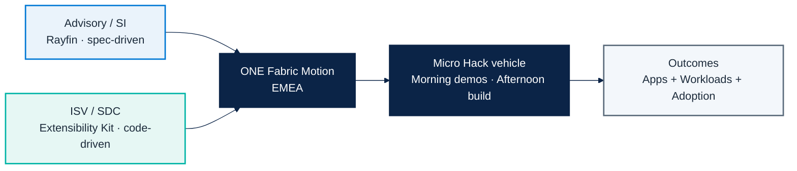

# Fabric Motion — Brief

Concise working brief for FY27 EMEA Fabric Application Motion.

## Goal

Build one coherent Microsoft Fabric application motion with two execution tracks:

1. **Advisory / SI track**: spec-driven business apps with Rayfin.
2. **ISV / SDC track**: code-driven workloads with Fabric Extensibility Kit.

Both tracks converge into one operating model and one reporting rhythm.

## KPI model

| Track | Primary KPI | Secondary KPI |
|---|---|---|
| Advisory / SI | # opportunities (MSX / CRM) | Stage 1–2 quality + ACR proxy |
| ISV / SDC | # workloads per ISV | workload adoption + Fabric capacity use |

## Activation baseline

- **Vehicle**: one-day Micro Hack format.
- **Ecosystem**: PwC, KPMG, EY, HVMC, Bain, BCG, McKinsey.
- **Ask**: sponsorship, funding, PM workloads alignment.

## Working artifacts in `/docs`

- `app-motion-overview.md`: full strategy template.
- `apprayfin-solution.md`: complete Rayfin business app solution with simulated captures.
- `microhack-1-business-apps-setup.md`: trainer setup guide (apps track).
- `microhack-1-business-apps-workbook.md`: participant workbook (apps track).
- `microhack-2-isv-workloads-setup.md`: trainer setup guide (ISV track).
- `microhack-2-isv-workloads-workbook.md`: participant workbook (ISV track).

## Working code in `/src`

- `src/apprayfin/`: implementation package for the Business Apps scenario.
